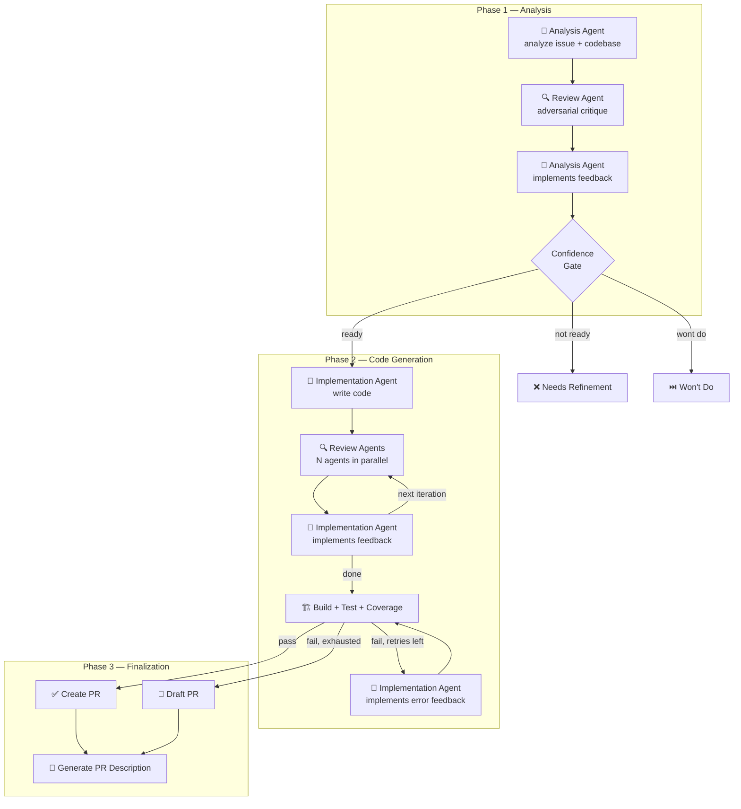
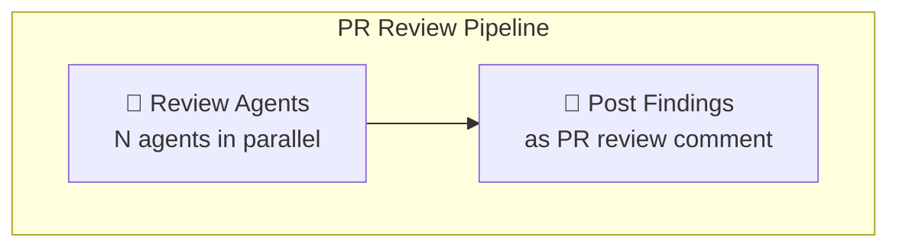
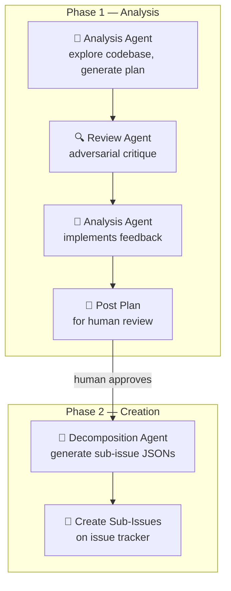

# Coding Agent Automation

An automated development pipeline that uses AI coding agents to implement issues end-to-end: analyze the issue, generate code, run quality gates, and create a pull request — all orchestrated through a web UI running in Containers.

Note: This system has been build with a little help of AI. Just kidding, it's entirely made by it.

## How It Works

1. **Pick an issue** — Select an issue from the web UI (or let closed-loop mode pick the next one automatically)
2. **Analysis** — The agent reads the issue, explores the codebase, and writes an analysis
3. **Implementation** — The agent implements the changes, guided by the analysis
4. **Quality gates** — Automated checks run: build, tests, code review (multi-agent), external CI
5. **Retry loop** — If quality gates fail, the agent gets feedback and retries (configurable max retries)
6. **Pull request** — On success, a PR is created with the changes, linked to the original issue

## Documentation

Detailed documentation lives in the [`docs/`](docs/) folder:

1. [Pipeline Orchestration](docs/pipeline-orchestration.md) — Core state machine, step descriptions, retry logic, error handling
2. [PR Review](docs/pr-review.md) — PR review pipeline, inline comments, configuration
3. [Epic Decomposition](docs/epic-decomposition.md) — Two-phase workflow, label state machine, approval process
4. [Issue Workflows](docs/github-issue-workflows.md) — Label system, user flows, closed-loop mode
5. [Label Routing](docs/label-routing.md) — Label hierarchy, agent selection, quality gate configs
6. [Configuration](docs/configuration.md) — Pipeline settings, job templates, provider setup, MCP servers
7. [Pipeline Projects](docs/projects.md) — Multi-repository grouping, project-level configuration
8. [Feedback & Consolidation](docs/feedback-and-consolidation.md) — Agent feedback loops, brain consolidation
9. [Observability](docs/observability.md) — Metrics, traces, OTLP configuration
10. [Deployment](docs/deployment.md) — Docker setup, Helm chart, volume mounts, scaling agents, architecture

## Agent Execution Flow

A single implementation run orchestrates multiple agent sessions across three phases:



**Session design:** One persistent session carries context from analysis → implementation → fixes. All review/critique agents use isolated sessions (no shared context with the generator) to avoid bias.

### PR Review Flow



The PR review pipeline is read-only — agents analyze the diff and post findings but never modify code. See [PR Review](docs/pr-review.md) for details.

### Epic Decomposition Flow



Phase 1 produces a plan for human review. Phase 2 runs only after explicit approval (`agent:epic-approved` label). See [Epic Decomposition](docs/epic-decomposition.md) for details.

## Key Concepts

- **Brain repository** — A `.brain/` folder in the target repo containing markdown files (lessons learned, architecture decisions, project context). Agents read it before starting and write to it after completing a run, accumulating knowledge across runs.
- **Confidence gate** — After analysis, the pipeline evaluates whether the issue is clear enough to implement. Vague or blocked issues are rejected with feedback (`agent:needs-refinement`), and issues that don't require code changes are closed as won't-do (`agent:wont-do`).
- **Quality gates** — Automated checks that must pass before a PR is created: compilation, tests, code coverage, and optionally external CI pipelines.
- **Closed-loop mode** — The pipeline polls for labeled issues and processes them autonomously without manual dispatch. Configurable poll interval and backoff.
- **Label routing** — Repository labels determine which agent container handles the job, which quality gates run, and which review agents are used.

## Features

- **Multi-agent architecture** — Multiple agent containers run in parallel, picking jobs from a shared queue
- **Multi-stack support** — Label-based routing dispatches jobs to the right agent and backend (dotnet, python, java × Kiro CLI, OpenCode) with stack-specific quality gates
- **PR review pipeline** — Automated code review for pull requests, triggered by labeling PRs with `agent:next`
- **Epic decomposition** — Two-phase workflow that breaks epics into implementation-ready sub-issues with human approval
- **Multi-agent code review** — Specialized review agents (Correctness, Security, etc.) run in parallel with inline PR comments
- **Issue dependency tracking** — `Blocked by #N` / `Depends on #N` patterns hold dispatch until dependencies close
- **Closed-loop automation** — Polls for labeled issues and PRs, processing them autonomously
- **External CI integration** — Optionally waits for CI pipelines to pass before creating the final PR
- **Brain repository** — Shared knowledge repo that agents read/write across runs
- **Agent feedback & consolidation** — Structured feedback, brain pruning, refactoring detection, harness suggestions
- **Real-time web UI** — Live output streaming, pipeline step sidebar, agent monitoring, interactive chat
- **Pipeline projects** — Multi-repository grouping with shared configuration and project-level context
- **MCP server & steering injection** — Agents receive tool configs and context conventions per workspace

## Quick Start

### Prerequisites

- **Docker** — For building and running the application
- **.NET 10 SDK** — For local development (optional if only running via Docker)
- **Issue tracker credentials** — App credentials for issue/repository access and PR creation (e.g., a GitHub App with Issues + Contents + Pull Requests permissions)
- **Agent CLI authentication** — Kiro agent containers need CLI auth tokens (see First-Time Setup below)

### Run with Docker Compose

```bash
# 1. Create a .env file with a shared secret for orchestrator↔agent authentication
echo "AGENT_API_KEY=$(openssl rand -hex 32)" > .env

# 2. Start the orchestrator and all agent containers
docker compose up --build
```

Open `http://localhost:8080` in your browser.

### First-Time Setup

1. **Authenticate Kiro CLI agents** — Exec into each Kiro agent container and run the login flow:
   ```bash
   docker exec -it coding-agent-automation-agent-dotnet-1-1 kiro-cli login
   ```
   Follow the device code flow in your browser. Auth tokens persist via the volume mount (one-time step per Kiro agent). OpenCode agents authenticate via environment variables and don't require this step.

2. **Configure providers** — Go to Settings → Providers in the web UI and set up Issue, Repository, Agent, and (optionally) Pipeline/CI providers.

3. **Configure label routing** — Set up Agent Profiles, Quality Gate Configs, and Reviewer Configs for your stack.

4. **Create a pipeline job template** — Link your providers and enable the desired work types (implementation, review, decomposition).

5. **Start a run** — Select a template, browse issues, and dispatch. Or enable closed-loop mode to process `agent:next` issues automatically.

## License

This project is for internal use.
