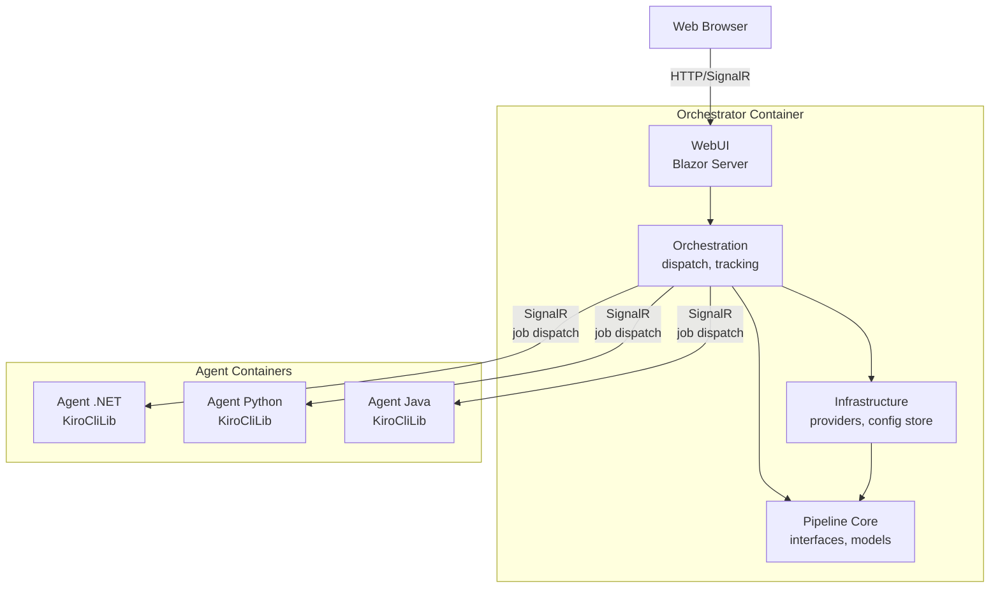

# Coding Agent Automation

An automated development pipeline that uses AI coding agents to implement issues end-to-end: analyze the issue, generate code, run quality gates, and create a pull request — all orchestrated through a web UI running in Docker.

## How It Works

1. **Pick an issue** — Select an issue from the web UI (or let closed-loop mode pick the next one automatically)
2. **Analysis** — The agent reads the issue, explores the codebase, and writes an analysis
3. **Implementation** — The agent implements the changes, guided by the analysis
4. **Quality gates** — Automated checks run: build, tests, code review (multi-agent), external CI
5. **Retry loop** — If quality gates fail, the agent gets feedback and retries (configurable max retries)
6. **Pull request** — On success, a PR is created with the changes, linked to the original issue

## Key Concepts

- **Brain repository** — A `.brain/` folder in the target repo containing markdown files (lessons learned, architecture decisions, project context). Agents read it before starting and write to it after completing a run, accumulating knowledge across runs.
- **Confidence gate** — After analysis, the pipeline evaluates whether the issue is clear enough to implement. Vague or blocked issues are rejected with specific feedback rather than producing bad code.
- **Quality gates** — Automated checks that must pass before a PR is created: compilation, tests, code coverage, and optionally external CI pipelines.
- **Closed-loop mode** — The pipeline polls for labeled issues and processes them autonomously without manual dispatch. Configurable poll interval and backoff.
- **Label routing** — Repository labels determine which agent container handles the job, which quality gates run, and which review agents are used.
- **Harness suggestions** — Automated improvement recommendations for the pipeline itself, derived from accumulated run feedback patterns.

## Documentation

Detailed documentation lives in the [`docs/`](docs/) folder. Suggested reading order:

1. [Pipeline Orchestration](docs/pipeline-orchestration.md) — Core state machine, step descriptions, retry logic, error handling
2. [Issue Workflows](docs/github-issue-workflows.md) — Label system, user flows, closed-loop mode
3. [Label Routing](docs/label-routing.md) — Label hierarchy, agent selection, quality gate configs, setting up new stacks
4. [Configuration](docs/configuration.md) — Pipeline settings, job templates, MCP server support
5. [Feedback & Consolidation](docs/feedback-and-consolidation.md) — Agent feedback loops, brain consolidation, refactoring detection

## Features

- **Multi-agent architecture** — Multiple agent containers run in parallel, picking jobs from a shared queue
- **Multi-stack support** — Label-based routing dispatches jobs to the right agent (dotnet, python, java) with stack-specific quality gates and review agents
- **Brain repository** — Shared knowledge repo that agents read/write across runs
- **Multi-agent code review** — Specialized review agents (Correctness, Security, AcceptanceCriteria, etc.) analyze changes sequentially
- **Confidence gate** — Rejects vague issues with specific feedback before attempting implementation
- **Closed-loop automation** — Polls for labeled issues and processes them autonomously
- **PR rework** — Re-queue an issue with an open PR to incorporate review feedback
- **External CI integration** — Optionally waits for CI pipelines to pass before creating the final PR
- **Agent feedback loops** — Structured feedback collected after every run for continuous improvement
- **Consolidation loops** — Brain pruning, refactoring detection, and harness suggestions
- **Real-time web UI** — Live output streaming, pipeline step sidebar, agent monitoring

## Quick Start

### Prerequisites

- **Docker** — For building and running the application
- **.NET 10 SDK** — For local development (optional if only running via Docker)
- **Issue tracker credentials** — App credentials for issue/repository access and PR creation (e.g., a GitHub App with Issues + Contents + Pull Requests permissions)
- **Agent CLI authentication** — Each agent container needs CLI auth tokens (see First-Time Setup below)

### Run with Docker Compose

```bash
# 1. Create a .env file with a shared secret for orchestrator↔agent authentication
#    (any random string works — it's a symmetric key for internal API auth)
echo "AGENT_API_KEY=$(openssl rand -hex 32)" > .env

# 2. Start the orchestrator and all agent containers
docker compose up --build
```

Open `http://localhost:8080` in your browser.

The `docker-compose.yml` defines 5 services: 1 orchestrator + 2 .NET agents + 1 Python agent + 1 Java agent. To add more agents, copy a service definition with a new name and volume — don't use `--scale` (each agent needs its own named volume to avoid SQLite corruption).

### First-Time Setup

1. **Authenticate the agent CLI** — Exec into each agent container and run the login flow:
   ```bash
   docker exec -it coding-agent-automation-agent-dotnet-1-1 kiro-cli login
   ```
   Follow the device code flow in your browser. Auth tokens persist via the volume mount, so this is a one-time step per agent.

2. **Configure providers** — Go to Settings → Providers in the web UI and set up:
   - **Issue Provider** — Connects to your issue tracker (requires app credentials)
   - **Repository Provider** — Connects to your code host for clone/push operations
   - **Agent Provider** — Points to the agent CLI binary (pre-configured in Docker)
   - **Pipeline Provider** (optional) — Connects to your CI system for external checks

3. **Configure label routing** — Go to Settings → Label Routing and set up Agent Profiles, Quality Gate Configs, and Reviewer Configs for your stack.

4. **Create a pipeline job template** — Go to Agent Coding and add a template linking your providers.

5. **Start a run** — Select a template, browse issues, and dispatch. Or enable closed-loop mode to process `agent:next` issues automatically.

## Project Structure

```
src/
  CodingAgentWebUI/                — Blazor Server app (UI, DI wiring, entry point)
  CodingAgentWebUI.Pipeline/       — Core library (interfaces, models, orchestration)
  CodingAgentWebUI.Infrastructure/ — Provider implementations (see table below)
  CodingAgentWebUI.Orchestration/  — Agent registry, job dispatch, run tracking
  CodingAgentWebUI.Agent/          — Agent worker container (SignalR client, CLI invocation)
  KiroCliLib/                      — Shared library (agent CLI process management)
tests/
  CodingAgentWebUI.UnitTests/              — WebUI unit tests
  CodingAgentWebUI.Pipeline.UnitTests/     — Pipeline core unit + property tests
  CodingAgentWebUI.Infrastructure.UnitTests/ — Infrastructure unit tests
  CodingAgentWebUI.Agent.UnitTests/        — Agent unit tests
  CodingAgentWebUI.IntegrationTests/       — Integration tests (bUnit)
  CodingAgentWebUI.E2ETests/               — End-to-end tests
  KiroCliLib.UnitTests/                    — KiroCliLib unit tests
dockerfiles/
  webui.Dockerfile           — Orchestrator (web UI)
  agent-dotnet10.Dockerfile  — .NET 10 agent container
  agent-python312.Dockerfile — Python 3.12 agent container
  agent-java21.Dockerfile    — Java 21 agent container
  e2e-tests.Dockerfile       — E2E test runner
config/
  pipeline/          — Provider configs, quality gates, profiles, run history
  appsettings.json   — Application configuration
```

## Volume Mounts

### Orchestrator

| Mount | Container Path | Purpose |
|-------|---------------|---------|
| Pipeline config | `/app/config/pipeline` | Provider configs, quality gates, profiles, run history (persists across restarts) |

### Agent Containers

| Mount | Container Path | Purpose |
|-------|---------------|---------|
| Agent CLI auth | `/home/ubuntu/.local/share/kiro-cli` | Agent CLI login tokens |
| SSO cache | `/home/ubuntu/.aws` | SSO cache for agent CLI auth (mounted read-only) |

Each agent container needs its own CLI data volume to avoid SQLite corruption from concurrent access. Workspaces are created inside the container at `/app/workspaces/` — no volume mount needed.

## Architecture

The application follows Clean Architecture with a multi-container deployment:



- **Pipeline (Core)** — Interfaces, models, orchestration services. Zero infrastructure dependencies.
- **Infrastructure** — Provider implementations (see table below).
- **Orchestration** — Agent registry, job dispatch, run tracking, token vending (issues short-lived auth tokens to agent containers for API calls).
- **WebUI** — Blazor Server components, SignalR hub for agent communication.
- **Agent** — Standalone worker container connecting via SignalR, executes coding agent CLI.
- **KiroCliLib** — Shared library for agent CLI process management and output parsing.

### Provider Implementations

The pipeline defines abstract provider interfaces in the core layer. Concrete implementations live in the Infrastructure and Agent projects.

| Provider | Interface | Purpose | Current Implementation |
|----------|-----------|---------|----------------------|
| Issue | `IIssueProvider` | Fetch issues, manage labels, post comments, create PRs | GitHub (Octokit) |
| Repository | `IRepositoryProvider` | Clone repos, create branches, commit/push changes | GitHub (LibGit2Sharp) |
| Agent | `IAgentProvider` | Execute coding agent for analysis/implementation/review | Kiro CLI (process wrapper) |
| Pipeline/CI | `IPipelineProvider` | Check external CI status for a branch/commit | GitHub Actions (Octokit) |

Adding a new implementation (e.g., GitLab issue provider, Jenkins CI provider) requires implementing the corresponding interface and registering it in the DI container.

## Testing

```bash
# Run all tests
dotnet test

# Run in Docker (Linux)
docker run --rm -v "${PWD}:/app" -w /app mcr.microsoft.com/dotnet/sdk:10.0 dotnet test
```

## Development

```bash
dotnet build
dotnet run --project src/CodingAgentWebUI
```

### Code Conventions

- Microsoft C# coding conventions, SOLID principles
- Immutability patterns (`init`-only properties, `IReadOnlyList<T>`)
- Input validation with `ArgumentNullException.ThrowIfNull`
- Async I/O with `CancellationToken` propagation

## License

This project is for internal use.
