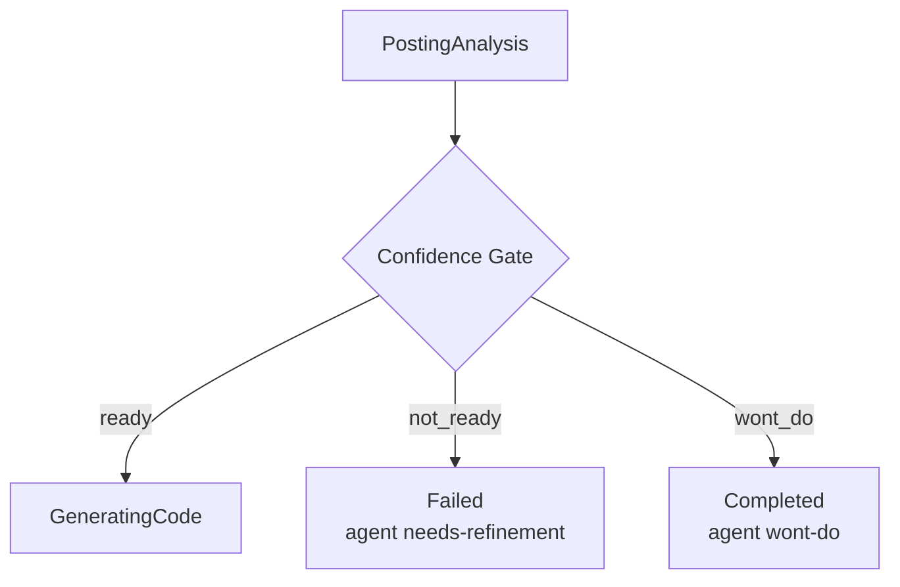
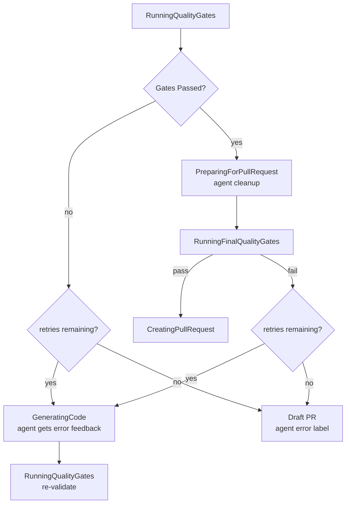
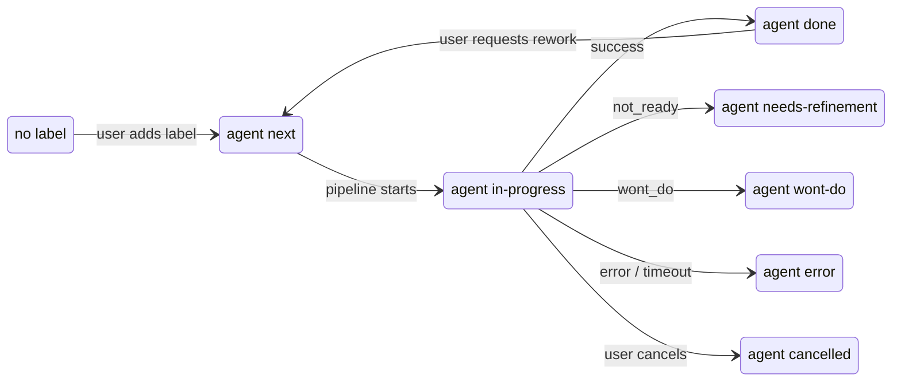

# Coding Agent Automation

Hello, World! 👋

An automated development pipeline that uses AI coding agents (Kiro CLI) to implement GitHub issues end-to-end: analyze the issue, generate code, run quality gates, and create a pull request — all orchestrated through a Blazor Server web UI running in Docker.

## How It Works

1. **Pick an issue** — Select a GitHub issue from the web UI (or let the closed-loop mode pick the next `agent:next` issue automatically)
2. **Analysis** — The agent reads the issue, explores the codebase, and writes an analysis with a planned approach
3. **Implementation** — The agent implements the changes, guided by the analysis
4. **Quality gates** — Automated checks run: build, tests, code review (multi-agent), external CI
5. **Retry loop** — If quality gates fail, the agent gets feedback and retries (configurable max retries)
6. **Pull request** — On success, a PR is created with the changes, linked to the original issue

The pipeline runs inside a Docker container with Kiro CLI installed. The web UI provides real-time visibility into each step.

## Prerequisites

- **Docker** — For building and running the application
- **.NET 10 SDK** — For local development (optional if only running via Docker)
- **GitHub App** — For issue/repository access and PR creation (configured in Settings)
- **Kiro CLI authentication** — The container needs Kiro CLI auth tokens (see First-Time Setup)

## Quick Start

### Build the Docker image

```powershell
docker build -f webUI.Dockerfile -t coding-agent-webui:latest .
```

### Run the container

```powershell
docker run -it --rm -p 5000:5000 -v ${PWD}/config/kiro-cli-data:/home/ubuntu/.local/share/kiro-cli -v "$env:USERPROFILE\.aws:/home/ubuntu/.aws" -v ${PWD}/config/kiro-settings:/home/ubuntu/.kiro/settings -v ${PWD}/config/pipeline:/app/config/pipeline coding-agent-webui:latest
```

Open `http://localhost:5000` in your browser.

### First-time setup

1. **Authenticate Kiro CLI** — On first run, exec into the container and run `kiro-cli login`. The auth tokens are persisted via the `kiro-cli-data` volume mount, so you only need to do this once.
2. **Configure providers** — Go to **Settings** in the web UI and set up your Issue Provider (GitHub App), Repository Provider, Agent Provider, and Pipeline Provider.
3. **Start a run** — Go to **Agent Coding**, select an issue, and click Start.

## Volume Mounts

| Mount | Container Path | Purpose |
|-------|---------------|---------|
| Kiro CLI auth | `/home/ubuntu/.local/share/kiro-cli` | Kiro CLI login tokens (persists across container restarts) |
| AWS SSO | `/home/ubuntu/.aws` | AWS SSO cache and config for Kiro CLI auth |
| Kiro settings | `/home/ubuntu/.kiro/settings` | MCP server config and CLI settings |
| Pipeline config | `/app/config/pipeline` | Provider configs, pipeline settings, run history (persists across restarts) |

Without the pipeline config mount, any providers configured in Settings will be lost when the container restarts.

Workspaces are created inside the container at `/app/workspaces/` (configurable via `workspaceBaseDirectory` in pipeline config). The pipeline clones a fresh copy of the repository for each run, so no workspace volume mount is needed. Successful workspaces are cleaned up automatically; failed ones are retained based on the `failedWorkspaceRetentionDays` setting.

## Project Structure

<!-- TODO: Update after ARC-11 (#146) and ARC-12 (#147) refactoring -->

```
src/
  KiroCliLib/          — Shared library: process management, output parsing, configuration
  CodingAgentWebUI/           — Blazor Server app: UI, pipeline engine, providers, persistence
tests/
  CodingAgentWebUI.Tests/     — Unit, property, integration, and smoke tests
config/
  pipeline/            — Provider configs and pipeline run history
  appsettings.json     — Application configuration
```

## User Interaction via GitHub Issues

The pipeline is driven entirely through GitHub issue labels. Users never interact with the pipeline directly — they manage issues on GitHub, and the pipeline reacts to label changes.

### Labels

The pipeline uses these `agent:*` labels (created automatically on first run):

| Label | Color | Meaning |
|-------|-------|---------|
| `agent:next` | 🟢 Green | Issue is queued for the pipeline to pick up |
| `agent:in-progress` | 🔵 Blue | Pipeline is actively working on this issue |
| `agent:error` | 🔴 Red | Pipeline failed (build errors, timeout, etc.) |
| `agent:needs-refinement` | 🟡 Yellow | Confidence gate rejected — issue needs more detail |
| `agent:wont-do` | ⚪ Gray | Agent determined no code changes are needed |
| `agent:done` | 🔵 Blue | Pipeline completed, PR awaiting review |
| `agent:cancelled` | 🟣 Light blue | Pipeline run was cancelled by user |

Only one `agent:*` label should be present on an issue at a time. The pipeline swaps labels atomically (removes all, then adds the new one).

### Flow 1: Happy Path

1. **User** adds `agent:next` label to a GitHub issue
2. **Pipeline** picks it up (manually via the web UI, or automatically in closed-loop mode)
3. **Pipeline** swaps label to `agent:in-progress`
4. **Pipeline** analyzes the issue, generates code, runs quality gates, creates a PR
5. **Pipeline** adds `agent:done` label on success
6. **User** reviews and merges the PR

### Flow 2: Confidence Gate Rejection (Needs Refinement)

1. **User** adds `agent:next` label
2. **Pipeline** runs the analysis agent, which determines the issue is too vague or has blockers
3. **Pipeline** posts two comments to the issue:
   - `## 🤖 Agent Analysis` — the agent's analysis of the codebase
   - `## ⚠️ Analysis Gate: Needs Refinement` — blocking issues and concerns
4. **Pipeline** swaps label to `agent:needs-refinement`
5. **User** reads the feedback, edits the issue description to address blocking issues
6. **User** removes `agent:needs-refinement` and re-adds `agent:next`
7. **Pipeline** detects the re-queue (gate rejection comment is newer than analysis comment), forces a fresh analysis

### Flow 3: Confidence Gate — Won't Do

1. **User** adds `agent:next` label
2. **Pipeline** analyzes the issue and determines no code changes are needed (bug already fixed, feature already exists, working as designed)
3. **Pipeline** posts analysis + `## 🚫 Analysis Gate: Won't Do` comment with reasoning
4. **Pipeline** swaps label to `agent:wont-do`, marks run as Completed
5. **User** can disagree: remove `agent:wont-do`, re-add `agent:next` to force re-analysis

### Flow 4: Quality Gate Failure with Draft PR

1. **Pipeline** generates code but quality gates fail (build errors, test failures, etc.)
2. **Pipeline** retries up to `maxRetries` times, giving the agent error feedback each time
3. If retries are exhausted, **pipeline** creates a **draft PR** with the failing code
4. **Pipeline** swaps label to `agent:error`
5. **User** can review the draft PR, fix issues manually, or close it

### Flow 5: Pipeline Error

1. **Pipeline** encounters an unrecoverable error (clone failure, timeout, provider error)
2. **Pipeline** swaps label to `agent:error`, records the failure reason
3. **User** can investigate via the web UI output log, fix the underlying issue, then remove `agent:error` and re-add `agent:next`

### Flow 6: PR Rework

1. **User** adds `agent:next` label to an issue that already has an open agent-created PR
2. **Pipeline** detects the existing PR by matching the branch name pattern (`feature/auto-{issueNumber}-*`)
3. **Pipeline** swaps label to `agent:in-progress`, enters rework mode
4. **Pipeline** checks out the existing PR branch and merges from main
5. **Pipeline** builds a rework prompt containing merge conflict info (if any) and/or PR review feedback
6. **Pipeline** re-runs code generation and quality gates using the rework prompt
7. **Pipeline** pushes to the existing branch (updates the PR automatically) and refreshes the PR body with current quality gate results
8. **Pipeline** adds `agent:done` label on success

If the user wants a fresh run instead of rework, they close the existing PR first, then add `agent:next`. The pipeline only enters rework mode when an open agent PR exists for the issue.

### Closed-Loop Mode

When the pipeline loop is active, it polls for `agent:next` issues automatically:

- Issues are processed FIFO (oldest `CreatedAt` first)
- Issues with `agent:error` or `agent:needs-refinement` are **skipped** (even if they also have `agent:next`)
- One issue is processed at a time; the loop waits for the current run to finish before starting the next
- Configurable poll interval, max runs per cycle, and backoff on failures

## Pipeline Orchestration

The pipeline is a state machine that progresses through a fixed sequence of steps, with decision points that can branch to terminal states.


### Pipeline Steps

```
Created → CloningRepository → SyncingBrainRepoPreRun → CreatingBranch
  → AnalyzingCode → PostingAnalysis → [Confidence Gate]
  → GeneratingCode → ReviewingCode → RunningQualityGates → [Quality Gate Decision]
  → PreparingForPullRequest → [Final Quality Gate]
  → CreatingPullRequest → ReflectingOnRun → SyncingBrainRepoPostRun → Completed
```

Each step is represented by the `PipelineStep` enum. The pipeline tracks both the current step and a `HighWaterMark` (highest step ever reached), which the UI uses to show revisited steps during retries.

### State Descriptions

| Step | What Happens |
|------|-------------|
| **Created** | Run initialized, providers resolved and validated |
| **CloningRepository** | Repository cloned to a fresh workspace directory. Label swapped to `agent:in-progress` |
| **SyncingBrainRepoPreRun** | Brain repository synced into workspace (if configured). Non-fatal on failure |
| **CreatingBranch** | Feature branch created from default branch (format: `agent/{issue}-{slug}-{runid}`) |
| **AnalyzingCode** | Agent analyzes the issue and codebase, writes `analysis.md` and `analysis-assessment.json` |
| **PostingAnalysis** | Analysis comment posted to the GitHub issue |
| **GeneratingCode** | Agent implements the changes. Also used during quality gate retries |
| **ReviewingCode** | Multi-agent code review: each review agent writes findings, then a fix agent addresses `[CRITICAL]` items |
| **RunningQualityGates** | Build, tests, coverage, and external CI checks run |
| **PreparingForPullRequest** | Agent cleans up the working directory (removes debug artifacts, unused code, formatting). Quality gates run one final time after cleanup |
| **CreatingPullRequest** | PR created (normal or draft). Blacklisted file detection happens here |
| **ReflectingOnRun** | Agent reviews the entire run and enriches `.brain/` knowledge (if brain repo configured) |
| **SyncingBrainRepoPostRun** | Brain updates committed and pushed to brain repository |
| **Completed** | Terminal state — run succeeded (or `wont_do` assessment) |
| **Failed** | Terminal state — unrecoverable error or retries exhausted |
| **Cancelled** | Terminal state — user cancelled the run |

### Confidence Gate

After the analysis phase, the pipeline evaluates the agent's structured assessment (`analysis-assessment.json`):



- **`ready`** — proceed to code generation
- **`not_ready`** — abort, label `agent:needs-refinement`, post blocking issues to GitHub
- **`wont_do`** — mark Completed, label `agent:wont-do`, post reasoning to GitHub

Override rule: if `blockingIssues` is non-empty, the gate forces `not_ready` regardless of the recommendation value. Unknown recommendation values (e.g. typos) fall through as `ready` (fail-open design).

### Quality Gate Retry Loop

After code generation and review, quality gates run. If they fail, the pipeline enters a retry loop:



Quality gates checked (in order):
1. **Compilation** — `dotnet build` must succeed with 0 errors
2. **Tests** — `dotnet test` must have 0 failures
3. **Coverage** — Code coverage must meet `minCoverageThreshold` (if > 0)
4. **Security Scan** — Placeholder (not yet implemented)
5. **External CI** — GitHub Actions must pass (if enabled). Requires commit + push before checking

External CI is only evaluated after local gates (compilation, tests, coverage) pass. If external CI fails, it does not enter the agent retry loop — the failure goes straight to a draft PR. Only local gate failures trigger retries with agent error feedback.

The retry prompt includes the full gate failure details and points the agent to diagnostic output files. Each retry attempt is a `--resume` call, so the agent has full conversation history.

If all retries are exhausted, a **draft PR** is created with the failing code, and the issue is labeled `agent:error`.

### Label Transitions



### Error Handling

Any step can transition to `Failed` on error. The pipeline catches exceptions at each phase boundary and records the failure reason. Specific behaviors:

- **Clone failure** — immediate fail, no retry
- **Analysis failure** — retries up to `maxAnalysisRetries` (assessment file missing, malformed JSON, analysis too short)
- **Agent timeout** — fail with exit code 124
- **Blacklisted files** — fail if `blacklistMode` is `Fail`, warn if `Warn`
- **External CI timeout** — treated as gate failure, enters retry loop
- **Cancellation** — `OperationCanceledException` caught at top level, label set to `agent:cancelled`

## Architecture

<!-- TODO: Add architecture diagram after ARC-12 (#147) refactoring completes.
     Target structure:
       CodingAgentWebUI (Presentation) → CodingAgentWebUI.Pipeline (Core) + CodingAgentWebUI.Infrastructure
       See #147 for the full dependency graph and migration plan. -->

The application follows Clean Architecture principles:

- **Pipeline (Core)** — Interfaces, models, and orchestration services. Defines the pipeline steps, provider contracts, and data models. Zero infrastructure dependencies.
- **Infrastructure** — Provider implementations (GitHub API via Octokit, Kiro CLI agent, JSON config store, Git operations via LibGit2Sharp). Implements the interfaces defined in Pipeline.
- **WebUI (Presentation)** — Blazor Server components, DI wiring, and the application entry point.
- **KiroCliLib** — Shared library for Kiro CLI process management, output parsing, and configuration. Used by the agent provider to invoke Kiro CLI.

## Pipeline Configuration

Pipeline behavior is configured in `config/pipeline/pipeline-config.json`:

| Setting | Default | Description |
|---------|---------|-------------|
| `maxRetries` | 3 | Max retry attempts when quality gates fail |
| `agentTimeout` | 01:00:00 | Maximum time for a single agent invocation |
| `minCoverageThreshold` | 40 | Minimum test coverage percentage |
| `codeReview.enabled` | true | Enable multi-agent code review |
| `codeReview.maxIterations` | 2 | Max review → fix cycles |
| `externalCiEnabled` | true | Wait for GitHub Actions CI to pass |
| `externalCiTimeout` | 00:15:00 | Max wait time for external CI |
| `blacklistedPaths` | .kiro, .github, .brain | Paths excluded from agent commits |
| `cleanupSuccessfulWorkspaces` | true | Auto-delete workspaces after successful runs |
| `failedWorkspaceRetentionDays` | 7 | Days to keep failed workspaces |

### Closed-loop mode

The pipeline can run autonomously, polling for `agent:next` labeled issues and processing them sequentially:

| Setting | Default | Description |
|---------|---------|-------------|
| `closedLoopPollInterval` | 00:01:00 | How often to check for new issues |
| `closedLoopMaxRunsPerCycle` | 0 | Max issues per cycle (0 = unlimited) |
| `closedLoopMaxConsecutivePollFailures` | 5 | Failures before backing off |
| `closedLoopMaxBackoffInterval` | 00:15:00 | Max backoff between poll attempts |

## MCP Server Support

Kiro CLI supports [MCP (Model Context Protocol)](https://modelcontextprotocol.io/) servers for extending agent capabilities. The Docker image includes `uv`/`uvx` (Python) and `npm`/`npx` (Node.js) for running MCP servers.

Configure MCP servers in your Kiro settings directory (mounted at `/home/ubuntu/.kiro/settings/mcp.json`):

```json
{
  "mcpServers": {
    "context7": {
      "command": "uvx",
      "args": ["context7-mcp@latest"],
      "env": {},
      "disabled": false,
      "autoApprove": []
    }
  }
}
```

Kiro CLI automatically discovers and starts configured MCP servers during pipeline runs. The `.kiro/` directory is in the pipeline's blacklisted paths, so MCP config and any credentials it contains are never committed.

## Testing

### Run all tests

```bash
dotnet test
```

### Run tests in Docker (Linux)

```bash
docker run --rm -v "${PWD}:/app" -w /app mcr.microsoft.com/dotnet/sdk:10.0 dotnet test
```

## Development

### Local development

```bash
dotnet build
dotnet run --project src/CodingAgentWebUI
```

### Code conventions

- Microsoft C# coding conventions
- SOLID principles
- Immutability patterns (`init`-only properties, `IReadOnlyList<T>`)
- Input validation with `ArgumentNullException.ThrowIfNull`
- Async I/O with `CancellationToken` propagation

## Roadmap

See [open issues](https://github.com/Chemsorly/coding-agent-automation/issues) for planned features. Key upcoming work:

- [ARC-12](https://github.com/Chemsorly/coding-agent-automation/issues/147) — Split CodingAgentWebUI into Pipeline, Infrastructure, and WebUI projects
- [ARC-08a](https://github.com/Chemsorly/coding-agent-automation/issues/142) — Confidence gate for issue quality assessment
- [AGT-01](https://github.com/Chemsorly/coding-agent-automation/issues/10) — Crush as alternative agent provider

## License

This project is for internal use.
