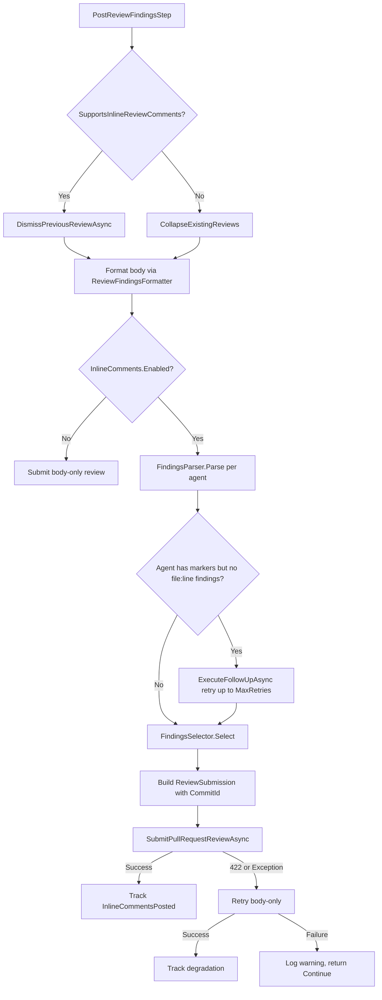

# Inline Comments Implementation Details

Internal reference for the inline review comments feature implementation.

## FindingsParser

Recognizes four file:line reference formats:
- `path/to/file.cs:42`
- `path/to/file.cs#L42`
- `path/to/file.cs (line 42)`
- `path/to/file.cs, line 42`

## Inline Comment Flow

The full flow within `PostReviewFindingsStep`:

```
Parse → Filter → Cap → Consolidate → Submit
```



### Steps

1. **Dismiss/Collapse** — If the provider supports inline reviews, dismiss previous bot reviews via the Reviews API. Otherwise, collapse existing review comments.
2. **Format body** — Generate the summary body via `ReviewFindingsFormatter.Format`.
3. **Check enabled** — If `InlineComments.Enabled` is `false`, submit body-only and return.
4. **Parse** — Run `FindingsParser.Parse` on each agent's output to extract `StructuredFinding` entries.
5. **Retry** — For agents that produced severity markers but no file:line references, invoke `ExecuteFollowUpAsync` up to `MaxRetries` times.
6. **Select** — `FindingsSelector` applies: filter by `SeverityThreshold` → stable sort by severity → cap at `MaxInlineComments` → consolidate same file:line.
7. **Submit** — Build a `ReviewSubmission` with the body, inline comments, and HEAD commit SHA.
8. **Degrade** — On HTTP 422 or exception, retry once body-only. If that fails, log warning and return `StepResult.Continue`.

## Per-Agent Retry

- Retries are per-agent, not global
- Each retry invokes `ExecuteFollowUpAsync` — fresh LLM call with original output + reformat instructions
- Counter capped at `MaxRetries` (default: 1)
- Retries are sequential

## Degradation Scenarios

| Scenario | Behavior |
|----------|----------|
| Agent doesn't produce structured output after retries | Body summary only |
| GitHub returns HTTP 422 | Retry once body-only |
| Body-only retry also fails | Log warning, step returns `Continue` |
| `SupportsInlineReviewComments` is `false` | Inline comments rendered in body under "📍 Findings by Location" |
| `InlineComments.Enabled` is `false` | Pre-feature behavior (body-only) |

## PipelineRun Tracking

| Property | Type | Description |
|----------|------|-------------|
| `InlineCommentsPosted` | `int` | Inline comments successfully submitted |
| `InlineCommentsDegraded` | `bool` | Whether fallback to body-only occurred |
| `InlineCommentsDegradedReason` | `string?` | Reason for degradation |

## SupportsInlineReviewComments

```csharp
bool SupportsInlineReviewComments => false; // default: conservative
```

- GitHub provider returns `true`
- GitLab provider returns `true`
- Default returns `false`

When `false` but findings have location metadata, a "📍 Findings by Location" section is appended to the body.

## Stale Review Handling

- **GitHub (inline-capable)**: `DismissPreviousReviewAsync` dismisses all previous bot reviews with `<!-- agent:pr-review -->` marker.
- **Non-inline providers**: Collapses previous reviews in `<details>` blocks with `<!-- agent:pr-review-superseded -->` marker.

## InlineCommentSettings

```json
{
  "CodeReview": {
    "InlineComments": {
      "Enabled": true,
      "SeverityThreshold": "Warning",
      "MaxInlineComments": 15,
      "OrderBySeverity": true,
      "MaxRetries": 1
    }
  }
}
```

Existing config files without `InlineComments` key deserialize to defaults (`Enabled = true`). Ranges validated at usage time via `Math.Clamp`.
