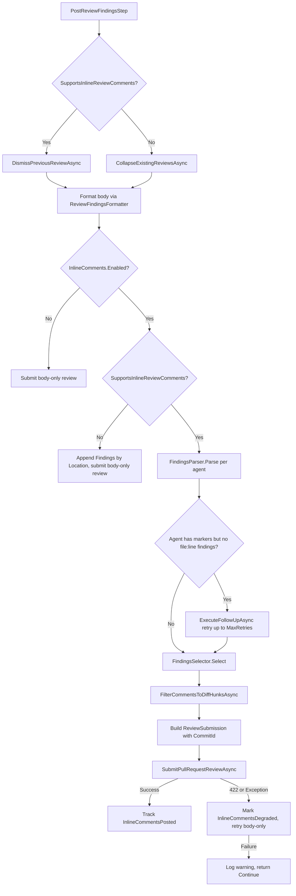

# Inline Comments Implementation Details

Internal reference for the inline review comments feature implementation.

## FindingsParser

A finding is a line whose first token is a severity marker (`[CRITICAL]`, `[WARNING]` or `[SUGGESTION]`, any case). Indentation, a list bullet or number, heading hashes, bold or a code span may come before the marker. A marker anywhere else on a line is prose that names a severity ("No [CRITICAL] issues", `// TODO [WARNING]: …`) and is not a finding. A finding line that carries the upper-case word `RESOLVED` reports a prior finding as fixed and is skipped. `SeverityParser` counts the same lines, so the severity table, the review type and the fix-prompt decision always match the parsed findings.

Recognizes four file:line reference formats:
- `path/to/file.cs:42`
- `path/to/file.cs#L42`
- `path/to/file.cs (line 42)`
- `path/to/file.cs, line 42`

## Inline Comment Flow

The full flow within `PostReviewFindingsStep`:

```
Parse → Filter → Cap → Consolidate → Submit
```


```mermaid
flowchart TD
    A[PostReviewFindingsStep] --> B{SupportsInlineReviewComments?}
    B -->|Yes| C[DismissPreviousReviewAsync]
    B -->|No| D[CollapseExistingReviewsAsync]
    C --> E[Format body via ReviewFindingsFormatter]
    D --> E
    E --> F{InlineComments.Enabled?}
    F -->|No| G[Submit body-only review]
    F -->|Yes| F2{SupportsInlineReviewComments?}
    F2 -->|No| G2[Append Findings by Location, submit body-only review]
    F2 -->|Yes| H[FindingsParser.Parse per agent]
    H --> I{Agent has markers but no file:line findings?}
    I -->|Yes| J[ExecuteFollowUpAsync retry up to MaxRetries]
    I -->|No| K[FindingsSelector.Select]
    J --> K
    K --> K2[FilterCommentsToDiffHunksAsync]
    K2 --> L[Build ReviewSubmission with CommitId]
    L --> M[SubmitPullRequestReviewAsync]
    M -->|Success| N[Track InlineCommentsPosted]
    M -->|422 or Exception| O[Mark InlineCommentsDegraded, retry body-only]
    O -->|Failure| Q[Log warning, return Continue]
```

### Steps

1. **Dismiss/Collapse** — If the provider supports inline reviews, dismiss (GitHub) or resolve (GitLab) the previous bot reviews. Otherwise, collapse existing review comments.
2. **Format body** — Generate the summary body via `ReviewFindingsFormatter.Format`.
3. **Check enabled** — If `InlineComments.Enabled` is `false`, submit body-only and return.
4. **Provider without inline support** — Append the "Findings by Location" section to the body and submit it body-only; steps 5-10 are skipped.
5. **Parse** — Run `FindingsParser.Parse` on each agent's output to extract `StructuredFinding` entries.
6. **Retry** — For agents that produced severity markers but no file:line references, invoke `ExecuteFollowUpAsync` up to `MaxRetries` times.
7. **Select** — `FindingsSelector` applies: filter by `SeverityThreshold` → stable sort by severity → cap at `MaxInlineComments` → consolidate same file:line.
8. **Filter to the diff** — `FilterCommentsToDiffHunksAsync` reads `.agent/full-diff.txt` and keeps only the comments whose file and line lie inside a diff hunk (parsed by `DiffHunkParser`), because GitHub answers HTTP 422 for a line outside the diff. A dropped comment is not posted inline, and its finding stays in the per-agent sections of the review body. If the diff file is missing or cannot be parsed, all comments are submitted unfiltered. `InlineCommentsPosted` counts the comments that passed this filter.
9. **Submit** — Build a `ReviewSubmission` with the body, inline comments, and HEAD commit SHA.
10. **Degrade** — On HTTP 422 or exception, retry once body-only. If that fails, log warning and return `StepResult.Continue`.

## Per-Agent Retry

- Retries are per-agent, not global
- Each retry invokes `ExecuteFollowUpAsync` — a fresh LLM call (no session resume) with the agent's output and the reformat instructions. The first retry gets the original output; a later retry gets the reply of the previous retry. The output is cut to 8000 characters in the prompt.
- Counter capped at `MaxRetries` (default: 1)
- Retries are sequential

## Degradation Scenarios

| Scenario | Behavior |
|----------|----------|
| Agent doesn't produce structured output after retries | Body summary only |
| GitHub returns HTTP 422 | Retry once body-only |
| Body-only retry also fails | Log warning, step returns `Continue` |
| `SupportsInlineReviewComments` is `false` | Inline comments rendered in body under "📍 Findings by Location" |
| `InlineComments.Enabled` is `false` | Pre-feature behavior (body-only) |

## PipelineRun Tracking

| Property | Type | Description |
|----------|------|-------------|
| `InlineCommentsPosted` | `int` | Inline comments successfully submitted |
| `InlineCommentsDegraded` | `bool` | Whether fallback to body-only occurred |
| `InlineCommentsDegradedReason` | `string?` | Reason for degradation |

## SupportsInlineReviewComments

```csharp
bool SupportsInlineReviewComments => false; // default: conservative
```

- GitHub provider returns `true`
- GitLab provider returns `true`
- Default returns `false`

When `false` but findings have location metadata, a "📍 Findings by Location" section is appended to the body.

## Stale Review Handling

- **GitHub (inline-capable)**: `DismissPreviousReviewAsync` dismisses the previous reviews that carry the `<!-- agent:pr-review -->` marker and are in the Changes requested or Approved state. GitHub cannot dismiss a review that was submitted as a plain comment, so those stay.
- **GitLab (inline-capable)**: the same method resolves every discussion thread that contains the marker.
- **Non-inline providers**: Collapses previous reviews in `<details>` blocks with `<!-- agent:pr-review-superseded -->` marker.

## InlineCommentSettings

```json
{
  "CodeReview": {
    "InlineComments": {
      "Enabled": true,
      "SeverityThreshold": "Warning",
      "MaxInlineComments": 15,
      "OrderBySeverity": true,
      "MaxRetries": 1
    }
  }
}
```

Existing config files without `InlineComments` key deserialize to defaults (`Enabled = true`). Ranges are `[Range]` attributes (`MaxInlineComments` 1-50, `MaxRetries` 0-5), checked when settings are saved; usage also clamps with `Math.Clamp`.
