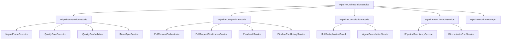

# Pipeline Orchestration — Facade Decomposition

Internal reference for the `PipelineOrchestrationService` facade architecture.

## Motivation

`PipelineOrchestrationService` historically accumulated dependencies for every pipeline phase (execution, completion, cancellation, state management). This produced a constructor with 12+ parameters — a violation of Seemann's Constructor Over-Injection heuristic indicating too many responsibilities in one class.

The decomposition applies the **Facade Service pattern** (Mark Seemann, "Dependency Injection: Principles, Practices, and Patterns"): group related dependencies into aggregate services that expose their members as properties. The orchestrator's constructor shrinks while each facade serves as a named, cohesive unit.

## Architecture



## Components

### PipelineOrchestrationService

The top-level coordinator. Manages provider resolution, issue parsing, execution orchestration, and label swaps. Constructor dependencies:

| Dependency | Purpose |
|-----------|---------|
| `IConfigurationStore` | Load pipeline configuration |
| `IProviderFactory` | Create typed providers (issue, repo, agent, brain, CI) |
| `IssueDescriptionParser` | Parse issue body into structured sections |
| `IPipelineExecutionFacade` | Delegate execution-phase work |
| `IPipelineCompletionFacade` | Delegate PR creation/finalization |
| `IPipelineCancellationFacade` | Delegate shutdown cancellation |
| `PipelineRunLifecycleService` | Run state, transitions, events |
| `ILabelSwapper` | Swap issue labels during pipeline lifecycle |
| `ILogger` | Structured logging |

Also creates `PipelineProviderManager` internally for provider lifecycle tracking.

### IPipelineExecutionFacade

Groups services that participate in pipeline step execution.

| Member | Service | Responsibility |
|--------|---------|---------------|
| `AgentExecution` | `IAgentPhaseExecutor` | Executes agent analysis/implementation/review phases |
| `QualityGates` | `IQualityGateExecutor` | Runs quality gate checks (build, test, coverage) |
| `QualityGateValidator` | `IQualityGateValidator?` | Validates quality gate prerequisites (baseline checks). Nullable — not configured in all modes |
| `BrainSync` | `IBrainSyncService` | Brain repository pull/push operations |

### IPipelineCompletionFacade

Groups services involved in post-execution PR creation and finalization.

| Member | Service | Responsibility |
|--------|---------|---------------|
| `PrOrchestrator` | `PullRequestOrchestrator` | Creates pull requests (normal or draft) |
| `Finalization` | `PullRequestFinalizationService` | Post-PR sequences: brain push, feedback, workspace cleanup |
| `FeedbackService` | `FeedbackService` | Generates and posts agent feedback/reflection |
| `HistoryService` | `IPipelineRunHistoryService` | Persists run history, workspace cleanup |

### IPipelineCancellationFacade

Groups services for graceful shutdown coordination.

| Member | Service | Responsibility |
|--------|---------|---------------|
| `DedupGuard` | `IJobDeduplicationGuard?` | Guards against duplicate issue dispatch. Nullable when not configured |
| `AgentCancellation` | `IAgentCancellationSender?` | Sends cancel signals to remote agents. Nullable when not configured |

### PipelineRunLifecycleService

The largest extraction — owns ALL run state management previously embedded in the orchestrator:

- **Run state** — `ActiveRun`, `IsRunning`, `HasAnyActiveRuns`
- **State transitions** — `TransitionTo()`, `FailRunAsync()`
- **Events** — `OnChange`, `OnOutputLine`, `OnChatResponse`, `OnChatCompleted`
- **Cancellation** — `CreateLinkedCancellationToken()`, `CancelPipelineAsync()`
- **Dispatched run tracking** — `RegisterDispatchedRun()`, `MarkAgentRunsCancelled()`
- **History** — `AddRunToHistory()`

The orchestrator delegates all state/event access to this service via forwarding properties and methods.

### PipelineProviderManager

Created internally (not injected) by the orchestrator. Manages provider resolution and disposal during pipeline execution.

## DI Registration

All facades are registered as singletons in `ServiceCollectionExtensions.AddPipelineCoreServices()`:

```csharp
services.AddSingleton<IPipelineExecutionFacade>(sp => new PipelineExecutionFacade(
    sp.GetRequiredService<IAgentPhaseExecutor>(),
    sp.GetRequiredService<IQualityGateExecutor>(),
    sp.GetRequiredService<IQualityGateValidator>(),
    sp.GetRequiredService<IBrainSyncService>()));

services.AddSingleton<IPipelineCompletionFacade>(sp => new PipelineCompletionFacade(
    sp.GetRequiredService<PullRequestOrchestrator>(),
    sp.GetRequiredService<PullRequestFinalizationService>(),
    sp.GetRequiredService<FeedbackService>(),
    sp.GetRequiredService<IPipelineRunHistoryService>()));

services.AddSingleton<IPipelineCancellationFacade>(sp => new PipelineCancellationFacade(
    sp.GetRequiredService<IJobDeduplicationGuard>(),
    sp.GetRequiredService<IAgentCancellationSender>()));
```

## File Locations

| Component | Path |
|-----------|------|
| `IPipelineExecutionFacade` | `src/CodingAgentWebUI.Pipeline/Interfaces/IPipelineExecutionFacade.cs` |
| `IPipelineCompletionFacade` | `src/CodingAgentWebUI.Pipeline/Interfaces/IPipelineCompletionFacade.cs` |
| `IPipelineCancellationFacade` | `src/CodingAgentWebUI.Pipeline/Interfaces/IPipelineCancellationFacade.cs` |
| `PipelineExecutionFacade` | `src/CodingAgentWebUI.Pipeline/Services/PipelineExecutionFacade.cs` |
| `PipelineCompletionFacade` | `src/CodingAgentWebUI.Pipeline/Services/PipelineCompletionFacade.cs` |
| `PipelineCancellationFacade` | `src/CodingAgentWebUI.Pipeline/Services/PipelineCancellationFacade.cs` |
| `PipelineRunLifecycleService` | `src/CodingAgentWebUI.Pipeline/Services/PipelineRunLifecycleService.cs` |
| `PipelineOrchestrationService` | `src/CodingAgentWebUI.Pipeline/Services/PipelineOrchestrationService.cs` |
| DI Registration | `src/CodingAgentWebUI/ServiceCollectionExtensions.cs` |
