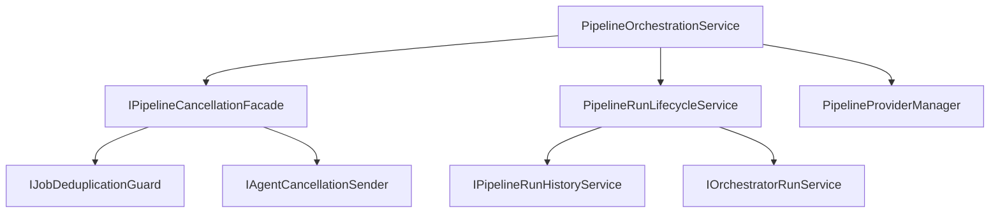

# Pipeline Orchestration — Cancellation Facade

Internal reference for the `IPipelineCancellationFacade` used by `PipelineOrchestrationService`.

## Motivation

`PipelineOrchestrationService` originally had three facade dependencies: execution, completion, and cancellation facades. The execution and completion facades were removed in issue #1732 after the pipeline execution path was refactored — `PipelineOrchestrationService` no longer handles pipeline execution (that's delegated to `DispatchRunCreationService` and remote agents). The cancellation facade remains because the orchestrator's `CancelActiveAgentRunsAsync` method actively uses both `AgentCancellation` and `DedupGuard` members.

## Architecture


```mermaid
flowchart TD
    POS[PipelineOrchestrationService]
    POS --> CAF[IPipelineCancellationFacade]
    POS --> LC[PipelineRunLifecycleService]
    POS --> PM[PipelineProviderManager]

    CAF --> DDG[IJobDeduplicationGuard]
    CAF --> ACS[IAgentCancellationSender]

    LC --> HIS[IPipelineRunHistoryService]
    LC --> ORS[IOrchestratorRunService]
```

## Components

### PipelineOrchestrationService

The top-level coordinator. Handles cancellation and graceful shutdown. Constructor dependencies:

| Dependency | Purpose |
|-----------|---------|
| `IConfigurationStore` | Load provider configurations |
| `IProviderFactory` | Create typed providers (issue, repo, agent, brain, CI) |
| `IPipelineCancellationFacade` | Delegate shutdown cancellation |
| `PipelineRunLifecycleService` | Run state, transitions, events |
| `ILabelService` | Swap issue labels during pipeline lifecycle |
| `ILogger` | Structured logging |

Also creates `PipelineProviderManager` internally for provider lifecycle tracking.

### IPipelineCancellationFacade

Groups services for graceful shutdown coordination.

| Member | Service | Responsibility |
|--------|---------|---------------|
| `DedupGuard` | `IJobDeduplicationGuard?` | Guards against duplicate issue dispatch. Nullable when not configured |
| `AgentCancellation` | `IAgentCancellationSender?` | Sends cancel signals to remote agents. Nullable when not configured |

### PipelineRunLifecycleService

Owns run state management:

- **Run state** — `ActiveRun`, `IsRunning`, `HasAnyActiveRuns`
- **State transitions** — `TransitionTo()`, `FailRunAsync()`
- **Events** — `OnChange`, `OnOutputLine`, `OnChatResponse`, `OnChatCompleted`
- **Cancellation** — `CreateLinkedCancellationToken()`, `CancelPipelineAsync()`
- **Dispatched run tracking** — `RegisterDispatchedRun()`, `MarkAgentRunsCancelled()`
- **History** — `AddRunToHistory()`

### PipelineProviderManager

Created internally (not injected) by the orchestrator. Manages provider resolution and disposal during pipeline execution.

## DI Registration

Registered as a singleton in `ServiceCollectionExtensions.RegisterPipelineFacades()` at `src/CodingAgentWebUI/ServiceCollectionExtensions.PipelineFacades.cs`:

```csharp
services.AddSingleton<IPipelineCancellationFacade>(sp => new PipelineCancellationFacade(
    sp.GetRequiredService<IJobDeduplicationGuard>(),
    sp.GetRequiredService<IAgentCancellationSender>()));
```

## File Locations

| Component | Path |
|-----------|------|
| `IPipelineCancellationFacade` | `src/CodingAgentWebUI.Pipeline/Interfaces/IPipelineCancellationFacade.cs` |
| `PipelineCancellationFacade` | `src/CodingAgentWebUI.Pipeline/Services/PipelineCancellationFacade.cs` |
| `PipelineRunLifecycleService` | `src/CodingAgentWebUI.Pipeline/Services/PipelineRunLifecycleService.cs` |
| `PipelineOrchestrationService` | `src/CodingAgentWebUI.Pipeline/Services/PipelineOrchestrationService.cs` |
| DI Registration | `src/CodingAgentWebUI/ServiceCollectionExtensions.PipelineFacades.cs` |