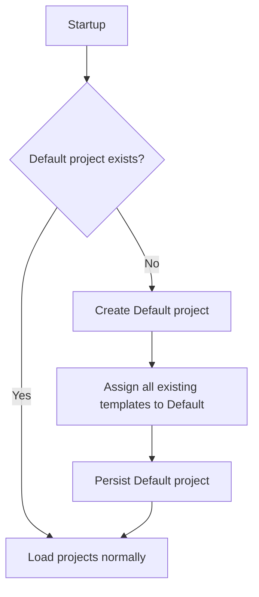
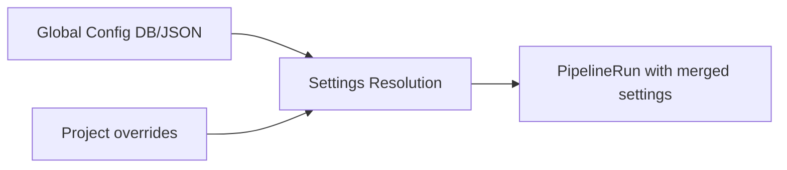

# Projects — Internal Details

Internal reference for project system implementation specifics.

## Migration Behavior

On first startup (or upgrade from pre-projects version):



The migration is idempotent — running it multiple times produces the same result. In DB mode, templates are stored in the PostgreSQL database; in legacy file-based mode, they were stored in `config/pipeline/` JSON files. Projects hold ownership IDs referencing templates.

## Pipeline Loop Integration

The pipeline loop iterates projects instead of reading templates directly from the global config:

```
foreach project in enabled projects (ordered by creation):
    foreach template in project.TemplateIds (ordered by position):
        if template.Enabled:
            apply project settings overrides
            poll for work (issues, PRs, epics)
```

- Disabled projects skip all templates within them
- Template ordering within a project determines poll priority
- Orphaned templates (data corruption) are auto-assigned to the Default project on load

## Observability Tags

Pipeline runs carry project metadata for filtering:

| Field | Source | Description |
|-------|--------|-------------|
| `ProjectId` | `PipelineRun.ProjectId` | Project GUID (set at dispatch) |
| `ProjectName` | `PipelineRun.ProjectName` | Human-readable name |
| OpenTelemetry tag | `pipeline.project_id` | On all trace spans |
| OpenTelemetry tag | `pipeline.project_name` | On all trace spans |
| Metric dimension | `pipeline.project_id` | On token/cost counters |
| Metric dimension | `pipeline.project_name` | On token/cost counters |

## Data Flow (Mono-Repo)


