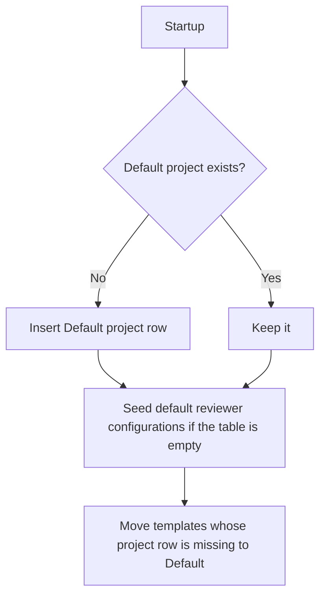
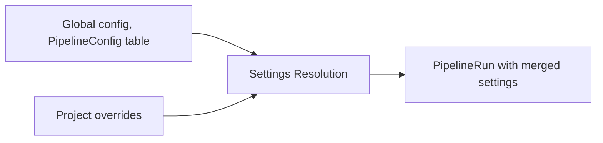

# Projects — Internal Details

Internal reference for project system implementation specifics.

## Migration Behavior

On every startup, the API startup seed step creates the Default project row if absent and calls `ClaimOrphanedTemplatesAsync` to reparent any orphaned templates:


```mermaid
flowchart TD
    A[Startup] --> B{Default project exists?}
    B -->|No| D[Insert Default project row]
    B -->|Yes| C[Keep it]
    D --> E[Seed default reviewer configurations if the table is empty]
    C --> E
    E --> F[Move templates whose project row is missing to Default]
```

The migration is idempotent — running it multiple times produces the same result.

## Membership

Each template row (`PipelineJobTemplates.ProjectId`) records its project, and that is the only record of membership. `PipelineProject.TemplateIds` is filled from it when projects are loaded, ordered by `TemplateOrder` (name ignoring case, then exact name, then ID), and ignored when a project is saved. Moving a template changes one row.

## Pipeline Loop Integration

The pipeline loop iterates projects instead of reading templates directly from the global config:

```
foreach project in enabled projects (ordered by name, ordinal comparison):
    foreach template in project.TemplateIds (ordered by name):
        if template.Enabled:
            apply project settings overrides
            poll for work (issues, PRs, epics)
```

- Disabled projects skip all templates within them
- Template ordering within a project determines poll priority
- Templates of a deleted project move to the Default project; the startup repair (`ClaimOrphanedTemplatesAsync`) also moves templates whose project row is missing

## Observability Tags

Pipeline runs carry project metadata for filtering:

| Field | Source | Description |
|-------|--------|-------------|
| `ProjectId` | `PipelineRun.ProjectId` | Project GUID (set at dispatch) |
| `ProjectName` | `PipelineRun.ProjectName` | Human-readable name |
| OpenTelemetry tag | `pipeline.project_id` | On all trace spans |
| OpenTelemetry tag | `pipeline.project_name` | On all trace spans |
| Metric dimension | `pipeline.project_name` | On `pipeline.run.outcomes` only. The token and cost counters (`pipeline.run.tokens`, `pipeline.run.cost_usd`) are tagged by `run_type`, `phase` and `provider`, and no metric has `pipeline.project_id` |

## Data Flow (Mono-Repo)


```mermaid
flowchart LR
    Global[Global config, PipelineConfig table] --> Resolve[Settings Resolution]
    Project[Project overrides] --> Resolve
    Resolve --> Run[PipelineRun with merged settings]
```
