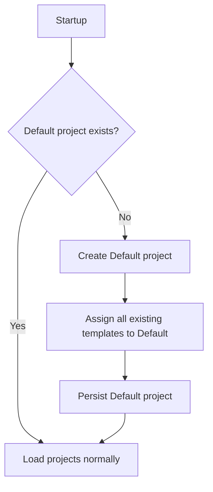
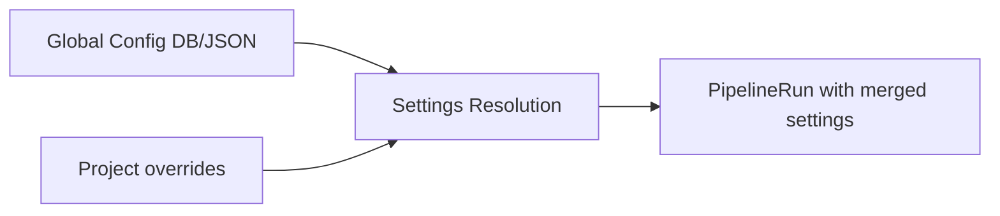

# Projects — Internal Details

Internal reference for project system implementation specifics.

## Migration Behavior

On first startup (or upgrade from pre-projects version):


```mermaid
flowchart TD
    A[Startup] --> B{Default project exists?}
    B -->|Yes| C[Load projects normally]
    B -->|No| D[Create Default project]
    D --> E[Assign all existing templates to Default]
    E --> F[Persist Default project]
    F --> C
```

The migration is idempotent — running it multiple times produces the same result. In DB mode, templates are stored in the PostgreSQL database; in legacy file-based mode, they were stored in `config/pipeline/` JSON files (historical only — file-based mode is no longer supported).

## Membership

Each template row (`PipelineJobTemplates.ProjectId`) records its project, and that is the only record of membership. `PipelineProject.TemplateIds` is filled from it when projects are loaded, ordered by `TemplateOrder` (name ignoring case, then exact name, then ID), and ignored when a project is saved. Moving a template changes one row.

Until the `RemoveProjectTemplateIds` migration, the project row also stored an ordered `TemplateIds` list, and the Settings JSON a copy of it. The loop and the UI followed the list, so the migration kept what the loop did:

- a template no project listed was never polled, so it is disabled, and shows up again;
- a template a project listed moves to that project (a project other than Default first, then the first by name);
- a template whose project no longer exists moves to the Default project.

## Pipeline Loop Integration

The pipeline loop iterates projects instead of reading templates directly from the global config:

```
foreach project in enabled projects (ordered alphabetically by name):
    foreach template in project.TemplateIds (ordered by name):
        if template.Enabled:
            apply project settings overrides
            poll for work (issues, PRs, epics)
```

- Disabled projects skip all templates within them
- Template ordering within a project determines poll priority
- Templates of a deleted project move to the Default project; the startup repair (`ClaimOrphanedTemplatesAsync`) also moves templates whose project row is missing

## Observability Tags

Pipeline runs carry project metadata for filtering:

| Field | Source | Description |
|-------|--------|-------------|
| `ProjectId` | `PipelineRun.ProjectId` | Project GUID (set at dispatch) |
| `ProjectName` | `PipelineRun.ProjectName` | Human-readable name |
| OpenTelemetry tag | `pipeline.project_id` | On all trace spans |
| OpenTelemetry tag | `pipeline.project_name` | On all trace spans |
| Metric dimension | `pipeline.project_id` | On token/cost counters |
| Metric dimension | `pipeline.project_name` | On token/cost counters |

## Data Flow (Mono-Repo)


```mermaid
flowchart LR
    Global[Global Config DB/JSON] --> Resolve[Settings Resolution]
    Project[Project overrides] --> Resolve
    Resolve --> Run[PipelineRun with merged settings]
```
