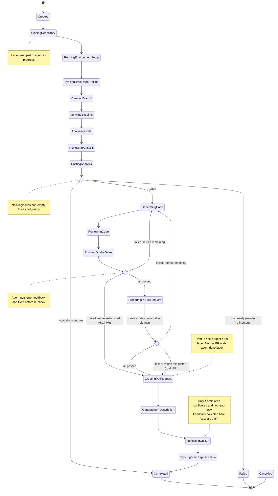
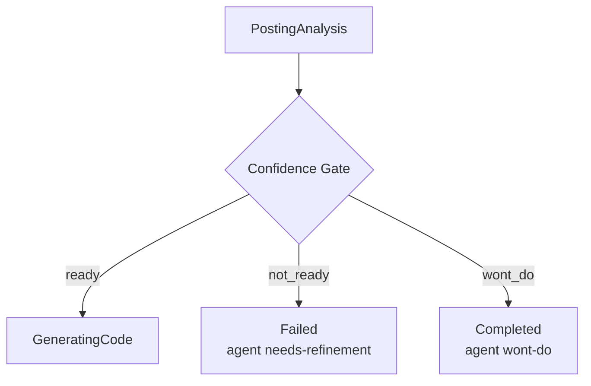
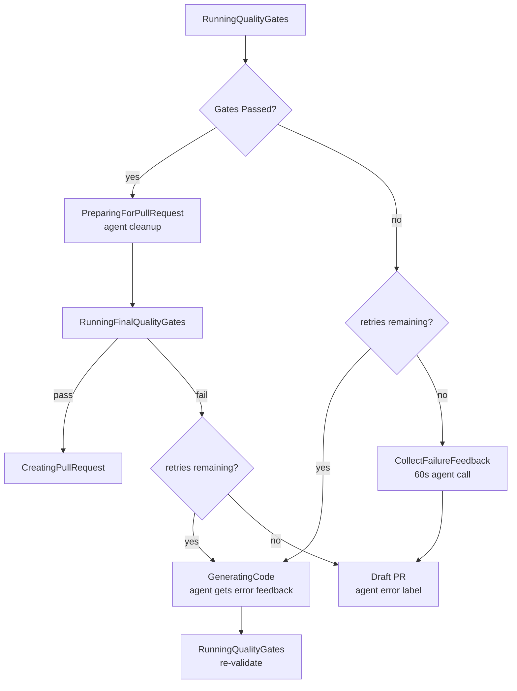
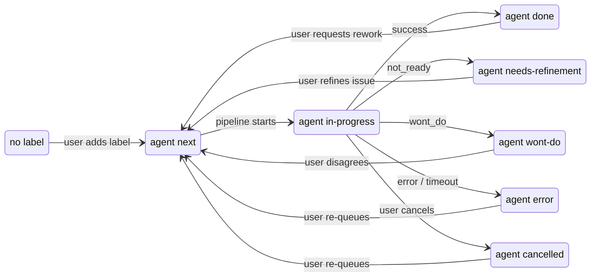
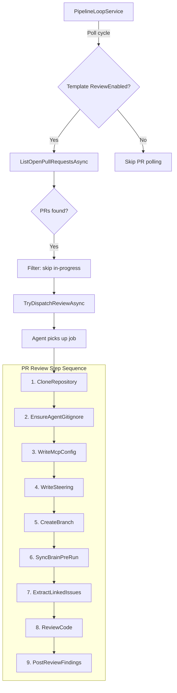
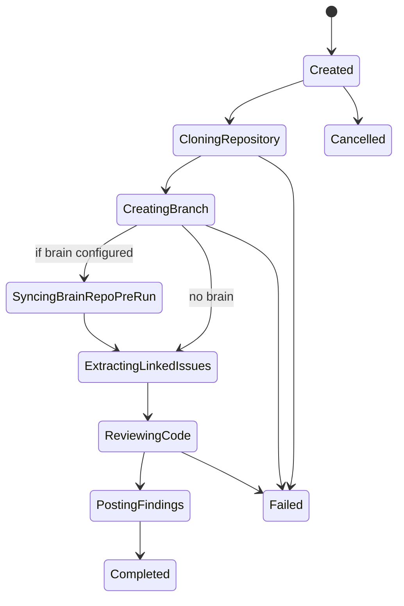
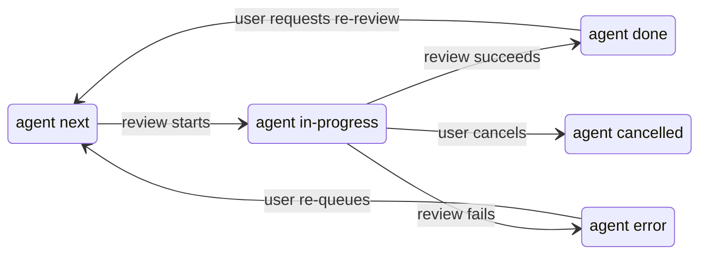
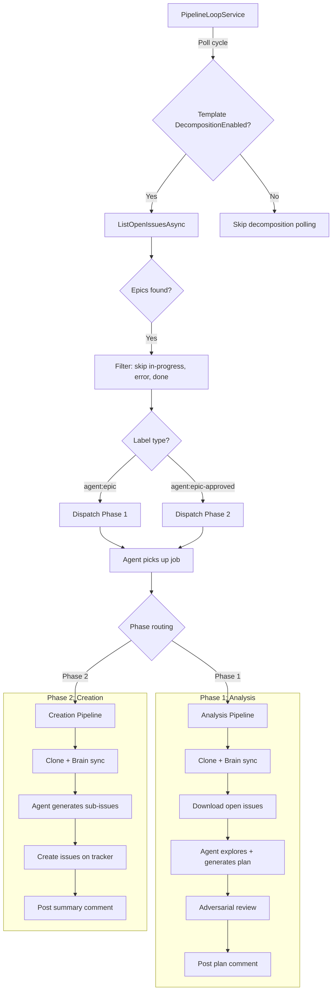
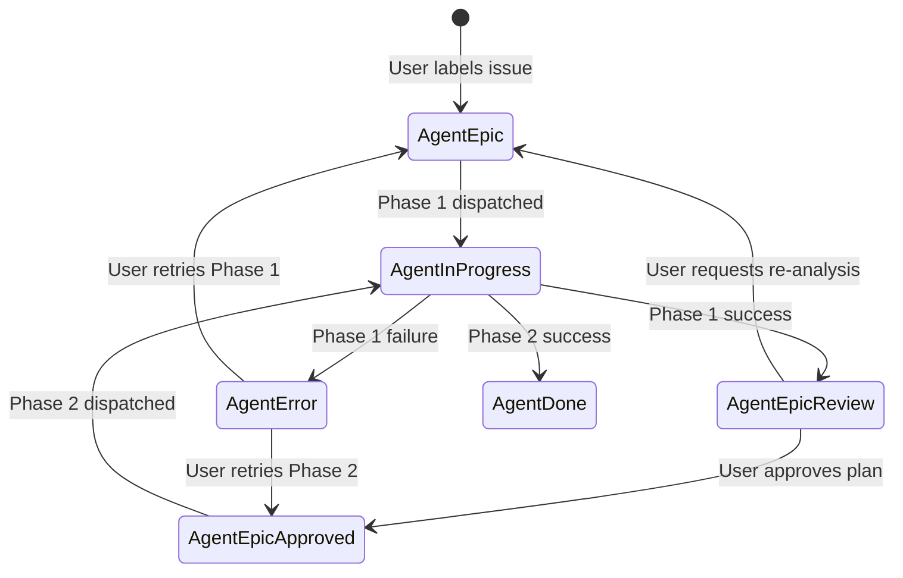

# Pipeline Orchestration

The pipeline is a state machine that progresses through a fixed sequence of steps, with decision points that can branch to terminal states. There are three pipeline workflows:

1. **Implementation pipeline** — Processes issues through analysis, code generation, quality gates, and PR creation
2. **PR review pipeline** — Processes pull requests through code review and posts findings (see [PR Review Pipeline](#pr-review-pipeline) below)
3. **Epic decomposition pipeline** — Processes epics through a two-phase workflow producing implementation-ready sub-issues (see [Epic Decomposition Pipeline](#epic-decomposition-pipeline) below)

All three workflows share the same dispatch mechanism, label lifecycle, and agent infrastructure.

## Dispatch Modes

The pipeline supports three dispatch modes, selected automatically based on configuration:

| Mode | Trigger | Description |
|------|---------|-------------|
| **Legacy** | No `Database__ConnectionString` set | In-memory state + direct SignalR push. `AgentJobDispatcher` creates the PipelineRun and sends `JobAssignmentMessage` in one atomic operation. |
| **DB+SignalR** | `Database__ConnectionString` set, no K8s | `DispatchOrchestrationService` prepares the request (creates PipelineRun, resolves providers, vends tokens), then `SignalRWorkDistributor` persists a WorkItem row and pushes via SignalR. |
| **DB+Kubernetes** | `workDistribution.mode=Kubernetes` | Same orchestration, but `KubernetesWorkDistributor` creates a WorkItem row and a K8s Job picks it up. |

In DB+SignalR mode, the dispatch chain ensures a single ID flows end-to-end:

```
PipelineRun.RunId (orchestration) = WorkItem.Id (DB) = JobAssignmentMessage.JobId (agent) = hub GetRun(jobId)
```

This ID alignment is critical — hub methods (`RequestTokenRefresh`, `ReportStepTransition`, `ReportJobCompleted`) look up the PipelineRun by the agent's `jobId`. If these don't match, the hub returns "No active run found".

See also: [Configuration](configuration.md) for all pipeline settings, and [Issue Workflows](github-issue-workflows.md) for how users interact with the pipeline via labels.



## Pipeline Steps

```
Created → CloningRepository → RunningEnvironmentSetup → SyncingBrainRepoPreRun → CreatingBranch
  → VerifyingBaseline → AnalyzingCode → ReviewingAnalysis → PostingAnalysis → [Confidence Gate]
  → GeneratingCode → ReviewingCode → RunningQualityGates → [Quality Gate Decision]
  → PreparingForPullRequest → [Final Quality Gate]
  → CreatingPullRequest → GeneratingPrDescription → ReflectingOnRun → SyncingBrainRepoPostRun → Completed
```

Each step is represented by the `PipelineStep` enum. The pipeline tracks both the current step and a `HighWaterMark` (highest step ever reached), which the UI uses to show revisited steps during retries.

## State Descriptions

| Step | What Happens |
|------|-------------|
| **Created** | Run initialized, providers resolved and validated |
| **CloningRepository** | Repository cloned to a fresh workspace directory. Label swapped to `agent:in-progress` |
| **RunningEnvironmentSetup** | Executes provider-defined setup steps (e.g., package restore, auth configuration) with injected secrets. Non-fatal steps abort the run on non-zero exit |
| **SyncingBrainRepoPreRun** | Brain repository synced into workspace (if configured). Non-fatal on failure |
| **CreatingBranch** | Feature branch created from default branch (format: `feature/auto-{issueNumber}-{slug}-{runId}`) |
| **VerifyingBaseline** | Baseline health check — runs build/tests on the default branch before the agent writes code. Catches broken base branches early. Skipped when `BaselineHealthCheckEnabled` is false |
| **AnalyzingCode** | Agent analyzes the issue and codebase, writes `analysis.md` and `analysis-assessment.json` |
| **ReviewingAnalysis** | Adversarial review of the analysis — validates completeness, flags gaps (when `AnalysisReviewEnabled` is true) |
| **PostingAnalysis** | Analysis comment posted to the GitHub issue |
| **GeneratingCode** | Agent implements the changes. Also used during quality gate retries |
| **ReviewingCode** | Multi-agent code review: each review agent writes findings, then a fix agent addresses `[CRITICAL]` items |
| **RunningQualityGates** | Build, tests, coverage, and external CI checks run |
| **PreparingForPullRequest** | Agent cleans up the working directory (removes debug artifacts, unused code, formatting). Quality gates run one final time after cleanup |
| **CreatingPullRequest** | PR created (normal or draft). Blacklisted file detection happens here |
| **GeneratingPrDescription** | Agent generates a structured PR description summarizing the changes (non-fatal on failure) |
| **ReflectingOnRun** | Agent reviews the entire run and enriches `.brain/` knowledge (if brain repo configured). Feedback collected here — questions appended to the reflection prompt |
| **SyncingBrainRepoPostRun** | Brain updates committed and pushed to brain repository |
| **Completed** | Terminal state — run succeeded (or `wont_do` assessment) |
| **Failed** | Terminal state — unrecoverable error or retries exhausted |
| **Cancelled** | Terminal state — user cancelled the run |

## Confidence Gate

After the analysis phase, the pipeline evaluates the agent's structured assessment (`analysis-assessment.json`):



- **`ready`** — proceed to code generation
- **`not_ready`** — abort, label `agent:needs-refinement`, post blocking issues to GitHub
- **`wont_do`** — mark Completed, label `agent:wont-do`, post reasoning to GitHub

Override rule: if `blockingIssues` is non-empty, the gate forces `not_ready` regardless of the recommendation value. Unknown recommendation values (e.g. typos) fall through as `ready` (fail-open design).

## Quality Gate Retry Loop

After code generation and review, quality gates run. If they fail, the pipeline enters a retry loop:



Quality gates checked (in order):
1. **Compilation** — Build command must succeed with 0 errors
2. **Tests** — Test command must have 0 failures
3. **Coverage** — Code coverage must meet `coverageThreshold` (if configured). Supports Cobertura XML (Python, .NET) and JaCoCo XML (Java) formats
4. **External CI** — External CI pipeline must pass (if enabled). Requires commit + push before checking

External CI is only evaluated after local gates (compilation, tests, coverage) pass. If external CI fails, it does not enter the agent retry loop — the failure goes straight to a draft PR. Only local gate failures trigger retries with agent error feedback.

The retry prompt includes the full gate failure details and points the agent to diagnostic output files. Each retry attempt is a `--resume` call, so the agent has full conversation history.

If all retries are exhausted, a **draft PR** is created with the failing code, and the issue is labeled `agent:error`.

## Label Transitions



Re-queueing from `agent:error` or `agent:needs-refinement` requires manual dispatch via the web UI — closed-loop mode skips issues that still carry these labels. Re-queueing from `agent:wont-do` or `agent:cancelled` works in both manual and closed-loop modes.

## Error Handling

Any step can transition to `Failed` on error. The pipeline catches exceptions at each phase boundary and records the failure reason. Specific behaviors:

- **Clone failure** — immediate fail, no retry
- **Analysis failure** — retries up to `maxAnalysisRetries` (assessment file missing, malformed JSON, analysis too short)
- **Agent timeout** — fail with exit code 124
- **Blacklisted files** — excluded from commits with a warning logged
- **External CI timeout** — treated as gate failure, enters retry loop
- **Cancellation** — `OperationCanceledException` caught at top level, label set to `agent:cancelled`

---

## PR Review Pipeline

The PR review pipeline is a parallel workflow that processes pull requests for automated code review. It reuses the same dispatch mechanism (`agent:next` label polling), the same step execution pattern, and the same agent execution infrastructure — but with a shorter step sequence that skips analysis, code generation, and quality gates.

### Overview



### Review Step Sequence

| # | Step | Description |
|---|------|-------------|
| 1 | `CloneRepositoryStep` | Clone the repository to a fresh workspace |
| 2 | `EnsureAgentGitignoreStep` | Ensure `.agent/` is in `.gitignore` |
| 3 | `WriteMcpConfigStep` | Write MCP server configuration for the agent |
| 4 | `WriteSteeringStep` | Write pipeline steering content to the workspace |
| 5 | `CreateBranchStep` | Check out the PR branch (rework path, skip merge from base) |
| 6 | `SyncBrainPreRunStep` | Sync brain repository if configured (non-fatal on failure) |
| 7 | `ExtractLinkedIssuesStep` | Extract linked issues, write context files, write PR conversation context |
| 8 | `ReviewCodeStep` | Resolve reviewer configs and execute multi-agent code review |
| 9 | `PostReviewFindingsStep` | Format findings and post as PR review comment |

### Review Run State Machine



> **Note:** Infrastructure steps (EnsureAgentGitignore, WriteMcpConfig, WriteSteering) execute between Clone and CreateBranch but do not have dedicated `PipelineStep` enum values — they run transparently within the `CloningRepository` phase.

### PR Label Lifecycle

PR review runs follow the same label lifecycle as implementation runs:



- **Dispatch**: `agent:next` → `agent:in-progress`
- **Success**: `agent:in-progress` → `agent:done`
- **Failure**: `agent:in-progress` → `agent:error`
- **Cancellation**: `agent:in-progress` → `agent:cancelled`

Re-review is always explicitly triggered by the user (remove `agent:done`, re-add `agent:next`). New commits alone do NOT trigger re-review.

### Loop Mode Configuration

Each `PipelineJobTemplate` has three independent toggles controlling which work types it processes:

| Property | Type | Default | Description |
|----------|------|---------|-------------|
| `ImplementationEnabled` | `bool` | `true` | Template polls for issues and dispatches implementation jobs |
| `ReviewEnabled` | `bool` | `true` | Template polls for PRs and dispatches review jobs |
| `DecompositionEnabled` | `bool` | `false` | Template polls for epics and dispatches decomposition jobs |

The existing `Enabled` property acts as a master switch — when `false`, all work types (implementation, review, and decomposition) are disabled regardless of individual flags.

#### Configuration Examples

**Both enabled (default):**
```json
{
  "Name": "Full Pipeline",
  "Enabled": true,
  "ImplementationEnabled": true,
  "ReviewEnabled": true
}
```

**Review-only template** (dedicated to PR reviews, no implementation):
```json
{
  "Name": "Review Only",
  "Enabled": true,
  "ImplementationEnabled": false,
  "ReviewEnabled": true
}
```

**Implementation-only template** (no PR reviews):
```json
{
  "Name": "Implementation Only",
  "Enabled": true,
  "ImplementationEnabled": true,
  "ReviewEnabled": false
}
```

Settings are read at the start of each poll cycle, allowing runtime changes via the configuration UI without restarting the loop.

### Dispatch Budget Sharing

When multiple work type loops are active, they share the `ClosedLoopMaxRunsPerCycle` budget. The pipeline alternates fairly between issue, PR, and decomposition queues (round-robin) to prevent starvation of any work type.

- Total dispatches per cycle never exceed `ClosedLoopMaxRunsPerCycle`
- All active queues get at least one dispatch when budget allows
- PRs are processed in FIFO order (oldest `CreatedAt` first)
- Draft PRs are included in review dispatch (a warning is shown in the UI)
- PRs with `agent:error`, `agent:in-progress`, `agent:done`, or `agent:cancelled` labels are skipped
- Decomposition dispatch is additionally gated by `MaxConcurrentDecompositions`

### Issue Dependency Tracking

Issues referencing `Blocked by #N`, `Depends on #N`, `Requires #N`, or `After #N` in their body are automatically held until all referenced issues are closed. See [Issue Workflows](github-issue-workflows.md) for the user-facing patterns.

### Linked Issue Extraction

The review pipeline extracts linked issues from the PR to provide requirements context to the review agent. This enables the reviewer to evaluate the PR against the original acceptance criteria.

#### Extraction Priority Order

Each repository provider implements its own extraction logic:

1. **Platform API** — Query the platform's linked/closing references API (e.g., GitHub timeline events)
2. **PR title parsing** — Scan the PR title for issue references
3. **PR body parsing** — Scan the PR body/description for issue references

#### Recognized Patterns (GitHub)

- `#N` — issue number reference
- `owner/repo#N` — cross-repository reference
- `GH-N` — GitHub shorthand
- Closing keywords: `closes #N`, `fixes #N`, `resolves #N` (case-insensitive)

#### How Context is Provided

When linked issues are found:
1. Issue details (title, body) are fetched at dispatch time (orchestrator-side)
2. Pre-fetched issue context is included in the job assignment message
3. The agent writes each linked issue as `.agent/linked-issue-{id}.md` in the workspace
4. The review agent reads these files alongside the PR diff for requirements-aware review

When no linked issue is found, the review proceeds normally using PR metadata (title, description) as context. This is non-blocking — reviews work with or without linked issue context.

#### Multiple Issues

When multiple issue references are found, ALL are retrieved and written as separate files. The review agent infers which issue(s) are most relevant based on the PR title, description, and diff.

### Review Findings Format

Review findings are posted as a PR review comment with the following structure:

```markdown
<!-- agent:pr-review -->
## 🤖 Automated Code Review

**Review Agents**: Correctness, Security, AcceptanceCriteria

| Severity | Count |
|----------|-------|
| [CRITICAL] | 2 |
| [WARNING] | 5 |
| [SUGGESTION] | 3 |

<details>
<summary>Correctness</summary>

[Agent findings here]

</details>

<details>
<summary>Security</summary>

[Agent findings here]

</details>
```

The `<!-- agent:pr-review -->` marker enables the pipeline to detect and update existing reviews on subsequent runs, avoiding duplicate comments.

When no issues are found, the review body states: "✅ No issues found."

When no reviewer configuration matches the repository labels, a comment is posted indicating no applicable reviewers were found, and the run completes with `agent:done`.

### Error Handling (Review Runs)

Review runs follow the same error handling principles as implementation runs:

- **Clone failure** — immediate fail, label set to `agent:error`
- **Checkout failure** — immediate fail, label set to `agent:error`
- **Brain sync failure** — non-fatal, review continues without brain context
- **Review agent timeout** — fail with the configured `AgentTimeout`
- **Posting failure** — non-fatal (review ran successfully, posting failed), logged as warning
- **Cancellation** — label set to `agent:cancelled`


---

## Epic Decomposition Pipeline

The epic decomposition pipeline is a two-phase workflow that transforms high-level epics (GitHub issues labeled `agent:epic`) into implementation-ready sub-issues.

### Project Context in Decomposition

When a project has an `EpicIssueProviderId` configured, epics from that provider are decomposed with **cross-repository routing**. Sub-issues can specify a `targetRepository` to route creation to a different template's issue provider.

See [Projects — Cross-Repo Decomposition](projects.md#cross-repository-decomposition) for the full workflow and configuration details.

### Overview



### Label State Machine



| Label | Purpose |
|-------|---------|
| `agent:epic` | Triggers Phase 1 (analysis + plan generation) |
| `agent:epic-review` | Plan posted, awaiting human approval |
| `agent:epic-approved` | Triggers Phase 2 (sub-issue creation) |

### Phase 1: Analysis

| # | Step | Description |
|---|------|-------------|
| 1 | Clone + Brain sync | Clone repository, sync brain if configured |
| 2 | Download open issues | Fetch existing issues for deduplication context |
| 3 | Agent analysis | Agent explores codebase, generates decomposition plan |
| 4 | Adversarial review | Validates plan quality, triggers refinement if needed |
| 5 | Post plan | Post/update plan comment on epic, swap label to `agent:epic-review` |

### Phase 2: Creation

| # | Step | Description |
|---|------|-------------|
| 1 | Clone + Brain sync | Clone repository, sync brain if configured |
| 2 | Agent generation | Agent produces sub-issue JSON files |
| 3 | Create issues | Parse JSON, resolve dependencies, create issues sequentially |
| 4 | Post summary | Post summary comment listing created/failed issues, swap label |

### Configuration

| Property | Type | Default | Description |
|----------|------|---------|-------------|
| `DecompositionEnabled` | `bool` | `false` | Enable decomposition polling for this template |
| `MaxDecompositionSubIssues` | `int` | `10` | Maximum sub-issues per epic (range: 1–20) |
| `MaxConcurrentDecompositions` | `int` | `2` | Maximum simultaneous decomposition runs |
| `DecompositionTimeout` | `TimeSpan` | `15 min` | Timeout for each decomposition phase |
| `MaxOpenIssuesForContext` | `int` | `50` | Open issues downloaded for deduplication context |

### Partial Failure Handling

| Scenario | Behavior |
|----------|----------|
| Phase 1 agent error/timeout | Label → `agent:error` |
| Phase 2 individual sub-issue creation failure | Retry 3×, then skip and continue |
| Phase 2 creation timeout (5 min) | Mark remaining as failed, proceed to summary |
| Phase 2 all creations failed | Label → `agent:error`, summary lists failures |
| Phase 2 partial success | Label → `agent:done`, summary lists successes and failures |

Already-created sub-issues are never rolled back.

### Re-run Support

To re-run Phase 1 after providing feedback:

1. Post a comment on the epic with your feedback
2. Remove `agent:epic-review` and add `agent:epic`
3. The pipeline picks up the epic on the next poll cycle
4. The agent receives the full comment thread (including previous plan + your feedback) as context
5. The existing plan comment is updated (not duplicated) with the revised plan

### Error Recovery

| Error State | Recovery Action |
|-------------|----------------|
| Phase 1 failed (`agent:error`) | Remove `agent:error`, add `agent:epic` → re-runs Phase 1 |
| Phase 2 failed (`agent:error`) | Remove `agent:error`, add `agent:epic-approved` → re-runs Phase 2 |
| Phase 2 failed (`agent:error`) | Remove `agent:error`, add `agent:epic` → re-runs from Phase 1 |

