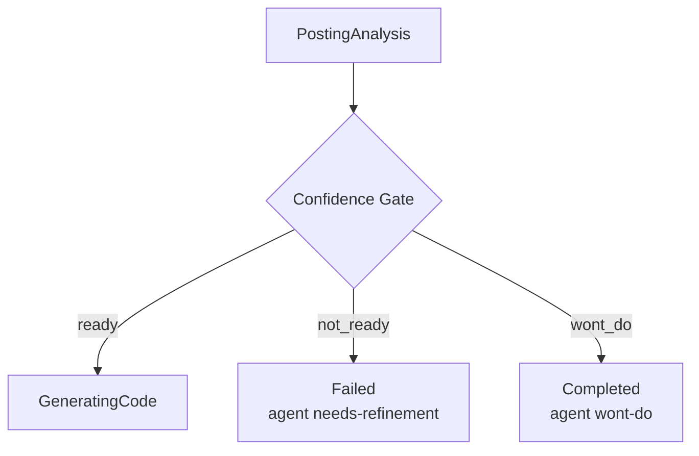
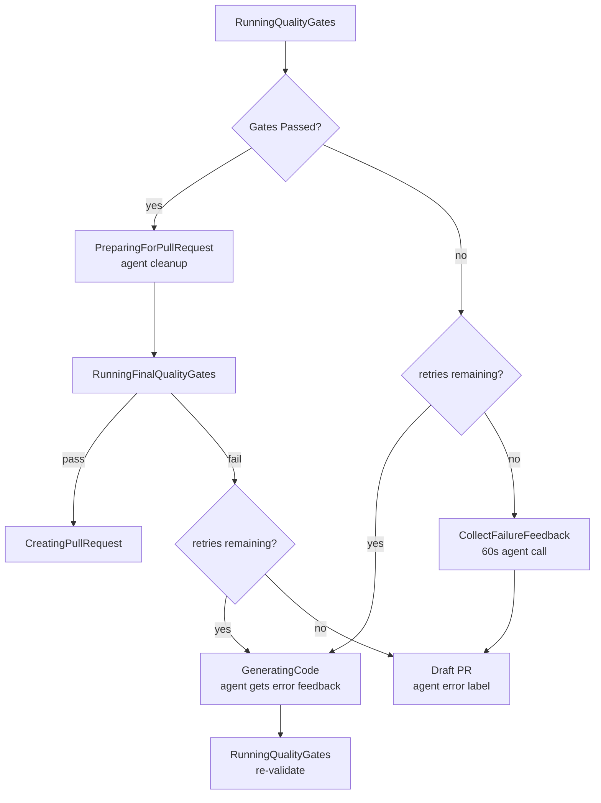
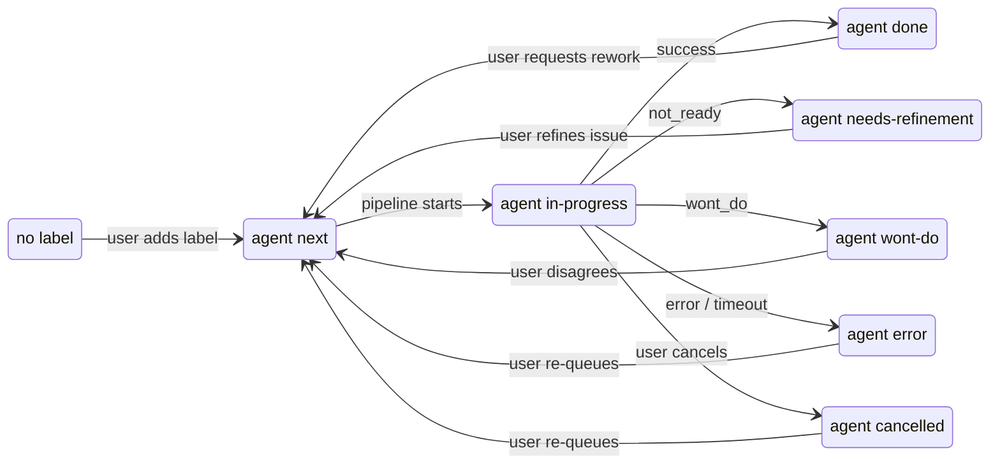

# Pipeline Orchestration

The pipeline is a state machine that progresses through a fixed sequence of steps, with decision points that can branch to terminal states.

See also: [Configuration](configuration.md) for all pipeline settings, and [Issue Workflows](github-issue-workflows.md) for how users interact with the pipeline via labels.

```mermaid
stateDiagram-v2
    direction TB

    [*] --> Created
    Created --> CloningRepository
    CloningRepository --> SyncingBrainRepoPreRun
    SyncingBrainRepoPreRun --> CreatingBranch
    CreatingBranch --> AnalyzingCode
    AnalyzingCode --> PostingAnalysis

    state ConfidenceGate <<choice>>
    PostingAnalysis --> ConfidenceGate
    ConfidenceGate --> GeneratingCode : ready
    ConfidenceGate --> Failed : not_ready (needs-refinement)
    ConfidenceGate --> Completed : wont_do (wont-do)

    GeneratingCode --> ReviewingCode
    ReviewingCode --> RunningQualityGates

    state QualityGateDecision <<choice>>
    RunningQualityGates --> QualityGateDecision
    QualityGateDecision --> PreparingForPullRequest : all passed
    QualityGateDecision --> GeneratingCode : failed, retries remaining
    QualityGateDecision --> CreatingPullRequest : failed, retries exhausted (draft PR)

    state FinalQualityCheck <<choice>>
    PreparingForPullRequest --> FinalQualityCheck : quality gates re-run after cleanup
    FinalQualityCheck --> CreatingPullRequest : all passed
    FinalQualityCheck --> GeneratingCode : failed, retries remaining
    FinalQualityCheck --> CreatingPullRequest : failed, retries exhausted (draft PR)

    CreatingPullRequest --> ReflectingOnRun
    ReflectingOnRun --> SyncingBrainRepoPostRun
    SyncingBrainRepoPostRun --> Completed

    Completed --> [*]
    Failed --> [*]
    Cancelled --> [*]

    note right of CloningRepository
        Label swapped to agent in-progress
    end note
    note right of ConfidenceGate
        blockingIssues non-empty forces not_ready
    end note
    note right of QualityGateDecision
        Agent gets error feedback and fixes before re-check
    end note
    note left of CreatingPullRequest
        Draft PR sets agent error label. Normal PR adds agent done label.
    end note
    note left of ReflectingOnRun
        Only if brain repo configured and not read-only.
        Feedback collected here (success path).
    end note
```



## Pipeline Steps

```
Created → CloningRepository → SyncingBrainRepoPreRun → CreatingBranch
  → AnalyzingCode → PostingAnalysis → [Confidence Gate]
  → GeneratingCode → ReviewingCode → RunningQualityGates → [Quality Gate Decision]
  → PreparingForPullRequest → [Final Quality Gate]
  → CreatingPullRequest → ReflectingOnRun → SyncingBrainRepoPostRun → Completed
```

Each step is represented by the `PipelineStep` enum. The pipeline tracks both the current step and a `HighWaterMark` (highest step ever reached), which the UI uses to show revisited steps during retries.

## State Descriptions

| Step | What Happens |
|------|-------------|
| **Created** | Run initialized, providers resolved and validated |
| **CloningRepository** | Repository cloned to a fresh workspace directory. Label swapped to `agent:in-progress` |
| **SyncingBrainRepoPreRun** | Brain repository synced into workspace (if configured). Non-fatal on failure |
| **CreatingBranch** | Feature branch created from default branch (format: `feature/auto-{issueNumber}-{slug}-{runId}`) |
| **AnalyzingCode** | Agent analyzes the issue and codebase, writes `analysis.md` and `analysis-assessment.json` |
| **PostingAnalysis** | Analysis comment posted to the GitHub issue |
| **GeneratingCode** | Agent implements the changes. Also used during quality gate retries |
| **ReviewingCode** | Multi-agent code review: each review agent writes findings, then a fix agent addresses `[CRITICAL]` items |
| **RunningQualityGates** | Build, tests, coverage, and external CI checks run |
| **PreparingForPullRequest** | Agent cleans up the working directory (removes debug artifacts, unused code, formatting). Quality gates run one final time after cleanup |
| **CreatingPullRequest** | PR created (normal or draft). Blacklisted file detection happens here |
| **ReflectingOnRun** | Agent reviews the entire run and enriches `.brain/` knowledge (if brain repo configured). Feedback collected here — questions appended to the reflection prompt |
| **SyncingBrainRepoPostRun** | Brain updates committed and pushed to brain repository |
| **Completed** | Terminal state — run succeeded (or `wont_do` assessment) |
| **Failed** | Terminal state — unrecoverable error or retries exhausted |
| **Cancelled** | Terminal state — user cancelled the run |

## Confidence Gate

After the analysis phase, the pipeline evaluates the agent's structured assessment (`analysis-assessment.json`):



- **`ready`** — proceed to code generation
- **`not_ready`** — abort, label `agent:needs-refinement`, post blocking issues to GitHub
- **`wont_do`** — mark Completed, label `agent:wont-do`, post reasoning to GitHub

Override rule: if `blockingIssues` is non-empty, the gate forces `not_ready` regardless of the recommendation value. Unknown recommendation values (e.g. typos) fall through as `ready` (fail-open design).

## Quality Gate Retry Loop

After code generation and review, quality gates run. If they fail, the pipeline enters a retry loop:



Quality gates checked (in order):
1. **Compilation** — Build command must succeed with 0 errors
2. **Tests** — Test command must have 0 failures
3. **Coverage** — Code coverage must meet `coverageThreshold` (if configured). Supports Cobertura XML (Python, .NET) and JaCoCo XML (Java) formats
4. **External CI** — External CI pipeline must pass (if enabled). Requires commit + push before checking

External CI is only evaluated after local gates (compilation, tests, coverage) pass. If external CI fails, it does not enter the agent retry loop — the failure goes straight to a draft PR. Only local gate failures trigger retries with agent error feedback.

The retry prompt includes the full gate failure details and points the agent to diagnostic output files. Each retry attempt is a `--resume` call, so the agent has full conversation history.

If all retries are exhausted, a **draft PR** is created with the failing code, and the issue is labeled `agent:error`.

## Label Transitions



Re-queueing from `agent:error` or `agent:needs-refinement` requires manual dispatch via the web UI — closed-loop mode skips issues that still carry these labels. Re-queueing from `agent:wont-do` or `agent:cancelled` works in both manual and closed-loop modes.

## Error Handling

Any step can transition to `Failed` on error. The pipeline catches exceptions at each phase boundary and records the failure reason. Specific behaviors:

- **Clone failure** — immediate fail, no retry
- **Analysis failure** — retries up to `maxAnalysisRetries` (assessment file missing, malformed JSON, analysis too short)
- **Agent timeout** — fail with exit code 124
- **Blacklisted files** — fail if `blacklistMode` is `Fail`, warn if `Warn`
- **External CI timeout** — treated as gate failure, enters retry loop
- **Cancellation** — `OperationCanceledException` caught at top level, label set to `agent:cancelled`
