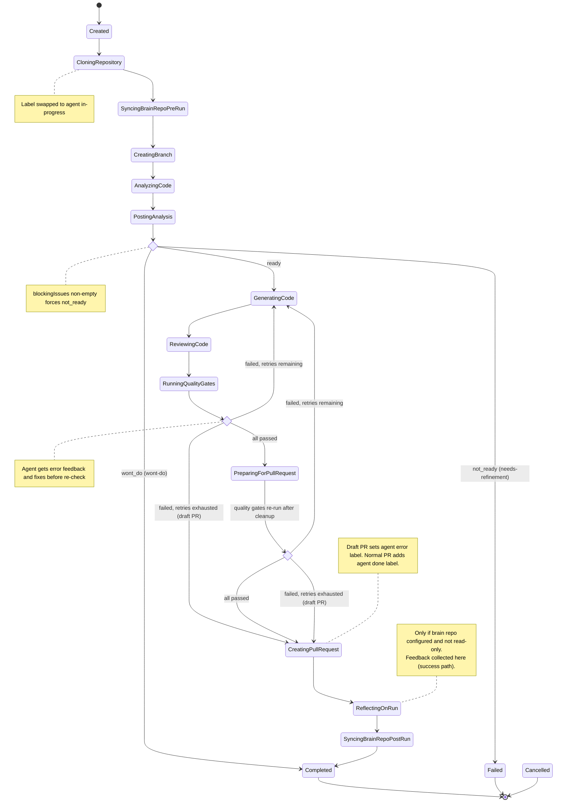
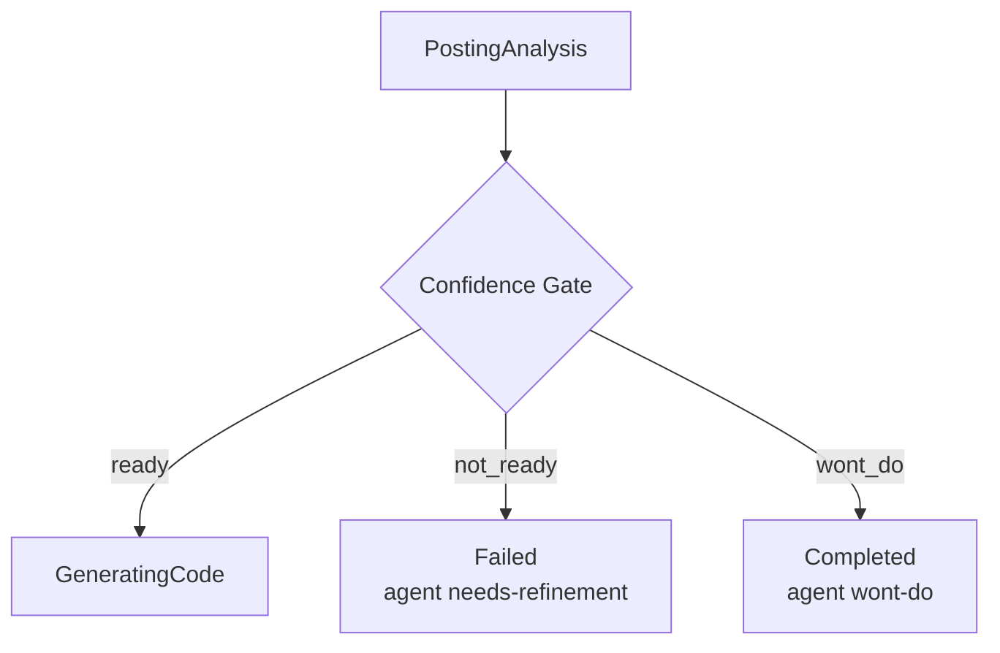
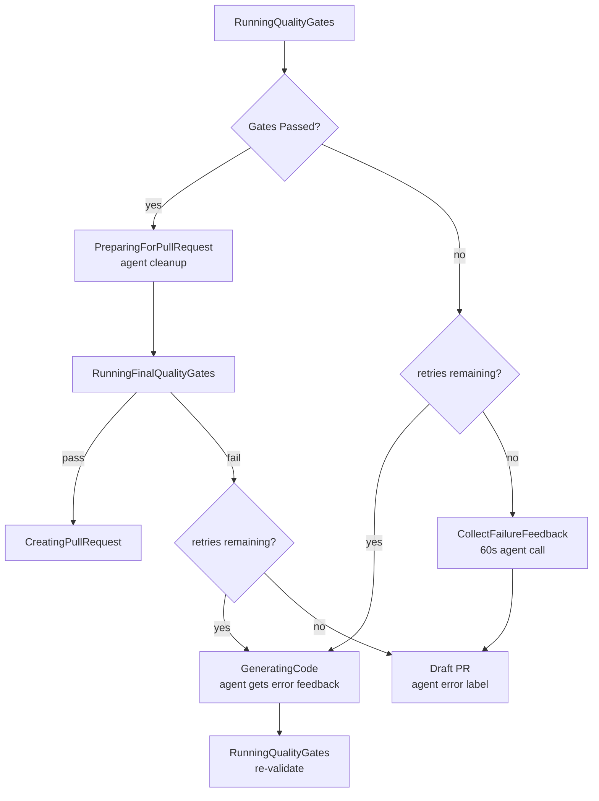
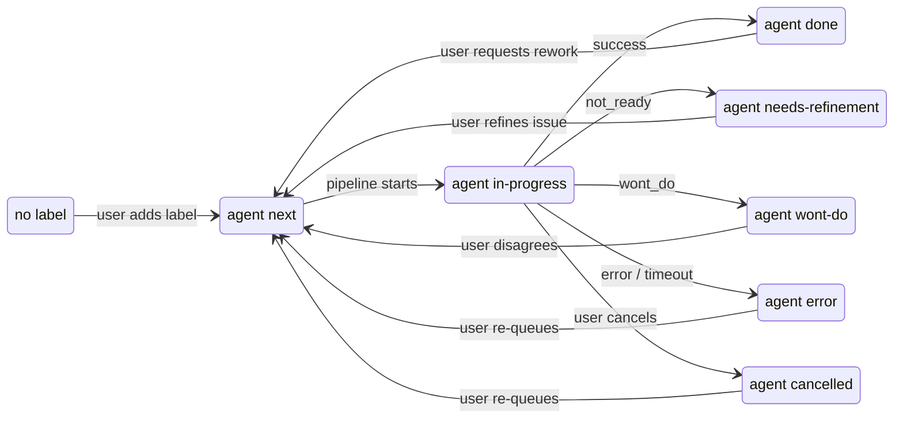
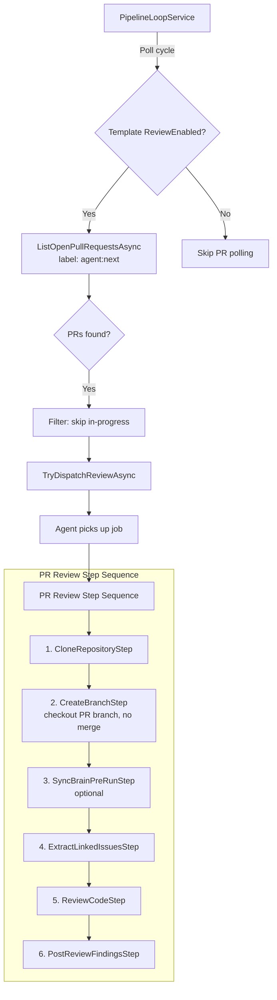
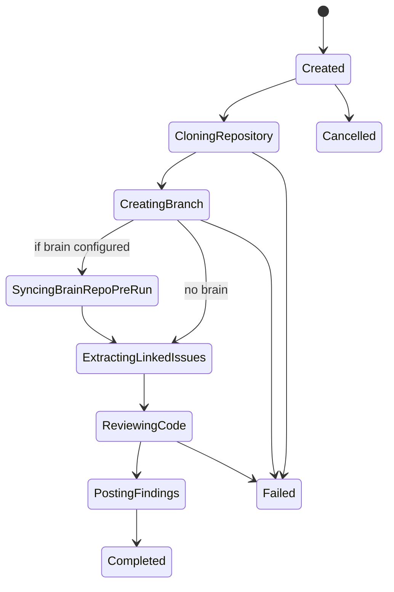
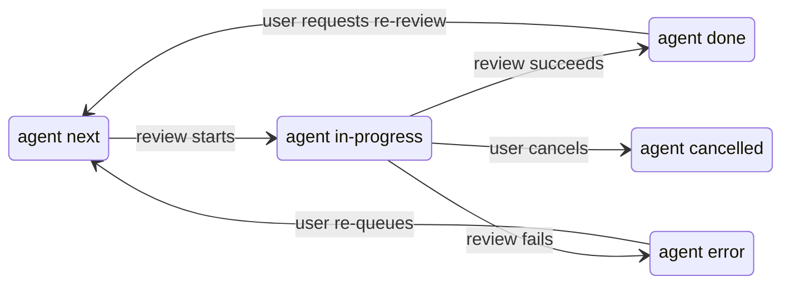
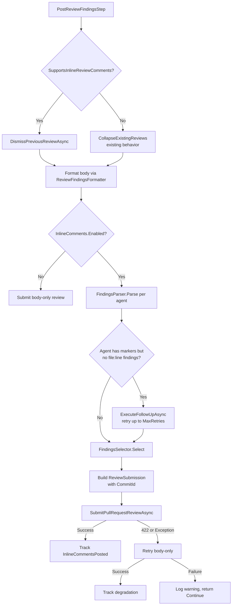

# Pipeline Orchestration

The pipeline is a state machine that progresses through a fixed sequence of steps, with decision points that can branch to terminal states. There are two pipeline workflows:

1. **Implementation pipeline** — Processes issues through analysis, code generation, quality gates, and PR creation
2. **PR review pipeline** — Processes pull requests through code review and posts findings (see [PR Review Pipeline](#pr-review-pipeline) below)

Both workflows share the same dispatch mechanism (`agent:next` label polling), label lifecycle, and agent infrastructure.

See also: [Configuration](configuration.md) for all pipeline settings, and [Issue Workflows](github-issue-workflows.md) for how users interact with the pipeline via labels.



## Pipeline Steps

```
Created → CloningRepository → SyncingBrainRepoPreRun → CreatingBranch
  → AnalyzingCode → PostingAnalysis → [Confidence Gate]
  → GeneratingCode → ReviewingCode → RunningQualityGates → [Quality Gate Decision]
  → PreparingForPullRequest → [Final Quality Gate]
  → CreatingPullRequest → ReflectingOnRun → SyncingBrainRepoPostRun → Completed
```

Each step is represented by the `PipelineStep` enum. The pipeline tracks both the current step and a `HighWaterMark` (highest step ever reached), which the UI uses to show revisited steps during retries.

## State Descriptions

| Step | What Happens |
|------|-------------|
| **Created** | Run initialized, providers resolved and validated |
| **CloningRepository** | Repository cloned to a fresh workspace directory. Label swapped to `agent:in-progress` |
| **SyncingBrainRepoPreRun** | Brain repository synced into workspace (if configured). Non-fatal on failure |
| **CreatingBranch** | Feature branch created from default branch (format: `feature/auto-{issueNumber}-{slug}-{runId}`) |
| **AnalyzingCode** | Agent analyzes the issue and codebase, writes `analysis.md` and `analysis-assessment.json` |
| **PostingAnalysis** | Analysis comment posted to the GitHub issue |
| **GeneratingCode** | Agent implements the changes. Also used during quality gate retries |
| **ReviewingCode** | Multi-agent code review: each review agent writes findings, then a fix agent addresses `[CRITICAL]` items |
| **RunningQualityGates** | Build, tests, coverage, and external CI checks run |
| **PreparingForPullRequest** | Agent cleans up the working directory (removes debug artifacts, unused code, formatting). Quality gates run one final time after cleanup |
| **CreatingPullRequest** | PR created (normal or draft). Blacklisted file detection happens here |
| **ReflectingOnRun** | Agent reviews the entire run and enriches `.brain/` knowledge (if brain repo configured). Feedback collected here — questions appended to the reflection prompt |
| **SyncingBrainRepoPostRun** | Brain updates committed and pushed to brain repository |
| **Completed** | Terminal state — run succeeded (or `wont_do` assessment) |
| **Failed** | Terminal state — unrecoverable error or retries exhausted |
| **Cancelled** | Terminal state — user cancelled the run |

## Confidence Gate

After the analysis phase, the pipeline evaluates the agent's structured assessment (`analysis-assessment.json`):



- **`ready`** — proceed to code generation
- **`not_ready`** — abort, label `agent:needs-refinement`, post blocking issues to GitHub
- **`wont_do`** — mark Completed, label `agent:wont-do`, post reasoning to GitHub

Override rule: if `blockingIssues` is non-empty, the gate forces `not_ready` regardless of the recommendation value. Unknown recommendation values (e.g. typos) fall through as `ready` (fail-open design).

## Quality Gate Retry Loop

After code generation and review, quality gates run. If they fail, the pipeline enters a retry loop:



Quality gates checked (in order):
1. **Compilation** — Build command must succeed with 0 errors
2. **Tests** — Test command must have 0 failures
3. **Coverage** — Code coverage must meet `coverageThreshold` (if configured). Supports Cobertura XML (Python, .NET) and JaCoCo XML (Java) formats
4. **External CI** — External CI pipeline must pass (if enabled). Requires commit + push before checking

External CI is only evaluated after local gates (compilation, tests, coverage) pass. If external CI fails, it does not enter the agent retry loop — the failure goes straight to a draft PR. Only local gate failures trigger retries with agent error feedback.

The retry prompt includes the full gate failure details and points the agent to diagnostic output files. Each retry attempt is a `--resume` call, so the agent has full conversation history.

If all retries are exhausted, a **draft PR** is created with the failing code, and the issue is labeled `agent:error`.

## Label Transitions



Re-queueing from `agent:error` or `agent:needs-refinement` requires manual dispatch via the web UI — closed-loop mode skips issues that still carry these labels. Re-queueing from `agent:wont-do` or `agent:cancelled` works in both manual and closed-loop modes.

## Error Handling

Any step can transition to `Failed` on error. The pipeline catches exceptions at each phase boundary and records the failure reason. Specific behaviors:

- **Clone failure** — immediate fail, no retry
- **Analysis failure** — retries up to `maxAnalysisRetries` (assessment file missing, malformed JSON, analysis too short)
- **Agent timeout** — fail with exit code 124
- **Blacklisted files** — fail if `blacklistMode` is `Fail`, warn if `Warn`
- **External CI timeout** — treated as gate failure, enters retry loop
- **Cancellation** — `OperationCanceledException` caught at top level, label set to `agent:cancelled`

---

## PR Review Pipeline

The PR review pipeline is a parallel workflow that processes pull requests for automated code review. It reuses the same dispatch mechanism (`agent:next` label polling), the same step execution pattern, and the same agent execution infrastructure — but with a shorter step sequence that skips analysis, code generation, and quality gates.

### Overview



### Review Step Sequence

The PR review pipeline executes 6 steps (compared to 10+ for implementation):

| # | Step | Reuses Existing | Description |
|---|------|:---:|-------------|
| 1 | `CloneRepositoryStep` | ✅ | Clone the repository to a fresh workspace |
| 2 | `CreateBranchStep` | ✅ | Check out the PR branch (rework path, skip merge from base) |
| 3 | `SyncBrainPreRunStep` | ✅ | Sync brain repository if configured (non-fatal on failure) |
| 4 | `ExtractLinkedIssuesStep` | ❌ | Extract linked issues, write context files, synthesize issue context |
| 5 | `ReviewCodeStep` | ✅ | Resolve reviewer configs and execute multi-agent code review |
| 6 | `PostReviewFindingsStep` | ❌ | Format findings and post as PR review comment |

Key differences from the implementation pipeline:
- **No analysis step** — the PR already contains the implementation
- **No code generation** — the review is read-only
- **No quality gates** — build/test feedback comes from existing CI
- **No merge from base** — the PR branch is reviewed as-is
- **No post-run brain sync** — reviews don't produce new knowledge to persist

### Review Run State Machine



### PR Label Lifecycle

PR review runs follow the same label lifecycle as implementation runs:



- **Dispatch**: `agent:next` → `agent:in-progress`
- **Success**: `agent:in-progress` → `agent:done`
- **Failure**: `agent:in-progress` → `agent:error`
- **Cancellation**: `agent:in-progress` → `agent:cancelled`

Re-review is always explicitly triggered by the user (remove `agent:done`, re-add `agent:next`). New commits alone do NOT trigger re-review.

### Loop Mode Configuration

Each `PipelineJobTemplate` has two independent toggles controlling which work types it processes:

| Property | Type | Default | Description |
|----------|------|---------|-------------|
| `ImplementationEnabled` | `bool` | `true` | Template polls for issues and dispatches implementation jobs |
| `ReviewEnabled` | `bool` | `true` | Template polls for PRs and dispatches review jobs |

The existing `Enabled` property acts as a master switch — when `false`, both implementation and review are disabled regardless of individual flags.

#### Configuration Examples

**Both enabled (default):**
```json
{
  "Name": "Full Pipeline",
  "Enabled": true,
  "ImplementationEnabled": true,
  "ReviewEnabled": true
}
```

**Review-only template** (dedicated to PR reviews, no implementation):
```json
{
  "Name": "Review Only",
  "Enabled": true,
  "ImplementationEnabled": false,
  "ReviewEnabled": true
}
```

**Implementation-only template** (no PR reviews):
```json
{
  "Name": "Implementation Only",
  "Enabled": true,
  "ImplementationEnabled": true,
  "ReviewEnabled": false
}
```

Settings are read at the start of each poll cycle, allowing runtime changes via the configuration UI without restarting the loop.

### Dispatch Budget Sharing

When both implementation and review loops are active, they share the `ClosedLoopMaxRunsPerCycle` budget. The pipeline alternates fairly between issue and PR queues (round-robin) to prevent starvation of either work type.

- Total dispatches per cycle never exceed `ClosedLoopMaxRunsPerCycle`
- Both queues get at least one dispatch when budget allows
- PRs are processed in FIFO order (oldest `CreatedAt` first)
- Draft PRs are included in review dispatch (a warning is shown in the UI)
- PRs with `agent:error`, `agent:in-progress`, `agent:done`, or `agent:cancelled` labels are skipped

### Issue Dependency Tracking

The dispatch loop supports dependency tracking for issues. When an issue body contains dependency references, the dispatcher checks whether those referenced issues are closed before dispatching. This prevents issues from being worked on before their prerequisites are complete.

#### Supported Dependency Patterns

The following patterns are recognized in the issue body (case-insensitive, word-boundary matched):

| Pattern | Example |
|---------|---------|
| `Blocked by #N` | `Blocked by #123` |
| `Depends on #N` | `Depends on #45` |
| `Requires #N` | `Requires #78` |
| `After #N` | `After #90` |

Multiple dependencies can appear in a single issue body — ALL must be satisfied (closed) before the issue is dispatched. Patterns are matched with a `\b` word boundary before the keyword, so "hereafter #123" does NOT match but "After #123" does.

#### How It Works

The dependency check is **stateless** and **body-parsed** on each poll cycle:

1. When a candidate issue is dequeued for dispatch, the `DependencyParser` extracts issue numbers from the body text
2. For each referenced issue number, the `DependencyChecker` calls `IsIssueClosedAsync` on the issue provider
3. Results are **cached per-cycle** in a shared `Dictionary<int, bool>` — if multiple candidates reference the same dependency, only one API call is made
4. If ALL dependencies are closed → issue is eligible for dispatch
5. If ANY dependency is still open → issue is skipped, next candidate in the queue is tried

No internal state is persisted between cycles. No new labels are introduced. The check runs fresh on every poll cycle (~30s default interval).

#### Behavior When Dependencies Are Unresolved

- The issue stays labeled `agent:next` (no label change)
- It is skipped silently from dispatch this cycle
- On the next poll cycle (~30s), the check runs again
- Once all dependencies are closed, the issue becomes eligible for dispatch
- A blocked issue at the front of the queue does NOT prevent unblocked issues behind it from being dispatched

#### Graceful Degradation

- **API failures** (network errors, rate limits, 5xx after retry exhaustion) → the dependency is treated as unresolved → the issue is skipped for this cycle, a warning is logged
- **Issue not found** (404) → treated as unresolved (conservative: don't dispatch if we can't verify)
- **Null body** → treated as no dependencies (issue dispatches normally)
- Failures for one issue do NOT affect other issues in the same cycle
- Failures do NOT cause the poll cycle to abort, the circuit breaker to trip, or the template status to record a failure

#### Known Limitations

| Limitation | Description |
|------------|-------------|
| "After" false positives | The word "after" is common in English. Sentences like "I fixed this after #456 was reported" will incorrectly match as a dependency. Prefer `Blocked by` or `Depends on` for human-written issues. |
| Code block matching | Patterns inside markdown code blocks (`` `Blocked by #123` `` or fenced blocks) will still match. Avoid putting dependency patterns in code examples within issue bodies. |
| Strikethrough matching | `~~Blocked by #123~~` will still match. Delete dependency text rather than striking through. |
| No circular dependency detection | If issue A depends on B and B depends on A, both are skipped indefinitely. Humans must notice and fix. |
| Same-repository only | Only `#N` references are supported. Cross-repository references (`owner/repo#N`) are not recognized. |

### Linked Issue Extraction

The review pipeline extracts linked issues from the PR to provide requirements context to the review agent. This enables the reviewer to evaluate the PR against the original acceptance criteria.

#### Extraction Priority Order

Each repository provider implements its own extraction logic:

1. **Platform API** — Query the platform's linked/closing references API (e.g., GitHub timeline events)
2. **PR title parsing** — Scan the PR title for issue references
3. **PR body parsing** — Scan the PR body/description for issue references

#### Recognized Patterns (GitHub)

- `#N` — issue number reference
- `owner/repo#N` — cross-repository reference
- `GH-N` — GitHub shorthand
- Closing keywords: `closes #N`, `fixes #N`, `resolves #N` (case-insensitive)

#### How Context is Provided

When linked issues are found:
1. Issue details (title, body) are fetched at dispatch time (orchestrator-side)
2. Pre-fetched issue context is included in the job assignment message
3. The agent writes each linked issue as `.agent/linked-issue-{id}.md` in the workspace
4. The review agent reads these files alongside the PR diff for requirements-aware review

When no linked issue is found, the review proceeds normally using PR metadata (title, description) as context. This is non-blocking — reviews work with or without linked issue context.

#### Multiple Issues

When multiple issue references are found, ALL are retrieved and written as separate files. The review agent infers which issue(s) are most relevant based on the PR title, description, and diff.

### Review Findings Format

Review findings are posted as a PR review comment with the following structure:

```markdown
<!-- agent:pr-review -->
## 🤖 Automated Code Review

**Review Agents**: Correctness, Security, AcceptanceCriteria

| Severity | Count |
|----------|-------|
| [CRITICAL] | 2 |
| [WARNING] | 5 |
| [SUGGESTION] | 3 |

<details>
<summary>Correctness</summary>

[Agent findings here]

</details>

<details>
<summary>Security</summary>

[Agent findings here]

</details>
```

The `<!-- agent:pr-review -->` marker enables the pipeline to detect and update existing reviews on subsequent runs, avoiding duplicate comments.

When no issues are found, the review body states: "✅ No issues found."

When no reviewer configuration matches the repository labels, a comment is posted indicating no applicable reviewers were found, and the run completes with `agent:done`.

### Error Handling (Review Runs)

Review runs follow the same error handling principles as implementation runs:

- **Clone failure** — immediate fail, label set to `agent:error`
- **Checkout failure** — immediate fail, label set to `agent:error`
- **Brain sync failure** — non-fatal, review continues without brain context
- **Review agent timeout** — fail with the configured `AgentTimeout`
- **Posting failure** — non-fatal (review ran successfully, posting failed), logged as warning
- **Cancellation** — label set to `agent:cancelled`


---

## Inline Review Comments

The PR review pipeline supports posting code review findings as native inline comments on specific file:line positions in the diff. This is an additive enhancement — the body-level review summary is always posted regardless of inline comment settings.

### GitHub API Migration

The review submission was migrated from the **Issue Comments API** (`POST /repos/{owner}/{repo}/issues/{issue_number}/comments`) to the **Pull Request Reviews API** (`POST /repos/{owner}/{repo}/pulls/{pull_number}/reviews`). This change means:

- Review comments are now **dismissible reviews** rather than plain issue comments
- Reviews support **inline comments** attached to specific file:line positions in the diff
- Reviews have a **type** (`COMMENT` or `REQUEST_CHANGES`) that affects PR merge status
- Previous automated reviews can be **dismissed** via the API before posting new ones

Existing issue-comment-based reviews on open PRs (from before the migration) are not affected — they remain as-is with their `<!-- agent:pr-review-superseded -->` collapse markers.

### Structured Output Format

When inline comments are enabled, the review prompt instructs agents to format findings with file:line references:

```
[SEVERITY] path/to/file.ext:LINE — description of the issue
```

Where:
- `SEVERITY` is one of: `CRITICAL`, `WARNING`, `SUGGESTION`
- `path` is relative to the repository root using forward slashes
- `LINE` is a 1-based line number in the file
- `description` explains the finding

Examples:
```
[CRITICAL] src/Service.cs:42 — Null reference possible when input is not validated
[WARNING] src/Controllers/UserController.cs:15 — Missing input validation on email parameter
[SUGGESTION] src/Utils/StringHelper.cs:8 — Consider using StringBuilder for repeated concatenation
```

For findings without a specific file location:
```
[WARNING] — General observation about architecture
```

The `FindingsParser` recognizes four file:line reference formats:
- `path/to/file.cs:42`
- `path/to/file.cs#L42`
- `path/to/file.cs (line 42)`
- `path/to/file.cs, line 42`

### Inline Comment Flow

The full flow within `PostReviewFindingsStep`:

```
Parse → Filter → Cap → Consolidate → Submit
```

Detailed sequence:



1. **Dismiss/Collapse** — If the provider supports inline reviews, dismiss previous bot reviews via the Reviews API. Otherwise, collapse existing review comments (existing behavior).
2. **Format body** — Generate the summary body via `ReviewFindingsFormatter.Format` (unchanged).
3. **Check enabled** — If `InlineComments.Enabled` is `false`, submit body-only and return.
4. **Parse** — Run `FindingsParser.Parse` on each agent's output to extract `StructuredFinding` entries.
5. **Retry** — For agents that produced severity markers but no file:line references, invoke `ExecuteFollowUpAsync` (a fresh prompt with the original output + reformat instructions) up to `MaxRetries` times.
6. **Select** — `FindingsSelector` applies the transformation pipeline: filter by `SeverityThreshold` → stable sort by severity (if `OrderBySeverity`) → cap at `MaxInlineComments` → consolidate same file:line into single comments.
7. **Submit** — Build a `ReviewSubmission` with the body, inline comments, and HEAD commit SHA. Submit via the Reviews API.
8. **Degrade** — On HTTP 422 or any exception, retry once without inline comments (body-only). If that also fails, log a warning and return `StepResult.Continue`. The pipeline never fails due to inline comment issues.

### Retry and Degradation Behavior

#### Per-Agent Retry

Retries are **per-agent**, not global. If Agent A produces structured findings but Agent B doesn't, only B is retried.

- Each retry invokes `ExecuteFollowUpAsync` — a fresh LLM call with the agent's original output + reformat instructions
- The retry counter is per-agent, capped at `MaxRetries` (default: 1)
- Retries are sequential (consistent with existing review execution)
- If the retry produces structured output, it replaces the original output for that agent

#### Degradation Scenarios

| Scenario | Behavior |
|----------|----------|
| Agent doesn't produce structured output after retries | Findings appear in body summary only (no inline comments for that agent) |
| GitHub returns HTTP 422 (Validation Failed) | Retry once without ALL inline comments (body-only). GitHub's 422 doesn't identify which comment failed |
| Body-only retry also fails | Exception caught, logged as warning, step returns `Continue` |
| `SupportsInlineReviewComments` is `false` | Inline comments rendered in body under "📍 Findings by Location" section |
| `InlineComments.Enabled` is `false` | No parsing, no prompt enhancement, body-only review (pre-feature behavior) |

#### Observability

The `PipelineRun` tracks inline comment outcomes:

| Property | Type | Description |
|----------|------|-------------|
| `InlineCommentsPosted` | `int` | Number of inline comments successfully submitted |
| `InlineCommentsDegraded` | `bool` | Whether fallback to body-only occurred |
| `InlineCommentsDegradedReason` | `string?` | Reason for degradation (null on success) |

### `SupportsInlineReviewComments` Capability Detection

The `IRepositoryProvider` interface exposes a `SupportsInlineReviewComments` property:

```csharp
bool SupportsInlineReviewComments => false; // default: conservative
```

- **GitHub provider** returns `true` — supports inline comments and review dismissal
- **Default** returns `false` — providers that haven't opted in get body-only behavior

When `SupportsInlineReviewComments` is `false` but the `FindingsParser` extracted findings with location metadata, the pipeline appends a **"📍 Findings by Location"** section to the body comment. Findings are grouped by file path (alphabetical), with each finding as a bullet point showing severity emoji, line number, and message:

```markdown
### 📍 Findings by Location

#### src/Controllers/UserController.cs
- 🔴 Line 42: Null reference possible when input is not validated
- 🟡 Line 15: Missing input validation on email parameter

#### src/Utils/StringHelper.cs
- 💡 Line 8: Consider using StringBuilder for repeated concatenation
```

### Stale Review Handling

Before posting a new review, the pipeline handles previous automated reviews:

- **GitHub (inline-capable)**: Calls `DismissPreviousReviewAsync` to dismiss all previous bot reviews containing the `<!-- agent:pr-review -->` marker. Uses the authenticated bot identity to filter reviews.
- **Non-inline providers**: Falls back to the existing collapse behavior (wrapping previous review bodies in `<details>` blocks with the `<!-- agent:pr-review-superseded -->` marker).

The coupling between `SupportsInlineReviewComments` and dismiss support is intentional — if a provider supports inline comments, it also supports review dismissal.

### `InlineCommentSettings` Configuration

The `InlineCommentSettings` record is nested within `CodeReviewConfiguration`:

```json
{
  "CodeReview": {
    "MaxIterations": 2,
    "FixPrompt": null,
    "ReviewIsolation": "Isolated",
    "InlineComments": {
      "Enabled": true,
      "SeverityThreshold": "Warning",
      "MaxInlineComments": 15,
      "OrderBySeverity": true,
      "MaxRetries": 1
    }
  }
}
```

#### Property Reference

| Property | Type | Default | Range | Description |
|----------|------|---------|-------|-------------|
| `Enabled` | `bool` | `true` | — | Master switch. When false, body-only reviews are posted (existing behavior). Defaults to enabled |
| `SeverityThreshold` | `FindingSeverity` | `Warning` | `Suggestion`, `Warning`, `Critical` | Minimum severity for inline posting. A finding is eligible when its severity value `>=` the threshold value |
| `MaxInlineComments` | `int` | `15` | 1–50 | Maximum inline comments per review. Highest-severity findings are prioritized when the cap is reached |
| `OrderBySeverity` | `bool` | `true` | — | Sort eligible findings by severity (Critical first) when selecting which to post inline |
| `MaxRetries` | `int` | `1` | 0–5 | Retry attempts per agent when structured output is missing. Each retry = 1 additional LLM API call |

#### Backward Compatibility

- Existing configuration files without the `InlineComments` key deserialize to a default `InlineCommentSettings` instance with `Enabled = true`
- No migration required — existing deployments are unaffected on upgrade
- Property ranges are validated at usage time via `Math.Clamp` (not at deserialization), consistent with other pipeline configs

#### Cost Awareness

Each retry invokes an additional LLM API call per agent. With `MaxRetries = 1` (default) and 3 review agents, worst case is 3 extra LLM calls per review. Operators should consider this cost tradeoff when increasing `MaxRetries`.
