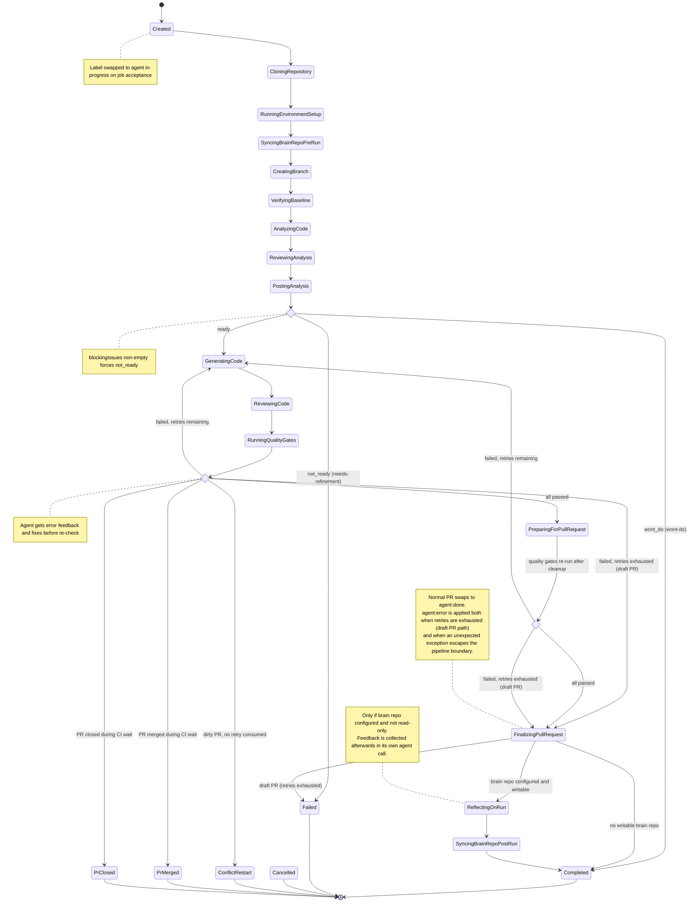
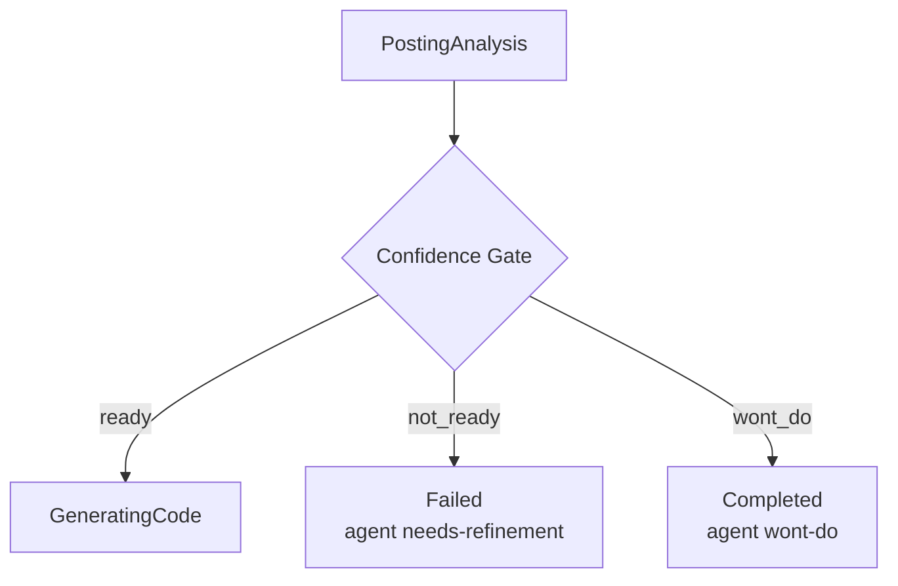
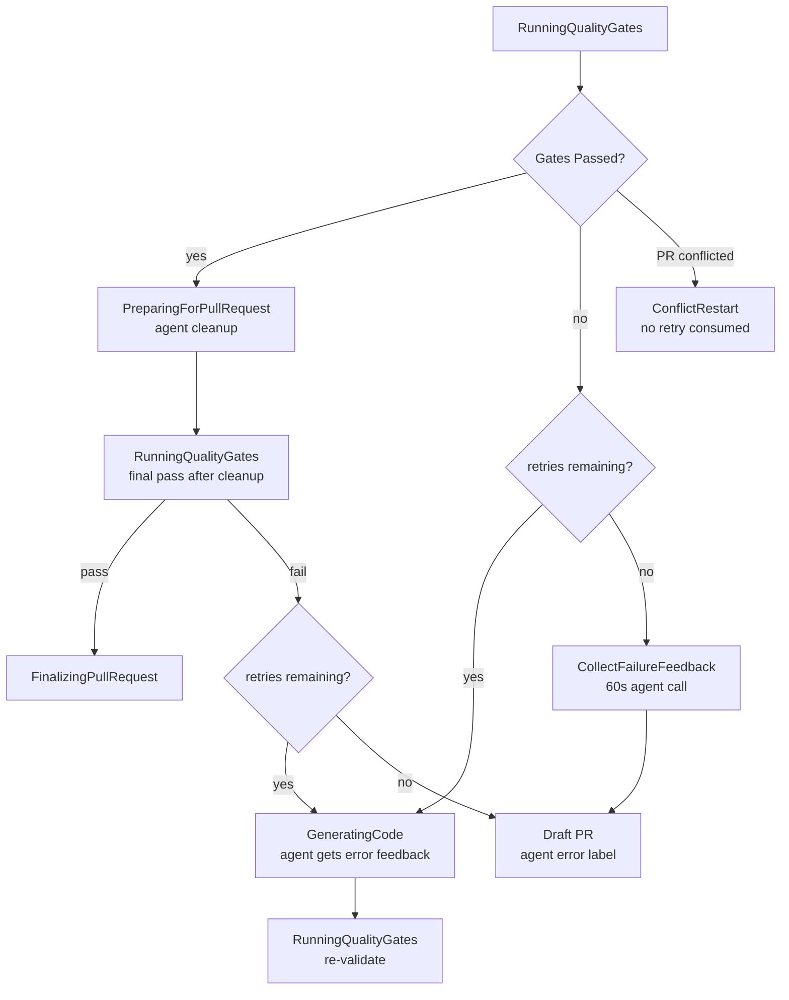
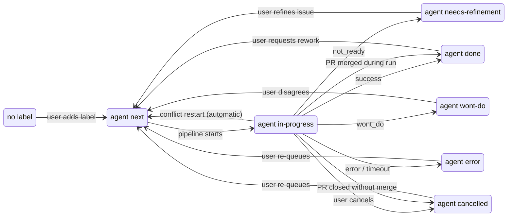
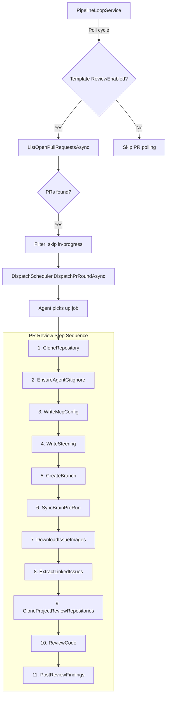
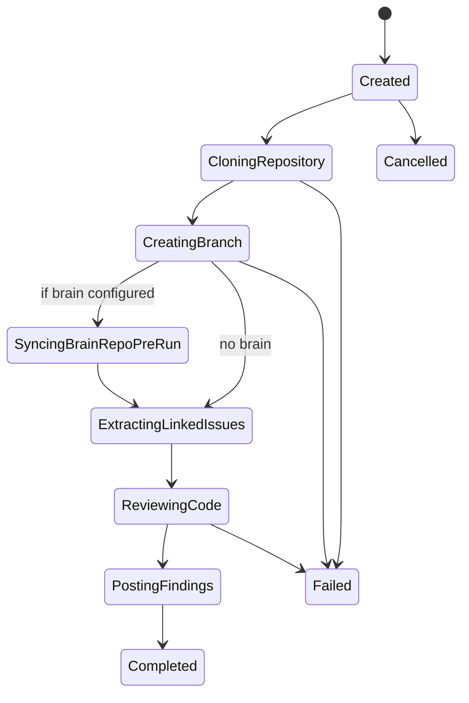
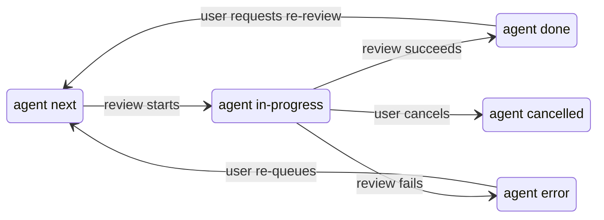
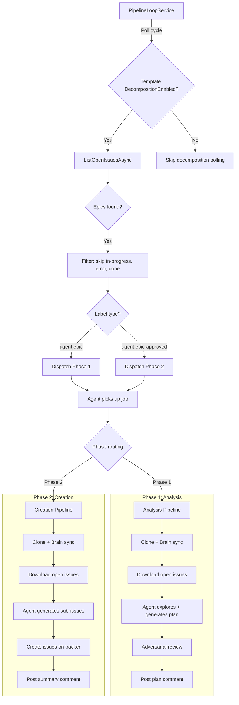
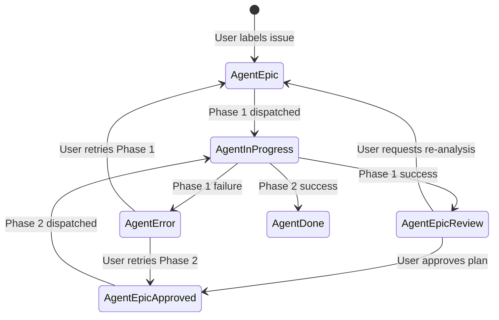

# Pipeline Orchestration

The pipeline is a state machine that progresses through a fixed sequence of steps, with decision points that can branch to terminal states. There are four pipeline workflows:

1. **Implementation pipeline** — Processes issues through analysis, code generation, quality gates, and PR creation
2. **PR review pipeline** — Processes pull requests through code review and posts findings (see [PR Review Pipeline](#pr-review-pipeline) below)
3. **Epic decomposition pipeline** — Processes epics through a two-phase workflow producing implementation-ready sub-issues (see [Epic Decomposition Pipeline](#epic-decomposition-pipeline) below)
4. **Consolidation pipeline** — Brain consolidation, refactoring detection, and harness suggestion runs. Dispatched on-demand via the Consolidation page, not by the label-based loop. See [Feedback & Consolidation](feedback-and-consolidation.md) for details.

The first three workflows share the same dispatch mechanism, label lifecycle, and agent infrastructure. Consolidation jobs are created as `WorkItem` rows by `ConsolidationService.TriggerAsync` and dispatched by the Scheduler's `WorkItemDispatchLoop` in the lowest-priority tier (after Review, Decomposition, and Implementation). Consolidation jobs do not go through the label loop.

## Dispatch Mode

The pipeline dispatches work via Kubernetes Jobs. `DispatchOrchestrationService` prepares each request (resolves providers, vends tokens), then `KubernetesWorkDistributor` creates a Pending `WorkItem` row through `POST /api/work-items`. The Scheduler's leader-elected `WorkItemDispatchLoop` polls `GET /api/work-items/pending` and calls `POST /api/work-items/{id}/dispatch` for each item; the Pipeline API's `DispatchLifecycleService` checks capacity and creates the K8s Job. The resulting ephemeral agent pod picks up the full assignment via `GET /api/work-items/{id}/assignment` and reports terminal status via `POST /api/work-items/{id}/status`. The PipelineRun is created by the Pipeline API's `POST /api/work-items` handler. The Job Controller only reconciles Jobs after dispatch (timeouts, Job status sync, orphan cleanup).

**Payload snapshot:** When `POST /api/work-items` creates the row, only identity fields (issue identifier, provider config IDs, run ID, task type) are stored in `WorkItems.Payload`. Mutable configuration — provider settings, quality gate configs, steering content, MCP servers, issue context — is **not** stored at enqueue time. Instead, `GET /api/work-items/{id}/assignment` fetches all mutable config fresh via `AssignmentEnricher` at the moment the agent pod claims the job. This means configuration changes take effect immediately for queued but not-yet-claimed work items, with no risk of serving stale credentials or settings to long-queued jobs.

**K8s Job naming** uses three formats:

- **Work items** (implementation, review, decomposition and consolidation runs), created by the Pipeline API's `DispatchLifecycleService`: `caa-{8 hex chars}` — the first 12 characters of `"caa-" + workItemId.ToString("N")` (e.g. `caa-7f3a9b2e`). The Job name also serves as the agent's `AGENT_ID`.
- **Model-fetch runs** dispatched by the Pipeline API's `ModelFetchJobService`: `caa-models-{8 hex chars}` (e.g. `caa-models-7f3a9b2e`), from a freshly generated GUID.
- **Chat sessions** dispatched by `ChatJobDispatcher`: `caa-chat-{8 hex chars}`, from a freshly generated GUID.

### Dispatch Priority

When multiple WorkItems are pending and an agent becomes available, the Scheduler's `WorkItemDispatchLoop` selects the highest-priority item first. The Pipeline API applies this fixed priority order (`WorkItemDispatchOrderExtensions.ApplyDispatchOrder`) when the Scheduler fetches pending items:

| Dispatch Order | Run Type | Notes |
|----------------|----------|-------|
| 1st (highest) | Review | PR review runs |
| 2nd | Decomposition / DecompositionAnalysis | Both epic decomposition phases |
| 3rd | Implementation | Standard issue implementation |
| 4th (lowest) | Consolidation | Brain / refactoring / harness runs |

The tier order is an explicit mapping (Review 0, Decomposition 1, Implementation 2, Consolidation 3); it does not follow the `WorkItemTaskType` enum values (`Implementation=0, Review=1, Decomposition=2, Consolidation=3`). Within a tier, items with a higher `PriorityWeight` go first (manual dispatches get 100, closed-loop dispatches 0, and operators can change it on the Work page), then the oldest enqueue time.

> **Note:** Consolidation `WorkItem` rows carry `PipelineRunType.Consolidation`. The Consolidation page lists them through `IPipelineApiRunHistoryClient.GetRunHistoryAsync` with `RunType = PipelineRunType.Consolidation`.

A single ID flows end-to-end:

```
PipelineRun.RunId = WorkItem.Id = hub GetRun(jobId)
```

The K8s Job name is a **truncated derivative** of the WorkItem ID (not the full GUID) and also serves as the agent's `AGENT_ID`. Hub methods (`RequestTokenRefresh`, `ReportStepTransition`, `ReportJobCompleted`) look up the PipelineRun by the agent's `jobId` (= WorkItem ID). If these don't match, the hub returns "No active run found".

See also: [Configuration](configuration.md) for all pipeline settings, and [Issue Workflows](github-issue-workflows.md) for how users interact with the pipeline via labels.


```mermaid
stateDiagram-v2
    direction TB

    [*] --> Created
    Created --> CloningRepository
    CloningRepository --> RunningEnvironmentSetup
    RunningEnvironmentSetup --> SyncingBrainRepoPreRun
    SyncingBrainRepoPreRun --> CreatingBranch
    CreatingBranch --> VerifyingBaseline
    VerifyingBaseline --> AnalyzingCode
    AnalyzingCode --> ReviewingAnalysis
    ReviewingAnalysis --> PostingAnalysis

    state ConfidenceGate <<choice>>
    PostingAnalysis --> ConfidenceGate
    ConfidenceGate --> GeneratingCode : ready
    ConfidenceGate --> Failed : not_ready (needs-refinement)
    ConfidenceGate --> Completed : wont_do (wont-do)
    GeneratingCode --> ReviewingCode
    ReviewingCode --> RunningQualityGates

    state QualityGateDecision <<choice>>
    RunningQualityGates --> QualityGateDecision
    QualityGateDecision --> PreparingForPullRequest : all passed
    QualityGateDecision --> GeneratingCode : failed, retries remaining
    QualityGateDecision --> FinalizingPullRequest : failed, retries exhausted (draft PR)
    QualityGateDecision --> ConflictRestart : dirty PR, no retry consumed
    QualityGateDecision --> PrMerged : PR merged during CI wait
    QualityGateDecision --> PrClosed : PR closed during CI wait

    state FinalQualityCheck <<choice>>
    PreparingForPullRequest --> FinalQualityCheck : quality gates re-run after cleanup
    FinalQualityCheck --> FinalizingPullRequest : all passed
    FinalQualityCheck --> GeneratingCode : failed, retries remaining
    FinalQualityCheck --> FinalizingPullRequest : failed, retries exhausted (draft PR)

    FinalizingPullRequest --> ReflectingOnRun : brain repo configured and writable
    FinalizingPullRequest --> Completed : no writable brain repo
    FinalizingPullRequest --> Failed : draft PR (retries exhausted)
    ReflectingOnRun --> SyncingBrainRepoPostRun
    SyncingBrainRepoPostRun --> Completed

    Completed --> [*]
    Failed --> [*]
    Cancelled --> [*]
    ConflictRestart --> [*]
    PrMerged --> [*]
    PrClosed --> [*]

    note right of Created
        Label swapped to agent in-progress on job acceptance
    end note
    note right of ConfidenceGate
        blockingIssues non-empty forces not_ready
    end note
    note right of QualityGateDecision
        Agent gets error feedback and fixes before re-check
    end note
    note left of FinalizingPullRequest
        Normal PR swaps to agent:done.
        agent:error is applied both when retries are exhausted (draft PR path)
        and when an unexpected exception escapes the pipeline boundary.
    end note
    note left of ReflectingOnRun
        Only if brain repo configured and not read-only.
        Feedback is collected afterwards in its own agent call.
    end note
```

## Pipeline Steps

```
Created → CloningRepository → RunningEnvironmentSetup → SyncingBrainRepoPreRun → CreatingBranch
  → VerifyingBaseline → AnalyzingCode → ReviewingAnalysis → PostingAnalysis → [Confidence Gate]
  → GeneratingCode → ReviewingCode → RunningQualityGates → [Quality Gate Decision]
  → PreparingForPullRequest → [Final Quality Gate]
  → FinalizingPullRequest → ReflectingOnRun → SyncingBrainRepoPostRun → Completed
```

Each step is represented by the `PipelineStep` enum. The pipeline tracks both the current step and a `HighWaterMark` (highest step ever reached), which the UI uses to show revisited steps during retries.

## State Descriptions

| Step | What Happens |
|------|-------------|
| **Created** | Run initialized, providers resolved and validated. Label swapped to `agent:in-progress` when the agent accepts the job (before any pipeline steps execute) |
| **CloningRepository** | Repository cloned to a fresh workspace directory |
| **RunningEnvironmentSetup** | Runs the repository provider's setup steps (e.g., package restore, auth configuration) with injected secrets. A step that exits non-zero fails the run, and later steps do not run. Skipped when the repository has no secrets and no setup steps |
| **SyncingBrainRepoPreRun** | Brain repository synced into workspace (if configured). Non-fatal on failure |
| **CreatingBranch** | Feature branch created from default branch (format: `feature/auto-{issueNumber}-{slug}-{runId[..8]}` — the run ID is truncated to its first 8 characters) |
| **VerifyingBaseline** | Baseline health check — runs build/tests on the default branch before the agent writes code. Catches broken base branches early. Skipped when `BaselineHealthCheckEnabled` is false |
| **AnalyzingCode** | Agent analyzes the issue and codebase, writes `analysis.md` and `analysis-assessment.json`. Before analysis begins, the pipeline downloads images from the issue/PR body (if `EnableIssueImageExtraction` is true and the agent model supports vision input) and checks for analysis staleness — if the issue body changed, the agent previously errored, or enough commits landed since the last analysis (`AnalysisCommitThreshold`), a fresh analysis is forced |
| **ReviewingAnalysis** | Adversarial review of the analysis — validates completeness, flags gaps (when `AnalysisReviewEnabled` is true) |
| **PostingAnalysis** | Analysis comment posted to the GitHub issue |
| **GeneratingCode** | Agent implements the changes. Also used during quality gate retries |
| **ReviewingCode** | Multi-agent code review: each review agent writes findings, then a fix agent addresses `[CRITICAL]` items. After all review iterations complete, an AI-generated review summary and verdict (approve/request-changes) is produced and included in the PR body |
| **RunningQualityGates** | Build, tests, and external CI checks run |
| **PreparingForPullRequest** | Agent cleans up the working directory (removes debug artifacts, unused code, formatting). Quality gates run one final time after cleanup |
| **FinalizingPullRequest** | PR created (normal or draft). Blacklisted file detection happens here. For a normal PR the agent then writes a structured PR description (non-fatal on failure) and the PR is marked ready for review last |
| **ReflectingOnRun** | Agent reviews the entire run and enriches `.brain/` knowledge (if brain repo configured). After reflection and the brain sync, every non-draft run collects feedback in a separate agent call (standalone feedback prompt, `FeedbackTimeoutSeconds`, default 60 s), with or without a brain repo |
| **SyncingBrainRepoPostRun** | Brain updates committed and pushed to brain repository |
| **Completed** | Terminal state — run succeeded (or `wont_do` assessment) |
| **Failed** | Terminal state — unrecoverable error or retries exhausted |
| **Cancelled** | Terminal state — user cancelled the run |
| **PrMerged** | Terminal state — the run's PR was merged while the run was active (found at run start by `CreateBranchStep` or during CI polling). The run ends Succeeded without further commits, and the label becomes `agent:done` |
| **PrClosed** | Terminal state — the run's PR was closed without merging while the run was active. The run ends Cancelled, and the label becomes `agent:cancelled` |
| **ConflictRestart** | Terminal-like state — PR branch became conflicted with main during CI polling (GitHub holds all CI checks in "Expected" state for dirty PRs). The pipeline terminates immediately without consuming a retry slot. `FinalLabel = agent:next` causes `PostCompletionBookkeepingAsync` to swap the issue label to `agent:next` automatically, re-queuing the run. The re-dispatched run enters `RunMode.Rework`, rebases (main wins), and re-enters the full pipeline. No human action required. |

## Confidence Gate

After the analysis phase, the pipeline evaluates the agent's structured assessment (`analysis-assessment.json`):


```mermaid
flowchart TD
    PA[PostingAnalysis] --> CG{Confidence Gate}
    CG -->|ready| GC[GeneratingCode]
    CG -->|not_ready| F[Failed\nagent needs-refinement]
    CG -->|wont_do| C[Completed\nagent wont-do]
```

- **`ready`** — proceed to code generation
- **`not_ready`** — abort, label `agent:needs-refinement`, post blocking issues to GitHub
- **`wont_do`** — mark Completed, label `agent:wont-do`, post reasoning to GitHub

Override rule: if `blockingIssues` is non-empty, the gate forces `not_ready` regardless of the recommendation value. Unknown recommendation values (e.g. typos) are treated as `not_ready` (fail-closed design) — this prevents accidental progression on malformed assessments.

## Quality Gate Retry Loop

After code generation and review, quality gates run. If they fail, the pipeline enters a retry loop:


```mermaid
flowchart TD
    RQG[RunningQualityGates] --> GP{Gates Passed?}
    GP -->|yes| PREP[PreparingForPullRequest\nagent cleanup]
    GP -->|no| RL{retries remaining?}
    RL -->|yes| GC[GeneratingCode\nagent gets error feedback]
    RL -->|no| FF[CollectFailureFeedback\n60s agent call]
    FF --> DPR[Draft PR\nagent error label]
    GC --> RQG2[RunningQualityGates\nre-validate]
    PREP --> FQG[RunningQualityGates\nfinal pass after cleanup]
    FQG -->|pass| PR[FinalizingPullRequest]
    FQG -->|fail| RL2{retries remaining?}
    RL2 -->|yes| GC
    RL2 -->|no| DPR
    GP -->|PR conflicted| CR[ConflictRestart\nno retry consumed]
```

Quality gates checked (in order):
1. **Compilation** — Build command must succeed with 0 errors
2. **Tests** — Test command must have 0 failures
3. **External CI** — External CI pipeline must pass (if enabled). Requires commit + push before checking

> **Coverage enforcement:** The built-in coverage threshold gate was retired. To enforce coverage minimums, pass the appropriate flag via the `TestArguments` field on the QGC (e.g., `--minimum-coverage 80` for a test runner that supports it, or `--coverage-fail-below 80` for pytest-cov). The test command will fail with a non-zero exit code if the threshold is not met, which the Tests gate will catch.

External CI is only evaluated after local gates (compilation, tests) pass. If any gate (including external CI) fails, the pipeline enters the retry loop — the agent gets error feedback and attempts to fix the code. After all retries are exhausted, the run falls back to a draft PR. Infrastructure-level CI failures (runner crashes, network errors) are counted separately via `MaxInfrastructureRetries` and do not consume the agent's code-fix retry budget.

**Post-PR CI:** When external CI is configured, the pipeline waits after `FinalizingPullRequest` for the CI runs that start once the PR is ready for review (`WaitForPostPrCiAsync`). If they fail, the retry loop runs again: a passing retry ends the run Completed; when the retries run out, the PR is finalized as a draft and the run ends Failed with `FailureCategory = QualityGateExhausted`.

**Conflict-restart short-circuit:** Before each empty-commit re-trigger push (and before the final exhaustion failure), `PollCiWithNotStartedRetryAsync` checks the PR's mergeability via `IsPullRequestBehindBaseAsync`. If the PR branch is `Conflicted` (dirty) with main, GitHub holds all required CI checks in "Expected — Waiting for status to be reported" state and will not schedule them regardless of how many commits are pushed. When a conflict is detected, the pipeline returns `ConflictRestart` status immediately without pushing any empty commit, without entering the retry loop, and without creating a draft PR. `run.FinalLabel = agent:next` is set, causing the issue to be automatically re-labelled `agent:next` and re-dispatched. The re-dispatched run enters `RunMode.Rework`, rebases (main wins), and re-enters the full pipeline. This avoids exhausting the 15-attempt retry budget (150+ minutes) on a branch that GitHub will never build.

The retry prompt includes the full gate failure details and points the agent to diagnostic output files. Each retry attempt is a `--resume` call, so the agent has full conversation history.

If all retries are exhausted, a **draft PR** is created with the failing code and the issue label is set to `agent:error`. The pipeline completes with `FailureCategory = QualityGateExhausted`. `agent:error` is applied both when retries are exhausted (draft PR path) and when an unexpected exception escapes the pipeline's error boundary (e.g., unhandled infrastructure failure) — in both cases the issue requires human attention before the next run.

## Label Transitions


```mermaid
stateDiagram-v2
    direction LR
    state "no label" as none
    state "agent next" as next
    state "agent in-progress" as ip
    state "agent done" as done
    state "agent needs-refinement" as nr
    state "agent wont-do" as wd
    state "agent error" as err
    state "agent cancelled" as cancel

    none --> next : user adds label
    next --> ip : pipeline starts
    ip --> done : success
    ip --> nr : not_ready
    ip --> wd : wont_do
    ip --> err : error / timeout
    ip --> cancel : user cancels
    ip --> next : conflict restart (automatic)
    ip --> done : PR merged during run
    ip --> cancel : PR closed without merge
    done --> next : user requests rework
    err --> next : user re-queues
    nr --> next : user refines issue
    wd --> next : user disagrees
    cancel --> next : user re-queues
```

Re-queueing from `agent:error` or `agent:needs-refinement` requires manual dispatch via the web UI — closed-loop mode skips issues that still carry these labels. Re-queueing from `agent:wont-do` or `agent:cancelled` works in both manual and closed-loop modes.

The `ip → next` conflict-restart transition is automatic and does not require human action. It fires when `PollCiWithNotStartedRetryAsync` detects a conflicted PR branch during CI polling. The re-dispatched run enters `RunMode.Rework` and rebases before re-entering CI.

## Housekeeping

`HousekeepingService` is a per-poll-cycle orchestrator that manages `agent:done` PRs and stale agent branches. It is enabled per template via `HousekeepingEnabled: true` on the `PipelineJobTemplate`. Two extracted collaborators handle the concrete work: `IssueReworkService` (conflict rework) and `StaleBranchCleaner` (stale branch deletion).

### What it does each poll cycle

1. **Conflict rework** — `IssueReworkService.TriggerConflictReworkAsync` handles every `agent:done` PR that is merge-conflicted: extracts linked issues, swaps the issue's label back to `agent:next` so the pipeline dispatches a rework run. Skips issues already carrying an active label (`agent:next`, `agent:in-progress`, `agent:epic`, `agent:epic-review`, `agent:epic-approved`) or an abandonment label (`agent:wont-do`, `agent:cancelled`).

2. **Automated branch updates** — For every `agent:done` PR that is behind its base branch: triggers a server-side branch update (fire-and-forget). Respects the `effectiveConcurrencyLimit` (template-level `HousekeepingConcurrencyLimit` or global fallback) — at most N updates are in-flight per repository at any time. Draft PRs and branches with active runs are skipped.

3. **Stale branch cleanup** (when `HousekeepingBranchCleanupEnabled: true`) — `StaleBranchCleaner.RunIfDueAsync` runs on a configurable interval (`HousekeepingBranchCleanupIntervalMinutes`, default 60 min): lists all `feature/auto-*` branches, skips any that have an open PR or whose linked issue carries an active label, deletes the rest.

### Configuration

See [Configuration — Housekeeping](configuration.md#housekeeping) for all settings and their defaults.

## Error Handling

Any step can transition to `Failed` on error. The pipeline catches exceptions at each phase boundary and records the failure reason. Specific behaviors:

- **Clone failure** — immediate fail, no retry
- **Analysis failure** — retries up to `maxAnalysisRetries` (assessment file missing, malformed JSON, analysis too short); on exhaustion, labels `agent:needs-refinement`
- **Agent timeout** — fail with exit code 124
- **Blacklisted files** — excluded from commits with a warning logged
- **External CI timeout** — treated as gate failure, enters retry loop
- **Cancellation** — `OperationCanceledException` caught at top level, label set to `agent:cancelled`

## Orphaned Label Recovery

The `OrphanedLabelRecoveryService` (in `CodingAgent.Scheduler`) is a background service that detects issues stuck with the `agent:in-progress` label when no corresponding active run exists in the orchestrator. This can happen when:

- The orchestrator crashes mid-run and restarts
- A run is cleaned up from memory but the label swap to a terminal state fails
- An agent pod exits unexpectedly and the orchestrator's disconnect handler completes before the run label is swapped to a terminal value

### Behavior

1. **Grace period** — On startup, waits 60 seconds before the first sweep to allow agents to reconnect after a pod restart
2. **Initial sweep** — Runs immediately after the grace period
3. **Periodic sweeps** — Repeats at the configured `orphanedLabelSweepIntervalMinutes` interval (default: 30 min)

### Sweep Logic

Each sweep:
1. Collects the trackers of all pipeline job templates and the epic tracker of every enabled project, without duplicates. Only the leader Scheduler replica sweeps.
2. For each issue provider, queries for open issues with the `agent:in-progress` label
3. Skips an issue that still has an active WorkItem (`IPipelineApiWorkItemClient.IsIssueDistributedAsync`), then re-reads its labels.
4. If it now carries two or more status labels, keeps one by `AgentLabels.DualLabelResolutionPrecedence`; if it already carries a terminal label, leaves it.
5. Otherwise swaps the label to `agent:error`.
6. Then scans open `agent:done`, `agent:error` and `agent:needs-refinement` issues and resolves any that carry a second status label (left behind by a label swap whose remove step failed) to one label, by `AgentLabels.DualLabelResolutionPrecedence`.

### Error Handling

- Individual sweep failures are logged as warnings and retried on the next interval
- Individual issue label-swap failures are logged and skipped (other issues continue processing)
- Provider configuration lookup failures are logged and the provider is skipped

### Configuration

| Setting | Default | Description |
|---------|---------|-------------|
| `orphanedLabelSweepIntervalMinutes` | 30 | Minutes between recovery sweeps |

See [Configuration](configuration.md) for the full settings reference.

---

## PR Review Pipeline

The PR review pipeline is a parallel workflow that processes pull requests for automated code review. It reuses the same dispatch mechanism (`agent:next` label polling), the same step execution pattern, and the same agent execution infrastructure — but with a shorter step sequence that skips analysis, code generation, and quality gates.

### Overview


```mermaid
flowchart TD
    A[PipelineLoopService] -->|Poll cycle| B{Template ReviewEnabled?}
    B -->|Yes| C[ListOpenPullRequestsAsync]
    B -->|No| D[Skip PR polling]
    C --> E{PRs found?}
    E -->|Yes| F[Filter: skip in-progress]
    F --> G[DispatchScheduler.DispatchPrRoundAsync]
    G --> H[Agent picks up job]
    H --> S1

    subgraph Steps["PR Review Step Sequence"]
        S1[1. CloneRepository]
        S1b[2. EnsureAgentGitignore]
        S1c[3. WriteMcpConfig]
        S1d[4. WriteSteering]
        S2[5. CreateBranch]
        S3[6. SyncBrainPreRun]
        S3b[7. DownloadIssueImages]
        S4[8. ExtractLinkedIssues]
        S4b[9. CloneProjectReviewRepositories]
        S5[10. ReviewCode]
        S6[11. PostReviewFindings]

        S1 --> S1b --> S1c --> S1d --> S2 --> S3 --> S3b --> S4 --> S4b --> S5 --> S6
    end
```

### Review Step Sequence

| # | Step | Description |
|---|------|-------------|
| 1 | `CloneRepositoryStep` | Clone the repository to a fresh workspace |
| 2 | `EnsureAgentGitignoreStep` | Ensure `.agent/` is in `.gitignore` |
| 3 | `WriteMcpConfigStep` | Write MCP server configuration for the agent |
| 4 | `WriteSteeringStep` | Write pipeline steering content to the workspace |
| 5 | `CreateBranchStep` | Check out the PR branch (rework path, skip merge from base) |
| 6 | `SyncBrainPreRunStep` | Sync brain repository if configured (non-fatal on failure) |
| 7 | `DownloadIssueImagesStep` | Download images from the PR body and linked issues for review agents |
| 8 | `ExtractLinkedIssuesStep` | Extract linked issues, write context files, write PR conversation context |
| 9 | `CloneProjectReviewRepositoriesStep` | Clone the project's other repositories read-only when the project has its own reviewers |
| 10 | `ReviewCodeStep` | Resolve reviewer configs and execute multi-agent code review |
| 11 | `PostReviewFindingsStep` | Format findings and post as PR review comment |

### Review Run State Machine


```mermaid
stateDiagram-v2
    [*] --> Created
    Created --> CloningRepository
    CloningRepository --> CreatingBranch
    CreatingBranch --> SyncingBrainRepoPreRun : if brain configured
    CreatingBranch --> ExtractingLinkedIssues : no brain
    SyncingBrainRepoPreRun --> ExtractingLinkedIssues
    ExtractingLinkedIssues --> ReviewingCode
    ReviewingCode --> PostingFindings
    PostingFindings --> Completed
    
    CloningRepository --> Failed
    CreatingBranch --> Failed
    ReviewingCode --> Failed
    Created --> Cancelled
```

> **Note:** Infrastructure steps (EnsureAgentGitignore, WriteMcpConfig, WriteSteering) execute between Clone and CreateBranch but do not have dedicated `PipelineStep` enum values — they run transparently within the `CloningRepository` phase.

### PR Label Lifecycle

PR review runs follow the same label lifecycle as implementation runs:


```mermaid
stateDiagram-v2
    direction LR
    state "agent next" as next
    state "agent in-progress" as ip
    state "agent done" as done
    state "agent error" as err
    state "agent cancelled" as cancel

    next --> ip : review starts
    ip --> done : review succeeds
    ip --> err : review fails
    ip --> cancel : user cancels
    done --> next : user requests re-review
    err --> next : user re-queues
```

- **Dispatch**: `agent:next` → `agent:in-progress`
- **Success**: `agent:in-progress` → `agent:done`
- **Failure**: `agent:in-progress` → `agent:error`
- **Cancellation**: `agent:in-progress` → `agent:cancelled`

Re-review is always explicitly triggered by the user (remove `agent:done`, re-add `agent:next`). New commits alone do NOT trigger re-review.

### Loop Mode Configuration

Each `PipelineJobTemplate` has four independent toggles controlling which work types it processes:

| Property | Type | Default | Description |
|----------|------|---------|-------------|
| `ImplementationEnabled` | `bool` | `true` | Template polls for issues and dispatches implementation jobs |
| `ReviewEnabled` | `bool` | `true` | Template polls for PRs and dispatches review jobs |
| `DecompositionEnabled` | `bool` | `false` | Template polls for epics and dispatches decomposition jobs |
| `HousekeepingEnabled` | `bool` | `false` | Template evaluates `agent:done` PRs for branch updates, conflict rework, and stale branch cleanup |

The existing `Enabled` property acts as a master switch — when `false`, all work types (implementation, review, decomposition, and housekeeping) are disabled regardless of individual flags.

#### Configuration Examples

**Both enabled (default):**
```json
{
  "Name": "Full Pipeline",
  "Enabled": true,
  "ImplementationEnabled": true,
  "ReviewEnabled": true
}
```

**Review-only template** (dedicated to PR reviews, no implementation):
```json
{
  "Name": "Review Only",
  "Enabled": true,
  "ImplementationEnabled": false,
  "ReviewEnabled": true
}
```

**Implementation-only template** (no PR reviews):
```json
{
  "Name": "Implementation Only",
  "Enabled": true,
  "ImplementationEnabled": true,
  "ReviewEnabled": false
}
```

Settings are read at the start of each poll cycle, allowing runtime changes via the configuration UI without restarting the loop.

### Poll-Cycle Scheduler Priority

When multiple work types are queued in the same poll cycle, the loop uses a fixed priority order — not round-robin — to decide which queue to serve first. This is distinct from the [WorkItem queue priority](#dispatch-priority) used by the Scheduler's `WorkItemDispatchLoop`:

| Priority | Work Type | Notes |
|----------|-----------|-------|
| 1 (highest) | Pull Requests (Review) | Dispatched first each cycle |
| 2 | Decomposition | Phase 1 and Phase 2 epics |
| 3 | Issues (Implementation) | Dispatched last |

The scheduler iterates this order on each turn, selecting the first queue with eligible work. If the highest-priority queue has nothing to dispatch, it falls through to the next. Consolidation jobs are queued as `WorkItem` rows and dispatched in the lowest-priority tier (4th, after Review, Decomposition, and Implementation) by the Scheduler's `WorkItemDispatchLoop`. They do not participate in the closed-loop scheduler.

### Dispatch Budget Sharing

All active queues share the `ClosedLoopMaxRunsPerCycle` budget.

- Total dispatches per cycle never exceed `ClosedLoopMaxRunsPerCycle`
- Queues are served in strict priority order. Only issues have a floor: when issues are waiting and the budget is at least 2, `MinIssueSlots` (default 1) slots of the cycle's budget are kept for them. Decomposition has no reserved slot.
- PRs are processed in FIFO order (oldest `CreatedAt` first)
- Draft PRs are included in review dispatch (a warning is shown in the UI)
- PRs with `agent:error`, `agent:in-progress`, `agent:done`, or `agent:cancelled` labels are skipped
- Decomposition dispatch is additionally gated by `MaxConcurrentDecompositions`

### Issue Dependency Tracking

Issues referencing `Blocked by #N`, `Depends on #N`, `Requires #N`, or `After #N` in their body are automatically held until all referenced issues are closed. See [Issue Workflows](github-issue-workflows.md) for the user-facing patterns.

### Linked Issue Extraction

The review pipeline extracts linked issues from the PR to provide requirements context to the review agent. This enables the reviewer to evaluate the PR against the original acceptance criteria.

Linked issues are found at dispatch time by `FetchLinkedIssueContextsAsync` in `DispatchOrchestrationService`, which parses the PR title and description. `ExtractLinkedIssuesStep` (agent-side) parses nothing: it writes the pre-fetched issues to the workspace, or falls back to the PR title and description when there are none.

#### Recognized Patterns (GitHub)

The patterns below apply at dispatch time, parsed by `FetchLinkedIssueContextsAsync` in `DispatchOrchestrationService`.

- Closing keywords: `closes #N`, `fixes #N`, `resolves #N` (and all verb forms: `close`, `fixed`, `closed`, `resolve`, `resolved`) — recognized by `ParseAllClosingKeywords`, which also accepts `GH-N` after a closing keyword
- `https://github.com/owner/repo/issues/N` — full GitHub issue URL (HTTP or HTTPS, optional `www.` prefix) — recognized by `ParseIssueUrls`; recognized at dispatch time by `FetchLinkedIssueContextsAsync`
- Standalone `#N`, `owner/repo#N` and bare `GH-N` references are not recognized, to avoid false positives on markdown prose.

#### How Context is Provided

When linked issues are found:
1. Issue details (title, body) are fetched at dispatch time (orchestrator-side)
2. Pre-fetched issue context is included in the job assignment message
3. The agent writes each linked issue as `.agent/linked-issue-{id}.md` in the workspace
4. The review agent reads these files alongside the PR diff for requirements-aware review

When no linked issue is found, the review proceeds normally using PR metadata (title, description) as context. This is non-blocking — reviews work with or without linked issue context.

#### Multiple Issues

When multiple issue references are found, ALL are retrieved and written as separate files. The review agent infers which issue(s) are most relevant based on the PR title, description, and diff. At most 5 linked issues are fetched per dispatch (cap applied to the combined set of keyword + URL references).

#### Observability

| Metric | Description | Tags |
|--------|-------------|------|
| `pipeline.dispatch.linked_issues_resolved` | Issues successfully fetched per dispatch, emitted after the fetch loop | `source=closing_keyword\|issue_url` |
| `pipeline.dispatch.linked_issue_fetch_failed` | Non-fatal `GetIssueAsync` failures per issue number | (none) |

`source` values are a closed set defined in `PipelineTelemetry.LinkedIssueSource`: `closing_keyword` for issues found via closing-keyword forms, `issue_url` for issues found via GitHub issue URLs. Only emitted when count > 0 for a given source.

### Review Findings Format

Review findings are posted as a PR review comment with the following structure:

```markdown
<!-- agent:pr-review -->
## 🤖 Automated Code Review

**Review Agents**: Correctness, Security, AcceptanceCriteria

| Severity | Count |
|----------|-------|
| [CRITICAL] | 2 |
| [WARNING] | 5 |
| [SUGGESTION] | 3 |

<details>
<summary>Correctness</summary>

[Agent findings here]

</details>

<details>
<summary>Security</summary>

[Agent findings here]

</details>
```

The `<!-- agent:pr-review -->` marker identifies the pipeline's earlier reviews. On a re-review the pipeline dismisses the previous review (providers with inline review comments) or collapses it into a "Superseded by newer review" details block, then posts the new review.

When no issues are found, the review body states: "✅ No issues found."

When no reviewer configuration matches the repository labels, a comment is posted indicating no applicable reviewers were found, and the run completes with `agent:done`.

### Error Handling (Review Runs)

Review runs follow the same error handling principles as implementation runs:

- **Clone failure** — immediate fail, label set to `agent:error`
- **Checkout failure** — immediate fail, label set to `agent:error`
- **Brain sync failure** — non-fatal, review continues without brain context
- **Review agent timeout** — fail with the configured `AgentTimeout`
- **Posting failure** — non-fatal (review ran successfully, posting failed), logged as warning
- **Cancellation** — label set to `agent:cancelled`


---

## Epic Decomposition Pipeline

The epic decomposition pipeline is a two-phase workflow that transforms high-level epics (GitHub issues labeled `agent:epic`) into implementation-ready sub-issues.

### Project Context in Decomposition

When a project has an `EpicIssueProviderId` configured, epics from that provider are project epics and are decomposed with **cross-repository routing**. Sub-issues can specify a `targetRepository` to route creation to a different template's issue provider, and the other project repositories are cloned into the workspace. Epics in a template's own tracker are repo epics: their sub-issues stay in that tracker. Both kinds are dispatched in the same decomposition priority tier, and each run is bound to the tracker its epic lives in.

See [Epic Decomposition — Epic Scope](epic-decomposition.md#epic-scope-repo-epics-and-project-epics) and [Projects — Multi-Repo](projects.md#use-case-multi-repo-cross-repo-decomposition) for the full workflow and configuration details.

### Overview


```mermaid
flowchart TD
    A[PipelineLoopService] -->|Poll cycle| B{Template DecompositionEnabled?}
    B -->|Yes| C[ListOpenIssuesAsync]
    B -->|No| D[Skip decomposition polling]
    C --> E{Epics found?}
    E -->|Yes| F[Filter: skip in-progress, error, done]
    F --> G{Label type?}
    G -->|agent:epic| H[Dispatch Phase 1]
    G -->|agent:epic-approved| I[Dispatch Phase 2]
    H --> J[Agent picks up job]
    I --> J
    J --> K{Phase routing}
    K -->|Phase 1| L[Analysis Pipeline]
    K -->|Phase 2| M[Creation Pipeline]

    subgraph "Phase 1: Analysis"
        L --> P1S1[Clone + Brain sync]
        P1S1 --> P1S2[Download open issues]
        P1S2 --> P1S3[Agent explores + generates plan]
        P1S3 --> P1S4[Adversarial review]
        P1S4 --> P1S5[Post plan comment]
    end

    subgraph "Phase 2: Creation"
        M --> P2S1[Clone + Brain sync]
        P2S1 --> P2S1b[Download open issues]
        P2S1b --> P2S2[Agent generates sub-issues]
        P2S2 --> P2S3[Create issues on tracker]
        P2S3 --> P2S4[Post summary comment]
    end
```

### Label State Machine


```mermaid
stateDiagram-v2
    [*] --> AgentEpic : User labels issue
    AgentEpic --> AgentInProgress : Phase 1 dispatched
    AgentInProgress --> AgentEpicReview : Phase 1 success
    AgentInProgress --> AgentError : Phase 1 failure
    AgentEpicReview --> AgentEpic : User requests re-analysis
    AgentEpicReview --> AgentEpicApproved : User approves plan
    AgentEpicApproved --> AgentInProgress : Phase 2 dispatched
    AgentInProgress --> AgentDone : Phase 2 success
    AgentError --> AgentEpic : User retries Phase 1
    AgentError --> AgentEpicApproved : User retries Phase 2
```

| Label | Purpose |
|-------|---------|
| `agent:epic` | Triggers Phase 1 (analysis + plan generation) |
| `agent:epic-review` | Plan posted, awaiting human approval |
| `agent:epic-approved` | Triggers Phase 2 (sub-issue creation) |

### Phase 1: Analysis

| # | Step | Description |
|---|------|-------------|
| 1 | Clone + Brain sync | Clone repository, sync brain if configured |
| 2 | Download open issues | Fetch existing issues for deduplication context |
| 3 | Agent analysis | Agent explores codebase, generates decomposition plan |
| 4 | Adversarial review | Validates plan quality, triggers refinement if needed |
| 5 | Post plan | Post/update plan comment on epic, swap label to `agent:epic-review` |

Pipeline steps: `CloningRepository` → (`RunningEnvironmentSetup`) → (`SyncingBrainRepoPreRun`) → `DownloadingOpenIssues` → `ExploringCodebase` → `GeneratingPlan` → `ReviewingPlan` → `PostingPlan`. Steps in parentheses run only when configured.

### Phase 2: Creation

| # | Step | Description |
|---|------|-------------|
| 1 | Clone + Brain sync | Clone repository, sync brain if configured |
| 2 | Download open issues | Fetch existing and recently closed issues for deduplication context |
| 3 | Agent generation | Agent produces sub-issue JSON files |
| 4 | Create issues | Parse JSON, resolve dependencies, create issues sequentially |
| 5 | Post summary | Post summary comment listing created/failed issues, swap label |

Pipeline steps: `CloningRepository` → (`RunningEnvironmentSetup`) → (`SyncingBrainRepoPreRun`) → `DownloadingOpenIssues` → `GeneratingSubIssues` → `CreatingIssues` → `PostingSummary`.

### Configuration

| Property | Type | Default | Description |
|----------|------|---------|-------------|
| `DecompositionEnabled` | `bool` | `false` | Enable decomposition polling for this template |
| `MaxDecompositionSubIssues` | `int` | `10` | Maximum sub-issues per epic (range: 1–20) |
| `MaxDecompositionSubIssueFiles` | `int` | `12` | Maximum files a single sub-issue may create or modify (range: 1–30) |
| `MaxConcurrentDecompositions` | `int` | `2` | Maximum simultaneous decomposition runs |
| `MaxOpenIssuesForContext` | `int` | `50` | Open issues downloaded for deduplication context |

Decomposition has no timeout of its own: each agent call, including the adversarial review, runs with `AgentTimeout`, like every other agent call.

### Partial Failure Handling

| Scenario | Behavior |
|----------|----------|
| Phase 1 agent error/timeout | Label → `agent:error` |
| Phase 2 individual sub-issue creation failure | Retry 3×, then skip and continue |
| Phase 2 creation timeout (5 min) | Mark remaining as failed, proceed to summary |
| Phase 2 all creations failed | Label → `agent:error`, summary lists failures |
| Phase 2 partial success | Label → `agent:done`, summary lists successes and failures |

Already-created sub-issues are never rolled back.

### Re-run Support

To re-run Phase 1 after providing feedback:

1. Post a comment on the epic with your feedback
2. Remove `agent:epic-review` and add `agent:epic`
3. The pipeline picks up the epic on the next poll cycle
4. The agent receives the full comment thread (including previous plan + your feedback) as context
5. The existing plan comment is updated (not duplicated) with the revised plan

### Error Recovery

| Error State | Recovery Action |
|-------------|----------------|
| Phase 1 failed (`agent:error`) | Remove `agent:error`, add `agent:epic` → re-runs Phase 1 |
| Phase 2 failed (`agent:error`) | Remove `agent:error`, add `agent:epic-approved` → re-runs Phase 2 |
| Phase 2 failed (`agent:error`) | Remove `agent:error`, add `agent:epic` → re-runs from Phase 1 |

