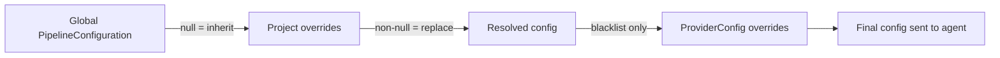
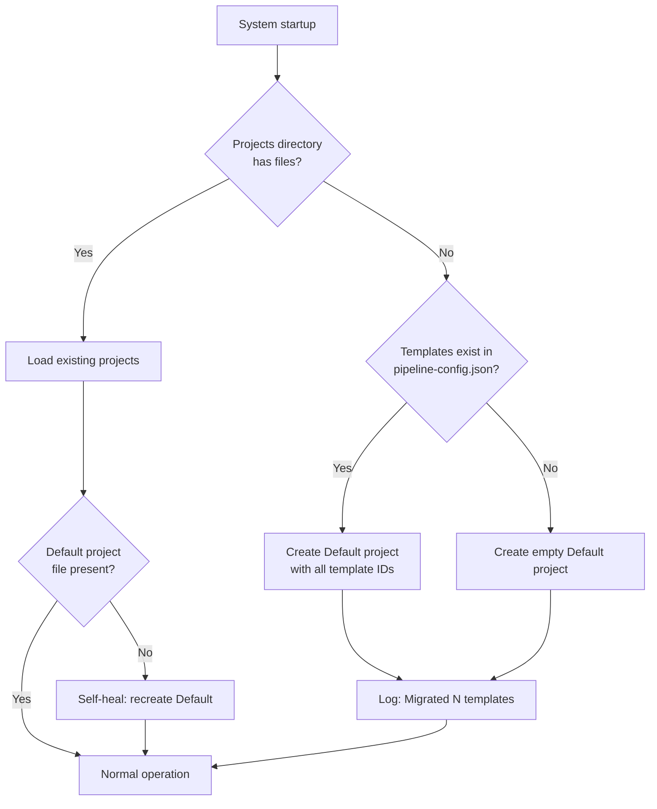
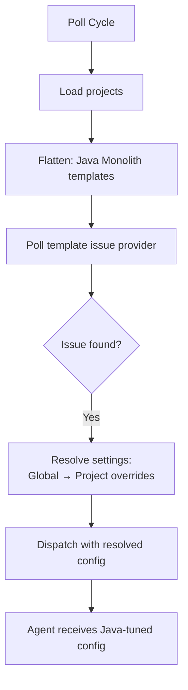
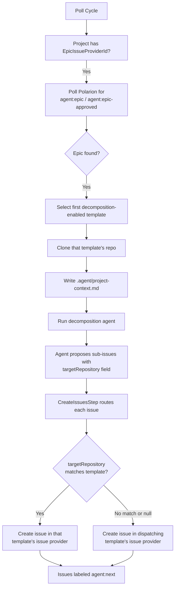
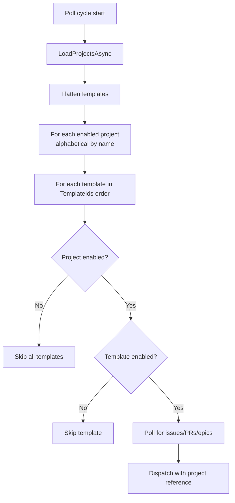

# Pipeline Projects

Projects group related Pipeline Job Templates together and provide per-project behavioral settings. A project gives operators fine-grained control over how different repositories are processed — different prompts, timeouts, retry policies, and review configurations — without editing the global pipeline config.

See also: [Configuration](configuration.md) for global pipeline settings, [Pipeline Orchestration](pipeline-orchestration.md) for the execution state machine, and [Issue Workflows](github-issue-workflows.md) for label-driven interactions.

## Why Projects?

Without projects, all templates share one global configuration. A Java repository and a .NET repository use the same prompts, the same timeouts, and the same code review settings. Projects solve this by introducing a grouping layer with per-project overrides:

- **Mono-repo setups** use a single project to group templates and apply shared settings (e.g., longer timeouts for a slow-building monolith)
- **Multi-repo setups** use a project with a centralized epic tracker (`EpicIssueProviderId`) to decompose high-level requirements into repository-specific issues

## Settings Inheritance

The pipeline uses a two-level settings hierarchy with a nullable override pattern:



**Rules:**
- A `null` project setting means "inherit from global defaults"
- A non-null project setting completely replaces the global value
- Nested objects (e.g., `CodeReview`) use **replace semantics** — the entire object is replaced, not deep-merged
- Per-repository blacklist overrides (from ProviderConfig) still take precedence over project-level blacklist settings
- Settings are resolved at dispatch time — changes take effect on the next dispatched job without restarting

### Resolution Order

1. **Global defaults** — `pipeline-config.json` provides base values for all settings
2. **Project overrides** — Non-null project settings replace corresponding global values
3. **Repository overrides** — `BlacklistedPaths` and `BlacklistMode` from ProviderConfig override project values (if set)

Templates do NOT carry behavioral overrides. They define provider bindings only (issue/repo/brain/pipeline provider IDs and feature toggles).

## Project JSON Structure

Each project is persisted as an individual JSON file at:

```
config/pipeline/projects/{project-id}.json
```

### Example: Mono-Repo Project (Settings Only)

```json
{
  "Id": "a1b2c3d4-e5f6-7890-abcd-ef1234567890",
  "Name": "Backend Services",
  "Description": "Java microservices with extended timeouts",
  "Enabled": true,
  "TemplateIds": [
    "template-id-1",
    "template-id-2"
  ],
  "EpicIssueProviderId": null,
  "MaxRetries": 5,
  "AgentTimeout": "00:45:00",
  "AnalysisPrompt": "You are working on a Java 21 Spring Boot microservice...",
  "CodeReview": {
    "Enabled": true,
    "MaxIterations": 3
  },
  "BaselineHealthCheckEnabled": true,
  "ExternalCiTimeout": "00:20:00"
}
```

### Example: Multi-Repo Project (Cross-Repo Decomposition)

```json
{
  "Id": "b2c3d4e5-f6a7-8901-bcde-f12345678901",
  "Name": "Platform Product",
  "Description": "Cross-repo product with Polarion epic tracking",
  "Enabled": true,
  "TemplateIds": [
    "frontend-template-id",
    "backend-template-id",
    "shared-libs-template-id"
  ],
  "EpicIssueProviderId": "polarion-provider-id",
  "MaxDecompositionSubIssues": 8,
  "DecompositionTimeout": "00:20:00",
  "MaxConcurrentDecompositions": 3
}
```

## Overridable Settings

All settings below are nullable on the project. When `null`, the global default from `pipeline-config.json` is used.

### Execution Settings

| Setting | Type | Description |
|---------|------|-------------|
| `MaxRetries` | int? | Max retry attempts when quality gates fail |
| `MaxAnalysisRetries` | int? | Max retry attempts for the analysis phase |
| `AgentTimeout` | TimeSpan? | Maximum time for a single agent invocation |
| `MaxInfrastructureRetries` | int? | Max retries for infrastructure operations |
| `StallWarningInterval` | TimeSpan? | Time without output before stall warning |

### Prompt Settings

| Setting | Type | Description |
|---------|------|-------------|
| `AnalysisPrompt` | string? | Custom prompt for the analysis phase |
| `ImplementationPrompt` | string? | Custom prompt for code generation |
| `AnalysisReviewPrompt` | string? | Custom prompt for analysis review |
| `AnalysisRefinementPrompt` | string? | Custom prompt for analysis refinement |

### Review Settings

| Setting | Type | Description |
|---------|------|-------------|
| `AnalysisReviewEnabled` | bool? | Enable analysis review step |
| `CodeReview` | CodeReviewConfiguration? | Code review config (REPLACE semantics) |
| `RefactoringReviewEnabled` | bool? | Enable refactoring review |
| `BrainConsolidationReviewEnabled` | bool? | Enable brain consolidation review |
| `HarnessSuggestionsReviewEnabled` | bool? | Enable harness suggestions review |

### CI/CD Settings

| Setting | Type | Description |
|---------|------|-------------|
| `BaselineHealthCheckEnabled` | bool? | Enable baseline health check before agent runs |
| `ExternalCiTimeout` | TimeSpan? | Max wait for external CI |
| `ExternalCiPollInterval` | TimeSpan? | Poll interval for external CI status |

### Decomposition Settings

| Setting | Type | Description |
|---------|------|-------------|
| `MaxDecompositionSubIssues` | int? | Max sub-issues per epic (1–20) |
| `MaxConcurrentDecompositions` | int? | Max simultaneous decomposition runs |
| `DecompositionTimeout` | TimeSpan? | Timeout for decomposition phases |
| `MaxOpenIssuesForContext` | int? | Max open issues fetched for deduplication context |

### Blacklist & Brain Settings

| Setting | Type | Description |
|---------|------|-------------|
| `BlacklistedPaths` | list? | Paths excluded from agent commits |
| `BlacklistMode` | BlacklistMode? | `WarnAndExclude` or `Fail` |
| `BrainReadOnly` | bool? | If true, brain is synced pre-run but not written post-run |

### Refactoring Settings

| Setting | Type | Description |
|---------|------|-------------|
| `MaxRefactoringProposals` | int? | Max refactoring proposals per run |

### Secrets & Steering

| Setting | Type | Description |
|---------|------|-------------|
| `Secrets` | Dictionary? | Project-level secrets injected as environment variables for every run. Merged with repo-level secrets at dispatch time (repo wins on key collision). Keys must match POSIX env var pattern. |
| `SteeringContent` | string? | Markdown steering content written to agent workspace before each run. Provides persistent behavioral instructions (code style, tool preferences, constraints). |

## The Default Project

On first startup (or upgrade from a pre-projects version), the system automatically creates a **Default** project:

- **ID:** `00000000-0000-0000-0000-000000000000` (stable well-known GUID)
- **Name:** "Default"
- **Contains:** All existing templates (migrated automatically)
- **Cannot be deleted** — attempting to delete returns an error

The Default project behaves identically to any other project: you can rename it, disable it, override settings, and move templates in or out. The only restriction is deletion.

### Migration Behavior



The migration is idempotent — running it multiple times produces the same result. Templates remain stored in `pipeline-config.json` (Phase 1) — projects only hold ownership IDs referencing them.

## Template Management

Every template belongs to exactly one project. There is no "unassigned" state.

### Moving Templates Between Projects

Templates can be moved between projects via the **Agent Coding** page using the "Move to..." action in each template's context menu. When a template moves:

- It is removed from the source project's `TemplateIds` list
- It is appended to the destination project's `TemplateIds` list
- The template itself is unchanged — only project ownership moves

### Deleting a Project

When a non-Default project is deleted:

1. All templates in that project are moved to the Default project (appended at the end)
2. The project JSON file is removed from disk

This ensures no template is ever orphaned.

### Template Ordering

Templates within a project are ordered by their position in the `TemplateIds` list. This order determines:

- **Poll sequence:** Templates are polled in list order within each project
- **Cross-project ordering:** Projects are sorted alphabetically by name, then templates within each project by position
- **Decomposition template selection:** The first decomposition-enabled template in the project is used for epic analysis

## Use Case: Mono-Repo (Grouping + Settings)

A single-project setup where the goal is behavioral customization without cross-repo routing.

**Scenario:** You have a Java Spring Boot monolith with a slow build. You want longer timeouts, more retries, and a custom analysis prompt tuned for Java conventions.

### Setup

1. Create a project named "Java Monolith"
2. Move the relevant template into it
3. Override settings:
   - `AgentTimeout`: "00:45:00" (45 min instead of 30)
   - `MaxRetries`: 5 (instead of 3)
   - `ExternalCiTimeout`: "00:20:00"
   - `AnalysisPrompt`: Custom Java-focused instructions

**Result:** All runs dispatched from templates in this project use the overridden settings. Other projects continue using global defaults.

### Data Flow



## Use Case: Multi-Repo (Cross-Repo Decomposition)

A multi-template project with a centralized epic tracker for decomposing high-level requirements across repositories.

**Scenario:** Your product spans a React frontend, a .NET API, and a shared library. Product requirements live in Polarion (or Jira). You want epics decomposed into repository-specific implementation issues automatically.

### Setup

1. Create a project named "Platform Product"
2. Add all three templates (frontend, backend, shared-libs)
3. Set `EpicIssueProviderId` to your Polarion issue provider
4. Configure decomposition settings as needed

### How It Works



### Project Context File

When decomposing from a project-level `EpicIssueProviderId`, the system generates `.agent/project-context.md` in the workspace:

```markdown
# Project Context

**Project:** Platform Product

## Available Repositories

When proposing decomposed issues, assign each to the most appropriate
repository using the `targetRepository` field. Values must EXACTLY match
a repository name below (case-sensitive).

### frontend-app
- **Description:** React frontend application
- **Decomposition enabled:** True
- **Status:** ✓

### backend-api
- **Description:** .NET 10 REST API
- **Decomposition enabled:** True
- **Status:** ✓

### shared-libs
- **Description:** Shared utility libraries
- **Decomposition enabled:** False
- **Status:** ✓

## Routing Instructions

- Set `targetRepository` in each sub-issue to the exact template name above
- If an issue spans multiple repositories, assign to the PRIMARY repository
- Issues without `targetRepository` are created in the default repository
```

### Routing Behavior

| `targetRepository` Value | Behavior |
|--------------------------|----------|
| Matches a template name in the project | Issue created in that template's issue provider |
| Does not match any template | Warning logged, issue created in dispatching template's provider |
| Null or empty | Issue created in dispatching template's provider (default) |

All created issues receive the `agent:next` and `agent:generated` labels regardless of routing target.

### Existing Per-Template Decomposition

The project-level epic flow coexists with existing per-template decomposition:

- **Without `EpicIssueProviderId`:** Each template with `DecompositionEnabled` polls its own issue provider for epics (existing behavior, unchanged)
- **With `EpicIssueProviderId`:** The project additionally polls the centralized tracker. Both sources are active simultaneously
- **Deduplication:** The same epic cannot be dispatched twice — the system checks `IsIssueBeingProcessed` / `IsIssueQueued` across both polling sources

## Pipeline Loop Integration

The pipeline loop iterates projects instead of reading templates directly from the global config:



**Key behaviors:**
- A disabled project skips ALL its templates regardless of individual template `Enabled` flags
- All templates share a single FIFO dispatch queue (no per-project parallelization)
- The project reference is captured at cycle start and passed through to dispatch for settings resolution
- Orphaned templates (data corruption) are auto-assigned to the Default project on load

## Observability

Pipeline runs carry project metadata for filtering and debugging:

| Field | Location | Description |
|-------|----------|-------------|
| `ProjectId` | PipelineRun | Project that owned the template at dispatch time |
| `ProjectName` | PipelineRun, PipelineRunSummary | Display name for UI rendering |
| `DecompositionSource` | PipelineRun | `"project-level"` or `"template-level"` for decomposition runs |
| `pipeline.project_id` | OpenTelemetry tag | Project ID on all pipeline activities |
| `pipeline.project_name` | OpenTelemetry tag | Project name on all pipeline activities |

The run history table includes a "Project" column for quick filtering.

## UI Management

Projects are managed in the **Settings** page under the "Projects" group in the navigation tree. Each project has three tabs:

| Tab | Contents |
|-----|----------|
| **Overview** | Name, description, enabled toggle, EpicIssueProviderId dropdown |
| **Templates** | Ordered list with add/remove/reorder controls |
| **Settings** | Behavioral overrides with "Reset to global" / "Override" toggle per field |

The **Agent Coding** page groups templates by project with project name headers. Each template row has a "Move to..." action in its context menu. Projects with `EpicIssueProviderId` set show a 🧩 indicator.
