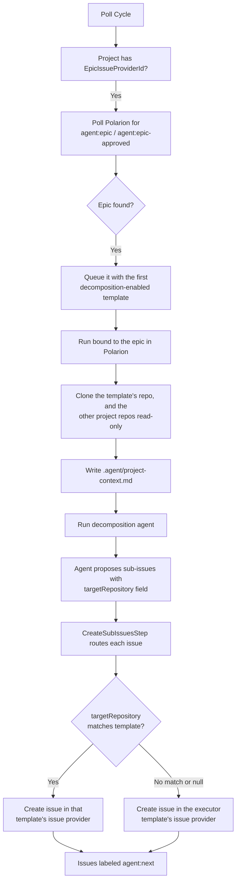

# Pipeline Projects

Projects group related Pipeline Job Templates together and provide per-project behavioral settings. A project gives operators fine-grained control over how different repositories are processed — different prompts, timeouts, retry policies, and review configurations — without editing the global pipeline config.

See also: [Configuration](configuration.md) for global pipeline settings, [Pipeline Orchestration](pipeline-orchestration.md) for the execution state machine, and [Issue Workflows](github-issue-workflows.md) for label-driven interactions.

## Why Projects?

Without projects, all templates share one global configuration. A Java repository and a .NET repository use the same prompts, the same timeouts, and the same code review settings. Projects solve this by introducing a grouping layer with per-project overrides:

- **Mono-repo setups** use a single project to group templates and apply shared settings (e.g., longer timeouts for a slow-building monolith)
- **Multi-repo setups** use a project with a centralized epic tracker (`EpicIssueProviderId`) to decompose high-level requirements into repository-specific issues

## Settings Inheritance

A project overrides global settings for all its templates. The settings it can override are marked **Project** in the [Settings Reference](configuration.md#settings-reference); [Where Settings Live](configuration.md#where-settings-live) shows every layer and how the layers combine.


```mermaid
flowchart LR
    A[Global settings] -->|empty = inherit| B[Project overrides]
    B -->|set = replace| C[Template: BrainReadOnly]
    C -->|blacklist only| D[Repository provider]
    D --> E[Final config sent to agent]
```

**Rules:**
- An empty project setting inherits the global value; a set one replaces it
- `codeReview` is merged field by field: only the sub-fields the project sets replace the global ones
- An override must be within the range of the setting it overrides; saving a project with one outside it is refused with a message that names the setting. An override stored outside its range (saved before this check) is skipped, so that setting keeps the global value while the project's other overrides still apply
- Settings are resolved when an agent claims a job, so changes apply to the next job without a restart

### Resolution Order

1. **Global settings** — Settings → Global Defaults
2. **Project overrides** — the project's set values replace the global ones
3. **Template** — `BrainReadOnly` on the pipeline job template can turn brain writes off, never on; the template also holds its workflow switches and housekeeping limit
4. **Repository provider** — its `BlacklistedPaths` replace the global or project list (if set)

## Project Storage

Projects are persisted in PostgreSQL (the `Projects` table). Configuration is managed via the web UI (Settings → Projects) or the import/export HTTP API. The runtime store is always PostgreSQL — on first startup against an empty database, the API seed step creates the Default project and seeds the default reviewer configurations. In normal operation there is no file-based runtime storage.

The JSON bundle produced by `GET /api/config/export` includes a `projects` array with the same shape documented below. This bundle can be used to migrate project configuration between instances (see [Bootstrap](bootstrap.md)).

A project does not store its templates: each template names the project it belongs to. The API returns a project's templates as a read-only `templateIds` list, ordered by name; saving a project ignores that list.

### Example: Mono-Repo Project (Settings Only)

```json
{
  "id": "a1b2c3d4-e5f6-7890-abcd-ef1234567890",
  "name": "Backend Services",
  "description": "Java microservices with extended timeouts",
  "enabled": true,
  "epicIssueProviderId": null,
  "maxRetries": 5,
  "agentTimeout": "00:45:00",
  "analysisPrompt": "You are working on a Java 21 Spring Boot microservice...",
  "codeReview": {
    "maxIterations": 3,
    "inlineComments": { "maxInlineComments": 25 }
  },
  "baselineHealthCheckEnabled": true,
  "externalCiTimeout": "00:20:00"
}
```

### Example: Multi-Repo Project (Cross-Repo Decomposition)

```json
{
  "id": "b2c3d4e5-f6a7-8901-bcde-f12345678901",
  "name": "Platform Product",
  "description": "Cross-repo product with a central epic tracker",
  "enabled": true,
  "epicIssueProviderId": "epic-tracker-provider-id",
  "maxDecompositionSubIssues": 8
}
```

## Project-Only Settings

Besides overrides, a project holds settings of its own:

### Secrets & Steering

| Setting | Type | Description |
|---------|------|-------------|
| `Secrets` | Dictionary? | Project-level secrets injected as environment variables for every run. Merged with repo-level secrets at dispatch time (repo wins on key collision). Keys must match POSIX env var pattern. |
| `SteeringContent` | string? | Markdown steering content written to agent workspace before each run. Provides persistent behavioral instructions (code style, tool preferences, constraints). |

### MCP Servers

| Setting | Type | Description |
|---------|------|-------------|
| `McpServers` | List? | Project-level MCP server configurations. Merged with the resolved agent profile's MCP servers at dispatch time. `null` = inherit profile list unchanged. |

**Merge semantics**: At dispatch time, project-level MCP servers are merged with the resolved agent profile's servers:
- A project server with the same `Name` (case-insensitive) as a profile server **replaces** it
- Project servers with new names are **appended** to the profile list
- `null` (or empty list) = inherit profile list unchanged

This allows projects to selectively override or augment the profile's MCP configuration without redefining the entire list. See [Configuration — Project-Level MCP Servers](configuration.md#project-level-mcp-servers) for merge semantics and examples.

### Project Review

| Setting | Type | Description |
|---------|------|-------------|
| `ProjectReviewEnabled` | bool | Whether the project review runs. Default `false`. |
| `ProjectReviewers` | List | The project's reviewers, each a name and instructions. An empty name or prompt means the default, and an empty list means one default reviewer. The settings page edits the first one. |

With the project review on, a project reviewer joins every code review of the project's repositories, in implementation runs and PR review runs. It runs concurrently with the reviewers the repository's labels pick, and its findings go through the same inline comments and fix rounds. It reads read-only clones of the project's other repositories and the connected MCP servers, and checks the change against the whole project: the contracts between the repositories, the project's decisions and its documentation. See [PR Review — Project Review](pr-review.md#project-review) for what it is told and how the clones are kept read-only.

## The Default Project

On first startup (or upgrade from a pre-projects version), the system automatically creates a **Default** project:

- **ID:** `00000000-0000-0000-0000-000000000000` (stable well-known GUID)
- **Name:** "Default"
- **Contains:** All existing templates (migrated automatically)
- **Cannot be deleted** — attempting to delete returns an error

The Default project behaves identically to any other project: you can rename it, disable it, override settings, and move templates in or out. It cannot be deleted, and as it holds templates that belong to no product, the settings page offers it no project review.

## Template Management

Every template belongs to exactly one project. There is no "unassigned" state. The template records its project, and that is the only record of membership.

### Template Rules

A template binds one repository to one implementation tracker. Among **enabled** templates:

- a repository belongs to one template;
- an issue tracker belongs to one template;
- a name is unique within its project, ignoring case, because a project epic routes each sub-issue by template name.

Saving or moving an enabled template that breaks a rule is refused with the reason. Disabled templates are not checked, so one of two conflicting templates can always be switched off. A project's epic tracker may also be the tracker of one of its templates.

A saved template keeps its repository and issue tracker. **Edit** on the Pipelines page changes everything else in place: name, brain provider and `BrainReadOnly`, CI provider, workflow switches and housekeeping. The template keeps its id, and with it its run and consolidation history. To bind another repository or tracker, add a new template.

Templates saved before these rules were enforced keep working. The **Pipelines** page lists any conflicts above the template table, and an enabled template that is part of one cannot be saved until the conflict is fixed, for example by disabling, moving or removing the other template.

### Moving Templates Between Projects

Templates can be moved between projects with the "Move to…" action, available in two places: each template row on the **Pipelines** page, and the project's **Templates** tab (Settings → Projects → *project*). When a template moves:

- Its project changes, so it leaves the source project's list and appears in the destination project's list
- The template itself is unchanged — only project ownership moves
- The move is refused if an enabled template in the destination project already has the same name

### Deleting a Project

When a non-Default project is deleted:

1. All templates in that project are moved to the Default project
2. The project record is removed from the database

This ensures no template is ever orphaned.

### Template Ordering

Templates within a project are ordered by name, ignoring case. There is no manual order. The order determines:

- **Poll sequence:** Templates are polled in this order within each project
- **Cross-project ordering:** Projects are sorted alphabetically by name, then templates within each project by name
- **Project epic executor:** The first enabled template with `DecompositionEnabled` runs the project's epics (the epics in its `EpicIssueProviderId` tracker). To choose it, rename it or enable decomposition only on that template

## Use Case: Mono-Repo (Grouping + Settings)

A single-project setup where the goal is behavioral customization without cross-repo routing.

**Scenario:** You have a Java Spring Boot monolith with a slow build. You want longer timeouts, more retries, and a custom analysis prompt tuned for Java conventions.

### Setup

1. Create a project named "Java Monolith"
2. Move the relevant template into it
3. Override settings:
   - Agent Timeout: 45 minutes instead of 30
   - Max Retries: 5 instead of 3
   - CI Timeout: 20 minutes
   - Analysis Prompt: custom Java-focused instructions

**Result:** All runs dispatched from templates in this project use the overridden settings. Other projects continue using global defaults.

## Use Case: Multi-Repo (Cross-Repo Decomposition)

A multi-template project with a centralized epic tracker for decomposing high-level requirements across repositories.

**Scenario:** Your product spans a React frontend, a .NET API, and a shared library. Product requirements live in Polarion (or Jira). You want epics decomposed into repository-specific implementation issues automatically.

### Setup

1. Create a project named "Platform Product"
2. Add all three templates (frontend, backend, shared-libs)
3. Set `EpicIssueProviderId` to your Polarion issue provider
4. Configure decomposition settings as needed

### How It Works


```mermaid
flowchart TD
    A[Poll Cycle] --> B[Project has EpicIssueProviderId?]
    B -->|Yes| C[Poll Polarion for<br/>agent:epic / agent:epic-approved]
    C --> D{Epic found?}
    D -->|Yes| E[Queue it with the first<br/>decomposition-enabled template]
    E --> F[Run bound to the epic in Polarion]
    F --> G[Clone the template's repo, and the<br/>other project repos read-only]
    G --> H[Write .agent/project-context.md]
    H --> I[Run decomposition agent]
    I --> J[Agent proposes sub-issues with<br/>targetRepository field]
    J --> K[CreateSubIssuesStep routes each issue]

    K --> L{targetRepository<br/>matches template?}
    L -->|Yes| M[Create issue in that<br/>template's issue provider]
    L -->|No match or null| N[Create issue in the executor<br/>template's issue provider]

    M --> O[Issues labeled agent:next]
    N --> O
```

### Project Context File

The system generates `.agent/project-context.md` in the workspace for every decomposition run where the epic lives in a project's `EpicIssueProviderId` tracker (a project epic). This applies to any project — including the Default project — that has `EpicIssueProviderId` configured and at least one enabled template. Repo epics (epics in a template's own tracker) do not receive a project context file; their sub-issues stay in that tracker.

```markdown
# Project Context

**Project:** Platform Product

## Available Repositories

When proposing decomposed issues, assign each to the most appropriate
repository using the `targetRepository` field. Values must EXACTLY match
a repository name below (case-sensitive).

### frontend-app
- **Decomposition enabled:** True
- **Status:** ✓

### backend-api
- **Decomposition enabled:** True
- **Status:** ✓

### shared-libs
- **Decomposition enabled:** False
- **Status:** ✓

## Routing Instructions

- Set `targetRepository` in each sub-issue to the exact template name above
- If an issue spans multiple repositories, assign to the PRIMARY repository
- Issues without `targetRepository` are created in the default repository
```

### Routing Behavior

| `targetRepository` Value | Behavior |
|--------------------------|----------|
| Matches a template name in the project | Issue created in that template's issue provider |
| Does not match any template | Warning logged, issue created in the executor template's provider |
| Null or empty | Issue created in the executor template's provider (default) |

All created issues receive the `agent:next` and `agent:generated` labels regardless of routing target. The gateway only accepts the trackers of the project's enabled templates, and only from a project epic's decomposition run. A template whose name is empty or already used by an earlier template in the project is left out of the project context.

### Repo Epics and Project Epics

Both kinds of epic use the same flow; only their scope differs:

- **Repo epics:** Each template with `DecompositionEnabled` polls its own issue provider for epics. Their sub-issues stay in that tracker.
- **Project epics:** With `EpicIssueProviderId`, the project also polls the centralized tracker. Project epics may create sub-issues in every template's tracker.

See [Epic Decomposition — Epic Scope](epic-decomposition.md#epic-scope-repo-epics-and-project-epics) for the full comparison.

## UI Management

Projects are managed in the **Settings** page under the "Projects" group in the navigation tree. Each project has six tabs (the Default project has no Project Review tab):

| Tab | Contents |
|-----|----------|
| **Overview** | Name, description, enabled toggle, EpicIssueProviderId dropdown |
| **Templates** | The project's templates by name, with add/remove controls and a "Move to…" action |
| **Secrets** | Environment variables injected into every run of the project. Merged with repository-level secrets; the repository value wins on a key collision |
| **Settings** | Behavioral overrides with an "Override" toggle per field; fields without an override show "Using global default: *value*" |
| **MCP Servers** | Project MCP servers, merged with the agent profile's servers at dispatch time. A server with the same name overrides the profile's; others are added |
| **Project Review** | The project review switch and the project reviewer's instructions, prefilled with the default ones; "Reset to default" restores them. Instructions equal to the default are stored empty, so the project follows later changes to the default |

The **Pipelines** page groups templates by project with project name headers. Each template row has a "Move to…" action. Projects with `EpicIssueProviderId` set show a 🧩 indicator.
